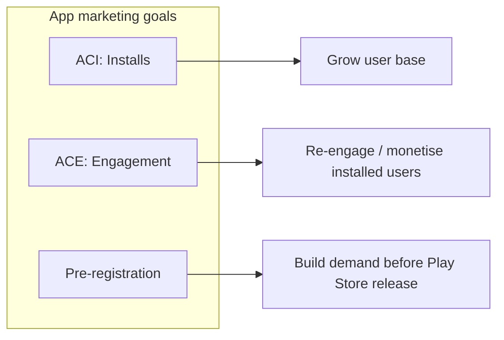
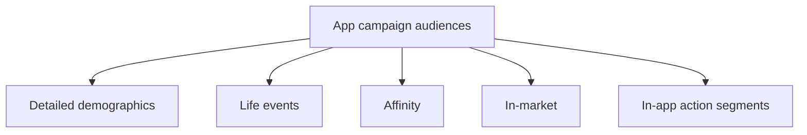

# App Campaigns on Google Ads: Foundational Knowledge

## Intuition First

App marketing on Google Ads is goal-driven automation. Google’s machine learning places ads across Search, YouTube, Discover, and the Play network — but **you** choose the objective: get installs (ACI), win back or monetise existing users (ACE), or build waitlists before launch (pre-registration). Wrong objective = wrong users = wasted CPI budget.

---

## Three App Campaign Types

| Type | Abbreviation | Objective | When to use |
|------|--------------|-----------|-------------|
| **App campaigns for installs** | ACI | Drive downloads | New launch or scale marketplace presence |
| **App campaigns for engagement** | ACE | Re-engage / in-app actions | Users installed but inactive; carts abandoned; push purchases or events |
| **App campaigns for pre-registration** | — | Sign-ups before release | Android apps / games not yet live on Google Play |

---

## ACI — App Campaigns for Installs

**Goal**: Reach people most likely to **download and install**.

How it works:

- Google Ads ML optimises delivery toward install-likely users
- Works for broad reach; still worth narrowing by usage behaviour and interests
- Best when the priority metric is installs (or quality installs if you set deeper conversion tracking)

**Marketing example**: A food-delivery app (e.g., Swiggy) launching in a new city runs ACI to maximise install volume within a daily CPA/CPI budget.

---

## ACE — App Campaigns for Engagement

**Goal**: Shift from **acquisition** to **engagement and retention** once enough users exist.

Typical ACE use cases:

| Segment | Message / action |
|---------|------------------|
| Lapsed purchasers | Come back and buy again |
| Cart abandoners | Complete checkout |
| Event / sale audiences | Reminder for live offer inside the app |

**Eligibility constraint**: ACE requires a substantial install base — typically **at least 50,000 installs** — so ML has enough users to re-target effectively.

**Marketing example**: After 80,000 installs, a shopping app runs ACE to users who added items to cart but did not purchase, with creatives focused on free shipping.

---

## Pre-registration Campaigns (Android)

**Goal**: Build excitement and Play Store pre-registrations **before** the app or game launches.

| Feature | Detail |
|---------|--------|
| Platform | **Android / Google Play only** |
| Targeting logic | Similar apps/games interest; history of pre-registering |
| Strategic value | Waitlist + early audience insights to refine creative and messaging before day-one launch |

**Marketing example**: A new mobile RPG runs pre-registration toward users of similar RPGs so launch day starts with an eager install queue.

---

## Audience Targeting Options

| Option | Basis | Example |
|--------|-------|---------|
| **Detailed demographics** | Long-term life facts: age, gender, income, parental status | Parenting / education apps → parents in selected age bands |
| **Life events** | Milestones: wedding, home move, new baby, graduation | Mortgage calculator app → recent home buyers |
| **Affinity** | Passions and habits (sports, travel, foodies, etc.) | Fitness app → sports enthusiasts |
| **In-market** | Recent purchase / action intent | Shopping app → users researching products in your category |
| **In-app action segments** | Behaviour inside your own app | Purchase completers, incomplete sign-ups, cart abandoners |

Custom in-app segments power tailored ACE (and related) messaging: complete purchase, finish signup, or simply reopen the app.

---

## Choosing the Right Campaign

| Situation | Campaign |
|-----------|----------|
| Need more downloads | ACI |
| Have ≥ ~50k installs; need activity / purchases | ACE |
| Android app/game not released yet | Pre-registration |
| Mix of goals | Separate campaigns by objective; do not overload one campaign |

---

## Common Pitfalls / Exam Traps

- **Trap**: Running ACE without meeting the **~50,000 install** eligibility — campaigns need a large enough base.
- **Trap**: Saying pre-registration works for iOS the same way; it is framed for **Android / Google Play**.
- **Trap**: Using ACI forever after launch; post-traction value often sits in ACE (retention and monetisation).
- **Trap**: Confusing affinity (long-term interests) with in-market (ready-to-act intent).
- **Trap**: Ignoring first-party in-app segments (cart abandoners, incomplete signup) when re-engaging.

---

## Quick Revision Summary

- Three types: **ACI** (installs), **ACE** (engagement), **pre-registration** (pre-launch Android)
- ACE needs ~**50,000** installs
- Targeting: demographics, life events, affinity, in-market, in-app behaviour segments
- ML automates delivery; marketer sets goal, creative assets, and audience logic
- Match campaign to lifecycle stage: launch → install, mature → engage, pre-release → pre-register

---

**← [Previous](01-introduction-to-google-ads-ecom-app-focused-transcript.md) · [Index](../README.md) · [Next](03-different-types-and-purpose-transcript.md) →**
