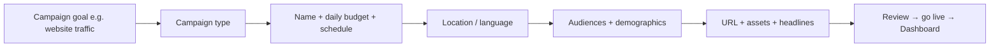

# Google Ads Lab: Demand Gen, Display, Shopping, and App Promotion

## Intuition First

Platform fluency is a skill: the Google Ads UI repeats the same skeleton across campaign types — **goal → budget/schedule → audience → assets → review**. Lab practice builds muscle memory for Demand Gen, Display, Shopping, and App Promotion so you can set up and diagnose live campaigns without guessing which screen controls what.

---

## Shared Setup Skeleton

Most campaign builders follow a similar path:

| Setting | Examples you can control |
|---------|--------------------------|
| Daily budget | e.g. ₹1 for a test; ₹100 for install volume tests |
| Ad schedule | Only Mondays and Wednesdays; custom dayparts |
| Location | India; city-level (e.g. Delhi) |
| Language | Match market language |

---

## Demand Gen Campaigns

**Purpose**: Generate demand with visual creatives across YouTube, Discover, and Gmail (among other surfaces in the Demand Gen family).

### Lab flow highlights

1. Choose goal (e.g. website traffic) → Demand Gen
2. Name campaign; optimise for **clicks**; set daily budget and schedule
3. Ad group → location targeting
4. Build an **audience** (name it, e.g. "test audience")

| Audience building path | Options |
|------------------------|---------|
| Interests | Education, news & politics, pets, media & entertainment, etc. |
| Browse categories | Life events, in-market categories (actively researching) |
| Demographics | Align to business (age, gender, etc.) |

5. Creative formats: **single image**, **video**, or **carousel**
6. Final URL + upload image/video + headlines → preview on YouTube / Discover / Gmail → Review → live after review

**Marketing example**: An edtech brand runs Demand Gen to interest audiences ("education") with a carousel of course benefits driving to a signup landing page.

---

## Display Campaigns

**Purpose**: Place visual ads across the Google Display Network and related placements.

### Controls similar to Demand Gen, plus placement precision

| Targeting layer | Examples |
|-----------------|----------|
| Demographics | Gender, age brackets, parental status, household income (exclude what you do not want) |
| Audience segments | Same interest / in-market style segments |
| Placements | Specific **YouTube channels** or **video URLs** (monetisable), websites, or apps |

Creative steps: Final URL → business name → images / logos / videos → multiple headlines and descriptions → use preview toggle → publish.

**Marketing example**: A D2C brand places Display ads on specific YouTube reviews in its category and on complementary content sites.

---

## Shopping Campaigns (Lab Path)

**Prerequisite**: Google Merchant Center account (same Google identity helps auto-fetch).

| Shopping option | Lab takeaway |
|-----------------|--------------|
| **Standard Shopping** | Product-list control; bids e.g. maximise clicks; pick SKUs from feed |
| **Performance Max** | One campaign across Google inventories (often covered separately; broader automation) |

### Standard Shopping lab sequence

1. New campaign → website traffic → Shopping
2. Link Merchant Center
3. Choose Standard Shopping → name → budget + bidding (e.g. max clicks)
4. Location + schedule
5. Ad group → **edit product list** (pick which catalog items to advertise)
6. Preview summary → go live; confirm status on main dashboard

**Marketing example**: An electronics store promotes only high-margin SKUs from the feed via Standard Shopping while holding back clearance inventory.

---

## App Promotion Campaigns

Three Google Ads app promotion goals mirror the foundational types:

| Option | Goal | Constraint / note |
|--------|------|-------------------|
| **App installs** | Drive downloads | Universal starter; Android or iOS |
| **App engagement** | Re-engage installed users | Needs ~**50,000** installs eligibility |
| **Pre-registration** | Pre-launch sign-ups | **Android only** |

### Install campaign lab sequence

1. New campaign → App promotion → App installs
2. Platform: Android or iOS → search/select app (e.g. Swiggy)
3. Location + optional start/end dates
4. Preview how ads appear on Search, YouTube, Discover
5. Headlines + descriptions
6. Focus: install volume; optional **target cost per install** (often left unchecked if maximising installs within budget)
7. Daily budget (e.g. ₹100) → next → live; verify on dashboard

---

## Platform Comparison Cheat Sheet

| Feature | Demand Gen | Display | Shopping | App installs |
|---------|------------|---------|----------|--------------|
| Core asset driver | Images / video / carousel | Images / video / logos | Product **feed** | App listing + headlines |
| Extra targeting | Interests, life events, in-market | Placements (YT, sites, apps) | Product picker from Merchant Center | Platform + CPI focus |
| Merchant Center | No | No | **Required** | No |
| Typical goal | Demand / clicks / engagement | Awareness / traffic | Product sales | Install volume |

---

## Common Pitfalls / Exam Traps

- **Trap**: Forgetting Shopping needs a **Merchant Center** link — the UI blocks or fails without it.
- **Trap**: Selecting App **engagement** without ~50k installs.
- **Trap**: Assuming pre-registration works for iOS the same as Android.
- **Trap**: Leaving display demographics unchecked incorrectly (remember: unchecked/excluded groups change who sees ads).
- **Trap**: Confusing Performance Max with Standard Shopping in the Shopping flow.
- **Trap**: Setting a very low daily budget for learning, then judging performance too early (see risk/timing in performance marketing).

---

## Quick Revision Summary

- Shared UI path: goal → type → budget/schedule → geo → audience → creative → review → dashboard
- Demand Gen: interests / life events / in-market; image, video, carousel; YouTube / Discover / Gmail previews
- Display: demographics + placements (YouTube channels/videos, sites, apps)
- Shopping: Merchant Center → Standard vs PMax → pick products from feed
- App: installs / engagement (≥50k) / Android pre-registration; preview across Google surfaces

---

**← [Previous](03-different-types-and-purpose-transcript.md) · [Index](../README.md) · [Next](05-performance-marketing-as-investment-banking-transcript.md) →**
