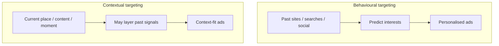
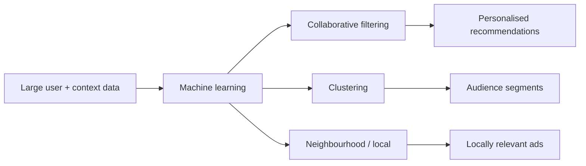

# How Digital Ads Work: Behavioural vs Contextual Targeting and ML

## Intuition First

Seeing an ad for something you "just thought about" rarely means the platform read your mind. It usually means **signals** — past behaviour, current context, and machine learning patterns — matched you to an advertiser’s bid. Marketers who understand **behavioural** vs **contextual** targeting (and the ML methods underneath) design media that feels personal without relying on myth.

---

## Two Targeting Foundations

| Dimension | Behavioural targeting | Contextual targeting |
|-----------|----------------------|----------------------|
| Primary input | Past actions, interests, interactions | Context of **where / what** the user is engaged with **now** |
| Data examples | Sites visited, search queries, social behaviour | Location, page topic, moment (e.g. at a bar vs at home browsing baby products) |
| Strength | High personalisation from proven interest | Relevance to present situation; avoids awkward mismatches |
| Failure mode | Ads ignore current context (baby ads while out drinking with friends) | Weak if context alone lacks commercial signal |

---

## Behavioural Targeting — Worked Example

A new parent researches childcare products online.

- Algorithm observes pattern → serves Pampers and related ads across feeds
- Ads feel timely because they reflect **demonstrated interest**

**Benefit**: Higher relevance → higher chance of engagement and conversion among people who already showed category affinity.

---

## Contextual Targeting — Same Person, Different Moment

Same new parent later meets friends for drinks.

| Lens | Ad served | Why |
|------|-----------|-----|
| Pure behavioural inertia | Childcare products again | Past search history dominates |
| Contextual | Wine / bar discount offer | Current location and situation dominate |

**Advantage of context**: Ad fit for **present** behaviour and environment, not only historical trail. Strong contextual systems can combine past behaviour **and** present context — relevance at *this* time and place.

---

## Machine Learning in Digital Advertising

Machine learning (a subset of AI) improves targeting, relevance, and performance by learning from large behavioural datasets without hard-coding every rule.

| Technique | What it does | Marketing use |
|-----------|--------------|---------------|
| **Collaborative filtering** | Infers preference from similar users | If User A and User B both like fitness products, suggest to A what B bought (e.g. tracker accessories) |
| **Clustering** | Groups users with shared traits | Segments: high spenders → premium offers; frequent shoppers → discounts / loyalty |
| **Neighbourhood algorithm** | Uses local trends and proximity | If many users in an area engage with a topic, related ads reach neighbours / local cohorts |

---

## Marketer Mindset After Launch

> "Everyone has a plan until they get punched in the face." — Mike Tyson (as applied to live campaigns)

Plans meet reality when campaigns go live. Success depends on:

- Staying close to data
- Adapting quickly
- Knowing when to cut losses vs double down

That operational mindset separates strong performance marketers from those who only design the initial plan.

---

## Common Pitfalls / Exam Traps

- **Trap**: Claiming ads "read minds" — explain with behavioural/contextual signals + ML instead.
- **Trap**: Treating behavioural and contextual as the same; one keys off **history**, the other off **present context**.
- **Trap**: Ignoring context so remarketing follows people into irrelevant situations (privacy/brand feel issues as well as wasted spend).
- **Trap**: Mixing up ML methods: collaborative filtering ≠ clustering ≠ neighbourhood/local.
- **Trap**: Believing perfect pre-launch plans guarantee results; live data and adaptation matter.

---

## Quick Revision Summary

- **Behavioural**: past actions → personalised ads (e.g. baby products after childcare research)
- **Contextual**: current situation/location/content → fit-for-now ads (e.g. wine offer at a bar)
- Best practice: relevance from context, often layered with behavioural signals
- ML tools: collaborative filtering, clustering, neighbourhood/local trends
- Live campaigns require data closeness, fast adaptation, and smart loss-cutting

---

**← [Previous](05-performance-marketing-as-investment-banking-transcript.md) · [Index](../README.md) · [Next](07-summary-transcript.md) →**
