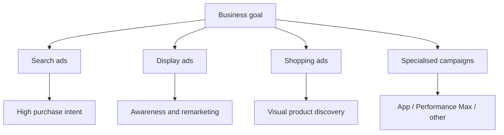

# Google Ads for E-commerce and App Marketing

## Intuition First

Google Ads is not one product — it is a toolkit. E-commerce brands need visual product discovery; app businesses need installs, re-engagement, or launch buzz. Matching **campaign type** to **business goal**, then narrowing with **audience targeting**, is the foundation of profitable media spend.

---

## Module Focus

This module centres on using Google Ads specifically for:

| Focus | Business need |
|-------|---------------|
| **E-commerce** | Product visibility, traffic to store, sales |
| **App marketing** | Installs, in-app engagement, pre-launch demand |

**Learning outcomes to aim for:**

1. Describe foundational Google Ads basics for e-commerce and app contexts
2. Explain major campaign types and the purpose each serves in a business plan

---

## Campaign Types You Will Use

| Campaign type | Primary role | Typical ecom / app use |
|---------------|--------------|------------------------|
| **Search** | Capture active query intent | "Buy running shoes", competitor brand terms |
| **Display** | Visual presence across the web | Brand awareness, retargeting cart abandoners |
| **Shopping** | Image + price + merchant name | Product catalog ads for online stores |
| **Specialised** | Goal-specific automation | App install / engagement / pre-registration |

Each type solves a different stage of the buyer or user journey. Running Search alone when you need app installs (or Shopping alone when people do not know your brand yet) misallocates budget.

---

## Why Audience Segmentation Matters

Ads only create value if the **right people** see them at the **right moment**.

| Lever | What it controls |
|-------|------------------|
| Demographics | Who (age, gender, income, parental status) |
| Interests / affinity | What they care about long-term |
| In-market / intent | What they are ready to buy now |
| Behaviour / remarketing | What they already did with your brand or app |

**Example**: An online electronics store uses Shopping ads for product queries, Search for brand defence, and Display remarketing for users who viewed a product but did not buy — three campaigns, one funnel.

---

## End State for the Marketer

After mastering this module's ideas, you should be able to:

- Navigate the Google Ads ecosystem with an e-commerce and app lens
- Map goals → campaign types → targeting
- Optimise for outcomes (sales, installs, engagement), not vanity metrics alone

---

## Common Pitfalls / Exam Traps

- **Trap**: Treating "Google Ads" as synonymous with Search only. Shopping, Display, and app campaigns are core for ecom/apps.
- **Trap**: Choosing campaign type by familiarity instead of goal (e.g., Display for "people searching to buy now").
- **Trap**: Ignoring audience segmentation — broad reach without targeting wastes budget.
- **Trap**: Confusing awareness goals with conversion goals; each needs different formats and metrics.

---

## Quick Revision Summary

- Week focus: Google Ads for **e-commerce** and **app** growth
- Core campaign families: Search, Display, Shopping, specialised
- Match campaign type to business goal and funnel stage
- Audience segmentation and targeting decide who sees the ad and when
- Outcomes: foundation + campaign purpose literacy for optimisation
