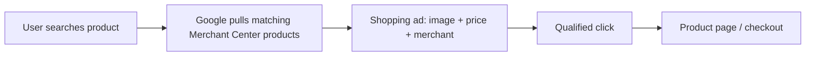
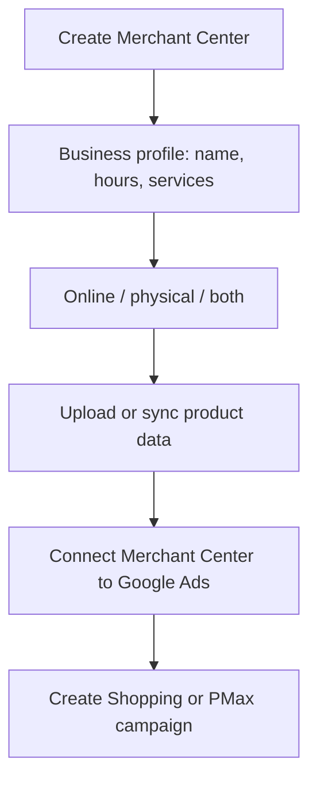

# Google Shopping Ads: Types, Setup, and Purpose

## Intuition First

When someone searches "Air Jordans" or "Bluetooth headphones," text ads describe; **Shopping ads show**. Image, title, price, and merchant name appear before the click — so shoppers compare and decide faster. For e-commerce, Shopping (via Merchant Center) is often the most direct path from search intent to product page.

---

## What Shopping Ads Are

Shopping ads place retailer products on Google Search (and related Shopping surfaces), often at the top of results and in the Shopping tab.

| Element shown | Why it matters |
|---------------|----------------|
| Product image | Faster recognition; higher click likelihood than text alone |
| Title | Clarifies variant / model |
| Price | Instant value comparison |
| Business name | Trust and brand recognition |

Unlike classic text Search ads, creatives are largely driven by **product feed data**, not free-form ad copy alone.

---

## Two Main Campaign Approaches

| Approach | Reach | Control | Best when |
|----------|-------|---------|-----------|
| **Performance Max (PMax)** | Search, YouTube, Display, Gmail, etc. | Highly automated via Google AI | Broader reach; willing to let ML place & optimise |
| **Standard Shopping** | Focused on Shopping inventory | More manual bids, product selection, listing control | Need hands-on control of which SKUs and how they compete |

**Key difference**: PMax = wider surfaces + automation; Standard Shopping = Shopping-centric + marketer control.

**Marketing example**: A fashion retailer uses Standard Shopping for hero SKUs with tight ROAS targets, and Performance Max to scale awareness and find converting placements beyond classic Shopping results.

---

## Google Merchant Center — The Backbone

Shopping campaigns need a **Google Merchant Center** product feed linked to Google Ads.

### Ways to Get Product Data In

| Method | How |
|--------|-----|
| **Platform sync** | Link Shopify, BigCommerce, WooCommerce, etc. — auto sync catalog |
| **Store connection** | Connect site so Google fetches products |
| **Manual upload** | Upload / edit products directly in Merchant Center |

Business profile (store name, hours, services) can be updated anytime and appears across Google tools. Correct multi-location details help customers find you.

---

## How a Search Looks to the User

**Example**: Query = "Air Jordans"

- Organic results still appear
- A row of Shopping ads shows styles, prices, and sellers
- Shopper compares options **on the SERP** before clicking

This visual comparison is a major conversion advantage versus text-only competitors.

---

## Business Benefits

| Benefit | Explanation |
|---------|-------------|
| **Higher visibility** | Often above organic; strong SERP real estate |
| **Improved conversion rates** | Image + price pre-qualify clicks |
| **Easier comparison shopping** | Side-by-side evaluation of similar products |
| **Control via Merchant Center** | Optimise titles, prices, availability, feed quality |

---

## Choosing PMax vs Standard Shopping

| Prefer Performance Max if… | Prefer Standard Shopping if… |
|----------------------------|------------------------------|
| You want one campaign across many Google properties | You want bidding / product-level precision |
| Feed is solid and you trust automation | Inventory is specialised; SKU control matters |
| Goal is scale and discovery | Goal is disciplined Shopping-only performance |

---

## Common Pitfalls / Exam Traps

- **Trap**: Trying to run Shopping without **Merchant Center** — the feed is mandatory.
- **Trap**: Equating Performance Max with Standard Shopping; reach and control differ sharply.
- **Trap**: Assuming Shopping ads are "written" like Search ads; feed quality (title, image, price, availability) drives performance.
- **Trap**: Ignoring product images — imagery is a primary reason Shopping outperforms text in ecom SERPs.
- **Trap**: Treating Shopping as awareness-only; they are primarily high-intent product discovery vehicles.

---

## Quick Revision Summary

- Shopping ads: **image + title + price + merchant** on Search / Shopping surfaces
- Campaign options: **Performance Max** (broad + automated) vs **Standard Shopping** (control + Shopping focus)
- Setup path: Merchant Center → product feed → link Google Ads → campaign
- Feeds: platform sync, site connect, or manual upload
- Benefits: visibility, conversion-ready clicks, comparison, feed-level control
