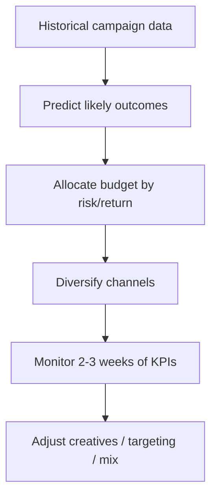
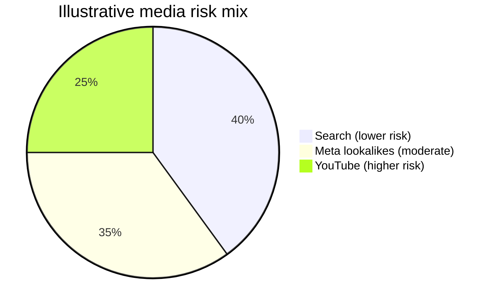

# Performance Marketing as Investment Banking

## Intuition First

Performance marketing is capital allocation under uncertainty. Like investment banking and portfolio management, you use **historical data**, **risk appetite**, and **diversification** to place media spend where expected return justifies risk — then you **monitor**, and cut or double down with good timing. Ads are not "set and forget"; they are managed positions.

---

## The Analogy Map

| Investment banking / portfolio idea | Performance marketing parallel |
|-------------------------------------|--------------------------------|
| Historical performance & ratings | Past CTR, CVR, CPC, CPA by campaign |
| Predictions & market conditions | Predictive analytics, audience behaviour, platform dynamics |
| Risk appetite | Aggressive vs conservative vs hybrid media mix |
| Portfolio diversification | Multiple channels / formats so one failure does not wipe ROI |
| Loss management | Stop or fix tanking campaigns before spend compounds |
| Timing of trades | Do not react too early or too late to KPI moves |

Better data → better predictions → smarter budget allocation.

---

## Risk Profiles in Media Mix

| Risk style | Investing metaphor | Performance marketing example | Character |
|------------|--------------------|-------------------------------|-----------|
| **Aggressive** | High-risk stocks / bonds | **YouTube ads** | High upside if storytelling and likability work; higher variance |
| **Conservative** | Low-risk instruments | **Google Search ads** | Users already state intent; more predictable; lower risk |
| **Moderate / hybrid** | Balanced instruments | **Meta (Facebook) video + lookalike audiences** | Broader reach than pure Search; anchored on similarities to existing customers |

**Marketing example portfolio**:

1. Search ads for "safer" intent-driven returns
2. Meta lookalike video for moderate scale
3. YouTube for higher-risk brand storytelling upside

If Search dips, Social and YouTube can offset — and vice versa. Concentration in one channel = concentration risk.

---

## Diversification Logic

Diversification is not random spreading. It is **testing** channels and tactics against your goals so you know what works for *your* business, not generic best practices alone.

---

## Managing Losses Like a Portfolio Manager

Advertising losses can erase profits as quickly as market losses erase gains. Discipline:

| Rule | Practice |
|------|----------|
| Wait for signal | Analyse **at least 2–3 weeks** of data before major calls |
| Do not panic-day-trade | Avoid decisions on a single day or one thin week |
| Keep continuous monitoring | Watch for sustained "tanking" (equivalent to accumulating losses) |
| Act on sustained KPI failure | Change creative, targeting, or bids when trends stay wrong |

### Core KPIs to Watch

| KPI | Full name | Warning signal | Typical response |
|-----|-----------|----------------|------------------|
| **CPC** | Cost per click | Rising for weeks without value | Tighten targeting; improve relevance |
| **CTR** | Click-through rate | Persistently low | Refresh visuals/copy; fix audience fit |
| **CPA** | Cost per action / acquisition | Persistently high | Optimise targeting + creative; improve conversion path |

---

## Timing: Too Early vs Too Late

| Mistake | Consequence |
|---------|-------------|
| **Act too early** | React to noise / short-term fluctuation; kill a learning campaign |
| **Act too late** | Compound losses; miss the window to repair creatives or targeting |

Great performance marketers stay close to data, adapt quickly once trends are clear, and know when to cut losses versus double down.

---

## Common Pitfalls / Exam Traps

- **Trap**: Equating performance marketing with "only creative" — data, risk, and timing are central.
- **Trap**: Calling Search "risky" and YouTube "safe"; in this framework Search is **more predictable**, YouTube **higher variance**.
- **Trap**: Judging campaigns on 1–2 days of data.
- **Trap**: Putting 100% of budget in one channel (no diversification).
- **Trap**: Watching vanity metrics only; ignore CPC, CTR, and CPA trends together.
- **Trap**: Confusing Meta lookalikes with pure cold broad prospecting — lookalikes sit in the **moderate** risk band because they mirror existing customers.

---

## Quick Revision Summary

- Performance marketing ≈ investment banking: data, prediction, risk, diversification, loss control, timing
- Aggressive: YouTube (story-dependent); Conservative: Search (intent); Moderate: Meta lookalike video
- Diversify so one channel’s failure does not wipe results
- Use **2–3 weeks** of data; key KPIs = CPC, CTR, CPA
- Do not decide too early or too late — manage the portfolio continuously
