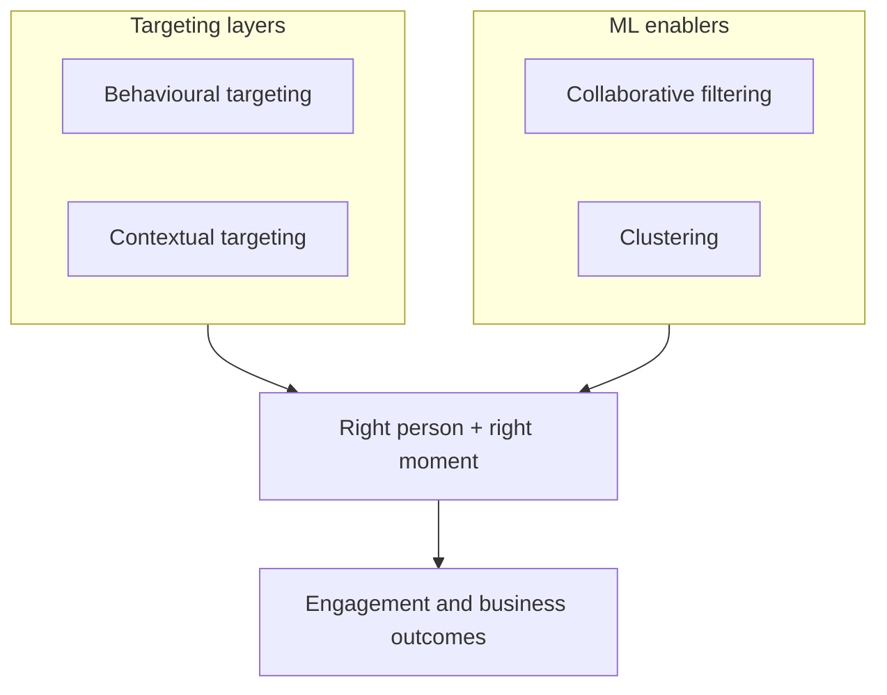

# Week 10 Summary: Targeting, Context, and Machine Learning in Digital Ads

## Intuition First

Digital ad success is not only creative craft — it is placing the **right message** with the **right person** at the **right moment**. This module’s spine is how behavioural signals, contextual signals, and machine learning techniques combine so campaigns feel personalised and drive business results.

---

## Recap Map

---

## Behavioural Targeting

**Idea**: Personalise ads from what users **already did** — actions, interests, interactions.

| Signal type | Role |
|-------------|------|
| Past visits / searches / social | Reveal interest patterns |
| Predicted affinity | Match creative and offer |

**Outcome**: Ads feel relevant because they follow demonstrated behaviour (e.g. fitness browsers see gym and supplement offers).

---

## Contextual Targeting

**Idea**: Serve ads based on the user’s **current context** (location, environment, content) — often **layered** with past behavioural data so the message fits *this* moment, not only history.

| Focus | Ensures |
|-------|---------|
| Present place / activity / content | Ad relevance **now** |
| Optional behavioural layer | Continuity with known interests without ignoring situation |

**Outcome**: Fewer mismatched impressions; better timing of offers.

---

## Machine Learning Concepts in the Ad Ecosystem

| Concept | Role in campaigns |
|---------|-------------------|
| **Collaborative filtering** | Recommend what similar users liked / bought → near-personalised suggestions |
| **Clustering** | Group similar users (e.g. high spenders vs frequent shoppers) → tailored creatives and offers |

Together, these approaches help build **hyper-personalised**, efficient campaigns: similar-user recommendations plus segment-level messaging.

---

## How It Fits the Broader Module

Across the week, Google Ads for e-commerce and apps, Shopping vs app campaign types, lab setup fluency, and the investment-banking risk lens all sit on this foundation:

| Layer | Module theme |
|-------|--------------|
| Products & goals | Search, Display, Shopping, App (ACI / ACE / pre-reg), Demand Gen |
| Capital allocation | Risk profiles, diversification, KPI timing (CPC, CTR, CPA) |
| Delivery science | Behavioural + contextual + ML |

Without targeting science, media budgets buy impressions; with it, they buy **qualified** attention.

---

## Common Pitfalls / Exam Traps

- **Trap**: Defining contextual targeting as "only past behaviour" — contextual is present-situation led (often with behavioural layering).
- **Trap**: Omitting collaborative filtering or clustering when asked how ML personalises ads.
- **Trap**: Treating personalisation as magic rather than patterned data + algorithms.
- **Trap**: Studying campaign UI types while forgetting why targeting math drives efficiency.

---

## Quick Revision Summary

- **Behavioural targeting**: ads from user actions, interests, interactions
- **Contextual targeting**: ads from current context (+ optional behavioural layer) for time/place fit
- **Collaborative filtering**: similar-user preference transfer → recommendations
- **Clustering**: group similar users → segment-specific creative and offers
- Combined: more targeted, personalised, effective campaigns and meaningful business results
