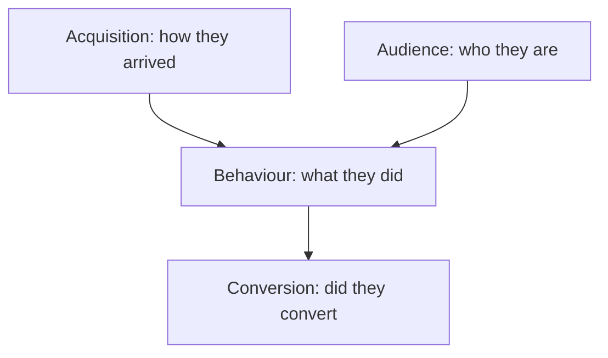

# Key Concepts and Metrics in Google Analytics

## Intuition First

GA4 measures nearly everything as events, then layers concepts like sessions, users, engagement, acquisition, and conversions on top. UTM parameters tell Analytics *which campaign link* brought a visit. Reports package these ideas so each report answers a specific marketing question.

---

## Core Measurement Concepts

| Concept | Meaning | Marketer Takeaway |
|---------|---------|-------------------|
| **Events** | Almost all activity is an event; some auto-tracked (page views, scroll), some custom (e.g. add to cart) | Configure business-critical actions |
| **Conversions / key events** | Valuable actions: purchase, sign-up, lead form | Not all events are equal |
| **Acquisition** | Where users come from (social, ads, direct, etc.) | Explains traffic origin |
| **Engagement** | Depth of interaction beyond simple land-and-leave | Prefer engaged sessions over vanity bounce alone |
| **Hits** | Interactions that send data to GA (page, event, commerce hits, etc.) | Building blocks of recorded activity |
| **Session** | Group of user hits within a time window; default ends after **30 minutes** of inactivity | Visit-level analysis unit |
| **User** | Repeat sessions tied to the same browser cookie / identifier | Person-level (approx.) view |
| **Goals** | How well the site meets objectives (destination, duration, pages/screens per session, events) | Align reporting to business targets |

---

## Engaged Session and Bounce Rate

An **engaged session** meets at least one of:

1. Lasts longer than **10 seconds**, or
2. Has **one or more** conversion / key events, or
3. Has **two or more** page or screen views

| Metric | Definition |
|--------|------------|
| **Bounce rate** | Percentage of sessions that were *not* engaged sessions |
| **Average session duration** | Average time users spend in a session on site or app |

---

## Source, Medium, and Channel

| Term | Answers | Examples |
|------|---------|----------|
| **Source** | Where traffic originates | Google, Facebook, LinkedIn, a referring domain |
| **Medium** | How traffic originated | Organic, paid/CPC, social, email, referral |
| **Channel** | Top-level grouping of source + medium | Organic Search, Direct, Social, Email, Paid Search |

---

## Report Types and the Questions They Answer

| Report type | Core question | Typical contents |
|-------------|---------------|------------------|
| **Acquisition** | How did users get here? | Traffic sources, Google Ads, Search Console insights |
| **Behaviour** | What did they do after arriving? | Site speed, events, page timings, site search |
| **Audience** | Who is visiting? | Demographics, interests, geo, new vs returning, tech/device |
| **Conversion** | Did they do what we wanted? | Goals, e-commerce, multichannel funnels, attribution, goal funnel visualisation |

---

## UTM Tracking (Urchin Tracking Module)

UTM codes are query parameters appended to a URL so GA receives campaign detail for that link.

### Five Campaign Dimensions

| Dimension | Role | Typical use |
|-----------|------|-------------|
| **Source** (`utm_source`) | Where visitors come from | Ad platform / publisher (e.g. facebook, google) |
| **Medium** (`utm_medium`) | Marketing medium | paid, cpc, email, social, organic |
| **Campaign** (`utm_campaign`) | Campaign name | monsoon_sale, brand_retarget |
| **Term** (`utm_term`) | Keyword or audience identifier | Paid search keywords / audiences |
| **Content** (`utm_content`) | Ad or creative variation | Distinguish creatives A vs B |

- Campaign-level tracking usually needs **source + medium + campaign**
- Ad-level depth uses **all five**
- **Source and medium** are the most critical pair for where + how analysis

### URL Markup Structure

Example shape:

`https://www.website.com/?utm_source=newssite.com&utm_medium=cpc&utm_campaign=brand_retarget`

| Symbol | Role |
|--------|------|
| `?` | Starts the query string |
| `=` | Separates parameter name and value |
| `&` | Separates multiple UTM parameters |

Referral fallback: if Site A links to Site B and Site B has GA, GA may report `source = websiteA.com`, `medium = referral` from the referrer URL when UTMs are absent.

### Marketing Example (Monsoon Sale on Meta)

| Parameter | Value |
|-----------|-------|
| Source | facebook / meta |
| Medium | paid / social |
| Campaign | monsoon_sale |

---

## Viewing Campaign Data in GA4 (Conceptual Path)

1. Open **Reports** in the left navigation
2. Go to **Acquisition → Traffic acquisition**
3. Review the table by **session default channel group** (Direct, Organic, Paid Search, etc.)
4. Change the primary dimension above the table when you need source, medium, or campaign views

---

## Common Pitfalls / Exam Traps

- **Trap**: Treating every event as a conversion. Conversions are key business actions only.
- **Trap**: Confusing bounce rate with "left after one second." In modern GA logic it is % of *non-engaged* sessions.
- **Trap**: Mixing up source and medium. Source = origin; medium = mechanism.
- **Trap**: Using only last-click channel reports when campaign UTMs are missing — unpaid links may look like Direct or Referral incorrectly.
- **Trap**: Forgetting `&` between UTM parameters or omitting `?` after the path — broken tags = lost campaign data.
- **Trap**: Analysing only source or only medium. The pair (or channel grouping) explains acquisition properly.

---

## Quick Revision Summary

- GA4 is event-centric; conversions = valuable key events
- Engaged session: >10s OR key event OR ≥2 page/screen views
- Default session timeout: 30 minutes of inactivity
- Source / medium / channel explain acquisition
- Main report families: acquisition, behaviour, audience, conversion
- UTMs: source, medium, campaign (+ term, content); join with `?` and `&`
- Source + medium are the most important tagging pair

---

**← [Previous](03-account-structure-transcript.md) · [Index](../README.md) · [Next](05-walk-through-of-sample-live-report-in-ga-transcript.md) →**
