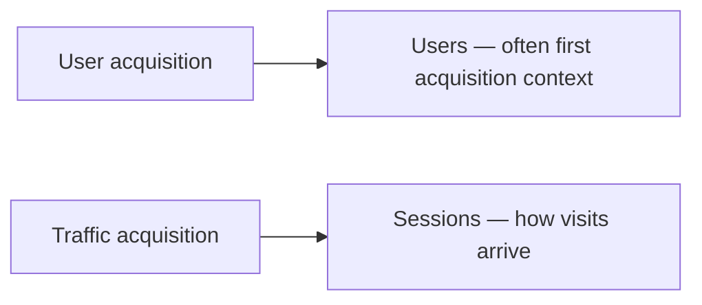

# Sample Live Google Analytics Report Walkthrough

## Intuition First

Reading GA well means knowing *which report answers which question*. The home and real-time views show activity now and recently; advertising and lifecycle reports connect channels to key events; Explore lets you build custom paths (valuable for e-commerce funnels). Always note that changing the attribution model can change credited conversion numbers.

---

## Home and Snapshot Metrics

| Area | What You Typically See |
|------|------------------------|
| Active / new users | Scale of current and recent audience |
| Average engagement time | How long people stay |
| Active users (last 30 minutes) | Near real-time activity, often by country |
| Engaged sessions per active user | Visit frequency / depth signal |
| Breakdowns | Country, new vs returning, and related cuts |

From the home cards you can drill into any metric for deeper breakdowns.

---

## Real-Time View

Useful for live monitoring:

- Where traffic is coming from (geography / channels)
- What users are doing right now (page views, engagement, clicks on key actions)

Ideal when launching a campaign or checking whether a spike is real.

---

## Advertising-Oriented Views

### Key Event Performance

Shows key events broken by acquisition patterns such as:

| Channel pattern | Meaning |
|-----------------|---------|
| Direct | Typed URL / bookmarks / unclassified direct |
| Paid Google ads | Google Ads traffic |
| Organic search | Unpaid search listings |
| Referral / cross-network | Other sites or cross-network placements |

Gives a consolidated view when you run Google Ads, Meta ads, and other paid media.

### Attribution Paths

Shows common conversion paths (e.g. 100% direct vs paths involving paid search) and how much each path pattern contributes to key events.

### Attribution Models Side-by-Side

Changing the model redistributes credit and can change reported key-event totals.

| Example observation | Implication |
|---------------------|-------------|
| Last-click key events ≈ 1,465,000 | One credit rule |
| Data-driven key events ≈ 1,479,000 | Slightly different credit → different totals |

**Exam-critical idea**: numbers move when the attribution model changes — not because reality changed, but because *credit rules* changed.

### Conversion Performance

Summarises conversions across Direct, Organic Search, Referral, Paid Search Network, and similar groupings — useful for multi-platform campaign review in one place.

---

## Custom / Explore Reporting

| Need | Approach |
|------|----------|
| E-commerce funnel | Path exploration or similar Explore templates |
| Funnel steps | Define events (session start → product view → …) |
| Flexible analysis | Pick a template; map event/page names yourself |

---

## Lifecycle: User Acquisition vs Traffic Acquisition

| Report | Focus | Rough interpretation |
|--------|--------|----------------------|
| **User acquisition** | New users / first-acquisition style view | Split of users (new/returning context) by channel; engagement time per active user |
| **Traffic acquisition** | Session-based | How sessions arrive, irrespective of treating each visit as a separate traffic event |

Conceptual difference used in practice: **user**-oriented views emphasise people (historically linked to identifiers); **traffic**-oriented views emphasise **sessions** and how interactions arrive.

Both typically show channel splits and engagement-related metrics.

---

## Marketing Example

An e-commerce brand launches a festive campaign. Real-time confirms India-heavy traffic ramping in. Key event performance shows Paid Search driving add-to-cart, but under last-click, Direct steals checkout credit. Switching to data-driven attribution lifts Paid Search's credited share — protecting the paid budget that last-click undercounted.

---

## Common Pitfalls / Exam Traps

- **Trap**: Reading home snapshot totals as campaign ROI without channel and conversion context.
- **Trap**: Assuming attribution model is fixed. Different models → different credited key events.
- **Trap**: Confusing user acquisition with traffic acquisition. Users ≠ sessions.
- **Trap**: Ignoring Explore/path reports for funnels. Standard tables may hide step drop-offs.
- **Trap**: Treating Direct as "no marketing." Direct often includes branded demand created earlier.

---

## Quick Revision Summary

- Home / real-time: active users, engagement, geography, live behaviour
- Ads views: key events, attribution paths, model comparison, conversion performance
- Explore: custom path / funnel analysis (strong for e-commerce)
- User acquisition ≈ people / first acquisition; traffic acquisition ≈ sessions
- Changing attribution models changes credited conversion counts

---

**← [Previous](04-key-concepts-and-metrics-transcript.md) · [Index](../README.md) · [Next](06-attribution-model-concept-with-example-transcript.md) →**
