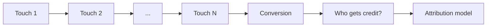
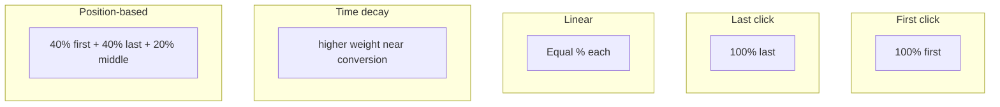

# Attribution Models: Concept and Examples

## Intuition First

Customers rarely convert after one ad. Research often cites roughly **seven digital touchpoints** before purchase. Attribution modelling stitches those touchpoints together and decides how much conversion credit each channel receives — so budgets reflect real contribution, not just the last click.

---

## Why Attribution Exists

In an omnichannel, fragmented landscape, single-touch thinking misallocates spend. Attribution is the framework that answers *contribution*, not just *last interaction*.

---

## Two Categories of Attribution

| Category | How credit is set | Examples |
|----------|-------------------|----------|
| **Rule-based** | Fixed human-defined rules | First click, last click, linear, time decay, position-based |
| **Non-rule-based** | Algorithm / ML from observed behaviour | Data-driven attribution |

---

## Rule-Based Models

Assume a journey: **Google Ad → Website form → Webinar → Email click → Facebook retargeting → Purchase**

| Model | Credit logic | Who wins in the example |
|-------|--------------|-------------------------|
| **First click / first touch** | 100% to the first touchpoint | Google Ad only |
| **Last click** | 100% to the final touchpoint before conversion | Facebook retargeting only |
| **Linear** | Equal share across all touchpoints | Each of 5 touches gets 20% |
| **Time decay** | More credit to touches closer to conversion | Email / Facebook get more; early Google Ad less |
| **Position-based (U-shaped)** | ~40% first + ~40% last; remaining ~20% split among middle | Google Ad and Facebook heavy; form, webinar, email share the middle |

### Position-Based Detail

- Roughly **40%** to first touch and **40%** to last touch
- Remaining **~20%** split evenly across middle touchpoints
- Values in examples may be stated as ~30–40% for ends and ~10% each for three middle steps — same U-shaped idea

---

## Story Metaphor: Assigning Credit for a Relationship

A simple analogy (wedding-toast credit) maps friends to touch roles:

| Character role | Journey role | Models that favour them |
|----------------|--------------|-------------------------|
| Friend who first introduces the couple | First touch / awareness | First click |
| Friend who hosts a later meetup | Mid-funnel nurture | Linear / middle of U-shape |
| Friend who pushes the final proposal | Last push before "convert" | Last click; heavy under time decay |

| Model | "Who gets thanked" |
|-------|--------------------|
| Last click | Only the last encourager |
| First click | Only the first introducer |
| Linear | First, middle, and last encouragers equally |
| Time decay | Most to the last encourager, then middle, then first |

**Takeaway**: pick (and state) your attribution model deliberately — do not leave credit ambiguous.

---

## Data-Driven Attribution (Non-Rule-Based)

| Feature | Description |
|---------|-------------|
| Engine | Machine learning / AI |
| Logic | Learns from real conversion paths and behavioural signals |
| Advantage | More adaptive credit than fixed rules; less human bias in weights |

Data-driven models redistribute credit based on how touchpoints actually change conversion probability in your data — not on a pre-set percentage table.

---

## Marketing Example (Same Path, Different Budgets)

Path: Paid Search (first) → Blog → Email → Retargeting (last) → Purchase

| If finance uses… | Paid Search budget signal | Retargeting signal |
|------------------|---------------------------|--------------------|
| Last click | Underfunded awareness | Overfunded |
| First click | Overfunded awareness | Underfunded |
| Linear | Shared fairly by touch count | Shared fairly |
| Time decay | Moderate | Strong |
| Position-based | Strong (as first) | Strong (as last) |

Wrong model → wrong reallocation in the next quarter.

---

## Common Pitfalls / Exam Traps

- **Trap**: Believing last click is "the" true model. It ignores awareness and assist channels.
- **Trap**: Believing first click is always fair. It ignores closers that seal the sale.
- **Trap**: Confusing linear with time decay. Linear = equal; time decay = later gets more.
- **Trap**: Mixing up position-based with linear. Position-based is U-shaped (ends heavy), not flat.
- **Trap**: Forgetting data-driven is *non-rule-based*. It is ML over rules, not another fixed % split.
- **Trap**: Comparing conversion totals across models as if they were different sales. Same conversions; different credit.

---

## Quick Revision Summary

- ~7 touchpoints before purchase → multi-touch credit problem
- Rule-based: first, last, linear, time decay, position-based (U-shape ~40/20/40)
- Non-rule-based: data-driven (ML / real behaviour)
- First = awareness credit; last = closer credit; linear = equal; time decay = recent-heavy; U-shape = first+last heavy
- Model choice directly affects how marketers allocate budget

---

**← [Previous](05-walk-through-of-sample-live-report-in-ga-transcript.md) · [Index](../README.md) · [Next](07-summary-transcript.md) →**
