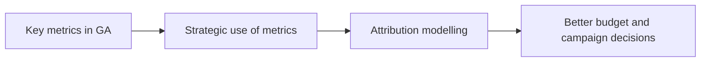

# Introduction to Google Analytics and Attribution Models

## Intuition First

Digital marketing without measurement is guesswork. Google Analytics turns site and app activity into metrics you can act on. Attribution modelling answers a harder question: when a customer saw seven ads before buying, which channel deserves credit — and budget?

---

## Why Digital Analytics Matters

| Need | What Analytics Provides |
|------|-------------------------|
| Track campaigns | Volume, quality, and path of traffic |
| Monitor performance | Engagement, drop-offs, conversion rates |
| Measure effectiveness | ROI and goal completion, not vanity clicks |
| Improve strategies | Data-backed fixes to creatives, pages, and spend |

With most marketing moving online, reading platform data well can make or break a campaign.

---

## Learning Focus for This Module

### 1. Key Metrics in Platforms like Google Analytics

- Metrics are not just numbers — they encode insight about success and gaps
- Learn *what* each metric means and *how* to use it for performance improvement
- Cover user engagement, traffic sources, and conversion rates

### 2. Attribution Modelling

- Process of assigning conversion credit across marketing touchpoints
- Customers often interact with multiple channels before converting
- Needed to evaluate channel effectiveness and allocate resources efficiently

---

## Marketing Example

An e-commerce brand runs Google Ads, Meta ads, and email. Sales rise, but without attribution you cannot tell whether to raise Google spend or email frequency. Analytics measures outcomes; attribution decides where credit (and next rupee) goes.

---

## Outcomes After This Module

- Assess campaign success with core GA concepts
- Optimise marketing strategies using measurement
- Deliver measurable results instead of gut-feel spend

---

## Common Pitfalls / Exam Traps

- **Trap**: Treating every metric as equally important. Engagement without conversion may not be success.
- **Trap**: Reading traffic volume without source quality. High visits from the wrong channel waste budget.
- **Trap**: Ignoring attribution in multi-touch journeys. Last-click alone undercredits awareness channels.
- **Trap**: Confusing measurement with strategy. Data informs decisions; it does not replace them.

---

## Quick Revision Summary

- Digital analytics tracks, monitors, and measures campaign effectiveness
- GA metrics support engagement, source, and conversion analysis
- Attribution assigns credit across touchpoints before a conversion
- Goal: data-driven decisions, smarter budget allocation, measurable results
