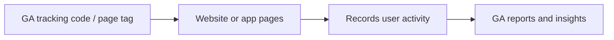

# Google Analytics: Foundational Knowledge

## Intuition First

Google Analytics (GA) is a free Google web analytics service that tracks and reports website and app traffic. For marketers, it answers three practical questions: who visits, what they do, and whether marketing goals are being met.

---

## What Google Analytics Does

| Capability | Marketer Benefit |
|------------|------------------|
| Track visitors | Who is on the site / app |
| Report engagement | How users interact with content |
| Measure marketing | Which channels drive valuable actions |
| Support optimisation | Continuous testing guided by data |

GA turns raw behavioural data into insights that improve ROI, user experience, and goal achievement.

---

## Questions Marketers Use GA to Answer

- How are users engaging with my site?
- How can outreach campaigns become more effective and accountable?
- Is my content working?
- Where do users enter and exit?
- How can I improve on-site experience?

---

## How Tracking Works: The Page Tag

- A small **JavaScript snippet** (page tag / tracking code) is added to pages or apps
- That code is the foundation of all data GA collects
- Without correct installation, reports are incomplete or empty

---

## Four Core Aspects Every Marketer Should Know

| Aspect | What It Monitors | Marketing Use |
|--------|------------------|---------------|
| **Behaviour tracking** | Popular pages, time on site, navigation paths | See the site through users' eyes |
| **Traffic sources** | Organic, social, paid, and other origins | Know which channels drive engagement |
| **Audience insights** | Demographics, location, devices | Tailor content and media to the right people |
| **Conversion tracking** | Purchases, sign-ups, form submissions | Confirm marketing achieves desired results |

Together these give a near-360° view of website and marketing performance.

---

## Why Marketers Rely on GA

| Reason | Practical Meaning |
|--------|-------------------|
| Improve ROI | Spotlight channels that deliver best results |
| Optimise UX | Find high bounce / falloff pages and fix them |
| Data-driven decisions | Use real-time and historical data for content and spend |
| Goal monitoring | Track e-commerce sales, sign-ups, form completions against objectives |

**Bottom line**: GA converts raw data into actionable insight so marketers can improve sites and campaigns.

---

## Marketing Example

A fashion retailer sees strong traffic but weak purchases. Behaviour reports show product pages with short visits and exits; traffic sources show most visits from a cheap display campaign. The marketer cuts spend on that channel, improves product page load and imagery, and rechecks conversion events — a classic GA feedback loop.

---

## Common Pitfalls / Exam Traps

- **Trap**: Equating high traffic with success. Volume without conversion or engagement can be wasted spend.
- **Trap**: Forgetting that the tracking code must be installed correctly. No tag, no trustworthy data.
- **Trap**: Ignoring bounce / falloff pages. High exits are a UX problem, not just a traffic problem.
- **Trap**: Celebrating channel traffic without conversion tracking. Visits are means; goals are ends.

---

## Quick Revision Summary

- GA = free Google service for website/app traffic and behaviour
- Works via a page-tag JavaScript tracking code
- Core pillars: behaviour, traffic sources, audience, conversions
- Helps ROI, UX, data-driven decisions, and goal monitoring
- Raw data → insights → smarter marketing
