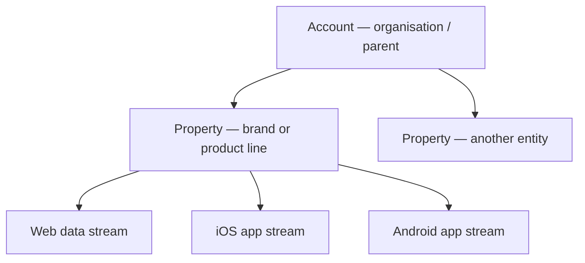
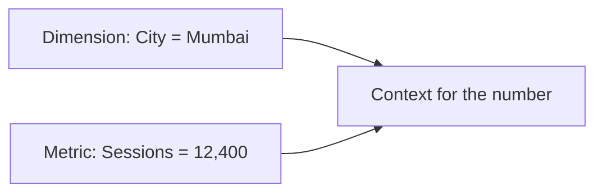

# Google Analytics Account Structure

## Intuition First

GA4 data is only as useful as how it is organised. The hierarchy **Account → Property → Data stream** tells you where company-wide settings live, where brand/product data is stored, and how each website or app feeds events into Analytics.

---

## GA4 Hierarchy: Three Levels

| Level | Role | Example (Nike-style) |
|-------|------|----------------------|
| **Account** | Parent container for the organisation | Nike's overarching GA account |
| **Property** | Specific business entity, brand, or product line | Nike Air as one property |
| **Data stream** | Channel that sends data from a touchpoint into GA | Web, iOS app, Android app |

Each property can have up to three stream types: **web**, **iOS**, and **Android**. Users may browse on web and purchase on app — separate streams still roll up under one property for cross-platform analysis when set up correctly.

---

## Pizza Store Example

| Level | Pizza Store Mapping |
|-------|---------------------|
| Account | The pizza business as one organisation |
| Property 1 | Customer-facing website / ordering app |
| Property 2 | Delivery-driver app / portal |
| Data streams | Web and/or app streams under each property |

This keeps customer journeys and driver app behaviour separate while holding both under one company account.

---

## GA4 vs Older Analytics: Event-Based Model

| Older GA focus | GA4 focus |
|----------------|-----------|
| Sessions and page views as the centre of the model | **Event-based** data model |
| Page-centric thinking | Every interaction can be an event |

In GA4, clicks, video views, purchases, and similar actions are recorded as **events**. That is the unit of measurement for analysis.

---

## Dimensions vs Metrics

| Concept | Answers | Form | Examples |
|---------|---------|------|----------|
| **Dimension** | *What?* (attributes / characteristics) | Usually text / categorical | City, device, category, browser, traffic source |
| **Metric** | *How many?* (quantitative measure) | Numbers | Total users, sessions, event counts |

**Together**: dimensions provide context; metrics provide scale and performance numbers.

---

## Marketing Example

A multi-brand FMCG holding company keeps one GA **account**. Each brand is a **property**. The D2C site, iOS app, and Android app for one brand are three **data streams**. Marketing can compare engagement by device (**dimension**) using sessions and purchases (**metrics**) without mixing unrelated brands' data.

---

## Common Pitfalls / Exam Traps

- **Trap**: Confusing account with property. Account = organisation; property = brand/entity being measured.
- **Trap**: Assuming one stream equals one company. Streams are per platform (web/iOS/Android) under a property.
- **Trap**: Mixing up dimensions and metrics. Dimensions describe; metrics count/measure.
- **Trap**: Thinking GA4 still centres only on page views. GA4 is event-based.

---

## Quick Revision Summary

- Structure: Account → Property → Data stream (web / iOS / Android)
- Cross-platform users can be understood via multiple streams under one property
- GA4 uses an event-based data model
- Dimensions = *what*; metrics = *how many*
- Correct structure is the foundation for collection, organisation, and analysis
