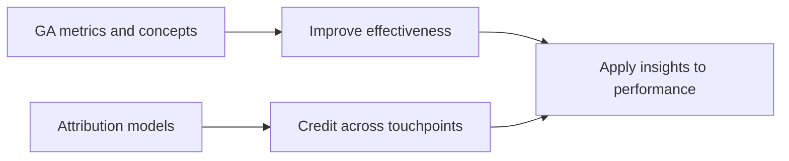

# Week Summary: Google Analytics and Attribution

## Intuition First

This module ties measurement to money decisions. Google Analytics supplies the metrics that show what users do; attribution models decide how conversion credit is shared across the many touchpoints that preceded a sale. Together they turn digital marketing from activity into accountable performance.

---

## What This Module Covered

| Theme | Core takeaway |
|-------|----------------|
| **Key GA metrics** | Engagement, acquisition, sessions/users, conversions — used to judge and improve campaigns |
| **Strategic use** | Metrics guide experience fixes, channel focus, and goal tracking — not vanity reporting |
| **Attribution modelling** | Rule-based and data-driven methods assign conversion credit across touchpoints |
| **Application readiness** | Use these foundations to improve marketing performance with measurement |

---

## Integrated Mental Model

| Question | Tool / idea |
|----------|-------------|
| What happened on site/app? | GA events, sessions, engagement, reports |
| Where did users come from? | Source, medium, channel, UTMs |
| Did they complete valued actions? | Key events / conversions |
| Which touchpoints deserve credit? | Attribution models |
| Where should next budget go? | Credit + ROI reading of channels |

---

## Marketing Example

A performance marketer reviews GA key events by channel, finds high assisted paths through Paid Search → Email → Retargeting, and rejects last-click-only budget cuts to Paid Search. Attribution literacy prevents killing the upper funnel that made retargeting look "efficient."

---

## Common Pitfalls / Exam Traps

- **Trap**: Memorising metrics without linking them to decisions. Measurement must change budgets or UX.
- **Trap**: Separating GA and attribution in your mind. Attribution is how multi-channel GA journeys get scored.
- **Trap**: Applying insights once. Analytics is continuous optimisation, not a one-time report.

---

## Quick Revision Summary

- Module focus: GA metrics + attribution for digital marketing effectiveness
- Metrics explain engagement, traffic, and conversions
- Attribution assigns credit across multi-touch journeys
- Outcome: apply analytics insights to improve marketing performance
