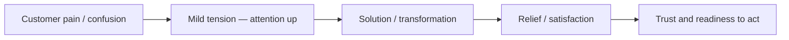

# Real-World Business Storytelling

## Intuition First

World-class storytellers (Pixar, Disney, great product marketers) do not keep audiences at one emotional pitch. They move people between warm joy and vulnerability, tension and release. Business storytelling uses the same wiring — subtly — so the audience *feels* the customer’s pain and then the relief of the solution, and therefore trusts and acts.

---

## Emotional Contrast Effect

Rapid shifts in emotion deepen impact. The simplified science:

| Emotional moment | Chemical signal (simplified) | Audience effect |
|------------------|------------------------------|-----------------|
| Happy / warm | Dopamine | Attention, motivation, engagement |
| Sad / vulnerable | Oxytocin | Empathy, trust, connection |

When these shifts occur close together, the story lands more deeply — which is why certain film scenes stay for years.

**Business application:** open with user frustration → show relief after the solution. Emotion is not decoration; it helps the audience connect and act.

Practical ways to create this in marketing:

- Play a real customer-support moment (frustration becomes tangible)
- Use authentic user quotes or summarised research findings
- Pair one human quote with a slide of numbers so the data has a face

---

## Roller Coaster Effect

A flat story loses attention. A well-shaped story rises and falls like a roller coaster: tension and release keep the mind awake.

| Moment type | Chemical signal (simplified) | Effect |
|-------------|------------------------------|--------|
| Light / hopeful | Endorphins | Relaxation, openness to new ideas |
| Tension / uncertainty | Cortisol | Sharper attention, sense of urgency |

**Film parallel:** sequences that move quickly from joy (falling in love) to sadness create lasting bonds with the audience (*Up*-style opening contrast).

**Marketing parallel:**

1. Describe confusion, frustration, or inefficiency (tension)
2. Show clarity, relief, or improvement after your solution (release)

Without intentional highs and lows, attention levels out and fades.

---

## Authenticity Over Cleverness

**Rule:** don’t try to be clever — try to be real. Authenticity builds trust faster than polished perfection.

| Source of authenticity | Why it works |
|------------------------|--------------|
| Creators’ real fears / life (*Finding Nemo* ← parental anxiety, overprotectiveness, learning to let go) | Genuine emotion becomes the heart of the story |
| Real customer experiences | Relatable proof, not slogans |
| Real team efforts and lessons learned | Credible culture and brand |

**Business translation:** instead of stating a mission as a poster line, make people *feel* it through a real story. “Customer-obsessed” is a claim; a specific recovery story is evidence.

---

## Voice Modulation as a Storytelling Tool

Voice shapes emotional tone. Four useful vocal tones (linked to element metaphors):

| Tone | Character | Strategic use |
|------|-----------|---------------|
| Earth | Deep, grounded, authoritative | Strategy reviews, risk, governance |
| Water | Calm, gentle, flowing energy | Empathy, support narratives, sensitive topics |
| Fire | Energetic, passionate, inspiring | Launches, vision pitches, rally moments |
| Metal | Bright, confident, enthusiastic | Wins, momentum updates, sales demos |

Match tone to story beat: earth for stakes, fire for possibility, water for customer pain, metal for confident close.

---

## Stories Move People — Use That Power Wisely

A core insight from documentary storytelling about Silicon Valley ambition: **stories carry emotions that data does not**, and emotions drive people toward both good and bad actions. For marketers, the implication is dual:

1. If you want messages remembered and acted on, speak to mind **and** heart
2. Emotional power without truth or responsibility becomes manipulation — authenticity and evidence keep stories ethical

---

## Putting It Together for Marketing Narratives

| Beat | Technique | Example |
|------|-----------|---------|
| Open | Tension / cortisol lift | “Checkout errors spiked on mobile last week…” |
| Humanise | Quote or support clip | “…one user: ‘I just wanted to buy birthday gifts’” |
| Contrast | Problem → possibility | Old flow vs fixed flow |
| Release | Endorphins / dopamine | Clear cart success, thank-you moment |
| Close | Authentic proof | Real metric + real name/story (with permission) |

---

## Common Pitfalls / Exam Traps

- **Trap**: Equating “emotional storytelling” with melodrama. Professional use is *subtle* contrast — pain then relief — not theatrical overacting.
- **Trap**: Mixing chemical pairings. Emotional contrast (happy ↔ sad) is often linked to dopamine/oxytocin; roller-coaster (hope ↔ tension) to endorphins/cortisol.
- **Trap**: Clever taglines over authentic stories. Slogans without lived proof underperform on trust.
- **Trap**: Monotone delivery of an emotionally structured story. Structure and voice should reinforce each other.
- **Trap**: Treating emotion as optional. Emotion nurtures understanding and drives action; it is part of how messages stick.

---

## Quick Revision Summary

- Emotional contrast: joy/vulnerability shifts deepen engagement (dopamine / oxytocin framing)
- Roller coaster: alternate tension and release (cortisol / endorphins) to hold attention
- Business pattern: customer pain → solution relief
- Authenticity > cleverness; root stories in real experiences
- Voice tones: earth, water, fire, metal — each has a strategic job
- Speak to mind and heart so the message is remembered, felt, and acted upon

---

**← [Previous](02-storytelling-formats-styles-tactics-and-use-cases-transcript.md) · [Index](../README.md) · [Next](04-thinking-models-transcript.md) →**
