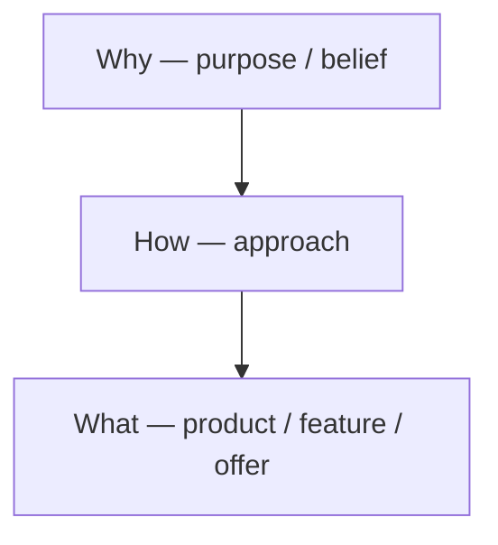
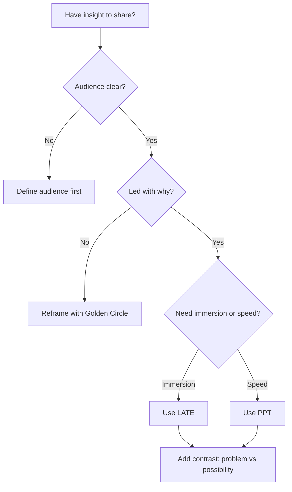

# Storytelling Formats, Styles, Tactics, and Use Cases

## Intuition First

Facts inform; stories make people *feel* and therefore remember. “Customer service needs improvement” is data. Describing a customer who tried repeatedly to get help, grew frustrated, and was finally helped by one employee who listened — that creates empathy. In marketing, the job is often to turn the same insight into a narrative the audience can visualise and carry with them.

---

## Why Stories Capture Attention

Stories activate imagination in a way lists of facts do not. They help people:

- Empathise with others’ situations
- Visualise scenes and outcomes
- Remember messages long after details fade

**Marketing example:** “Cart abandonment is 72%” vs “Maya added running shoes, hesitated at shipping cost, and left — three times this month.” The second line makes the metric actionable for creative, UX, and media teams.

---

## Rule 1: Know Your Audience (Love Letter Rule)

Designing a story without a clear audience is like writing a **love letter addressed “to whom it may concern.”** Precision of audience equals impact.

| Question | Why it matters |
|----------|----------------|
| Who is listening? | CEO vs media buyer vs consumer need different stakes |
| What do they fear / want? | Sets the emotional hook |
| What decision should they make? | Shapes the ending of the story |

---

## Rule 2: Start with the Why (Golden Circle)

Simon Sinek’s **Golden Circle**: **Why → How → What**.

Business communicators often jump to *what* (feature, change, SKU). Without *why*, the message lacks context and emotional connection.

| Weak open | Stronger open |
|-----------|---------------|
| “We are launching a new feature.” | “Users have wasted hours on the same workflow. This feature cuts that friction and gives them time back.” |

The second paints the pain, justifies the solution, and invites care.

---

## Power of Contrast

**Contrast** is movement between two states: what is vs what could be; problem vs possibility. It creates narrative tension, discovery, and resolution — the same rhythm real life uses.

**Classic product narrative (iPhone launch style):**

1. Competitors exist — but fall short in specific ways
2. Current phones struggle with software limits
3. Here is the revolutionary interface / OS that resolves the gap

Back-and-forth (challenge → solution) made the reveal feel inevitable and unforgettable — not a feature dump, but a narrative.

**Marketing use:** before/after creatives, “old way / new way” landing pages, retention stories (pain of churn → relief of fix).

---

## LATE Framework (Bring Scenes to Life)

**LATE** = Location, Action, Thoughts, Emotions, Dialogue. Use it to slow a moment down so the audience can almost *see* it.

| Element | Role | Tip |
|---------|------|-----|
| **L**ocation | Sets the scene | Enough place sense; avoid overload |
| **A**ction | What people do | Creates forward momentum |
| **T**houghts | Internal perspective | Raw, unfiltered cognition |
| **E**motions | Human reactions | Show via behaviour / body language, or name them |
| **Dialogue** | Voices in the moment | Makes the scene audible and alive |

Together, LATE turns an informational update into a human scene.

**Marketing example (support story):** Location = chat at 11:40 pm → Action = customer retries refund → Thoughts = “Is this even real?” → Emotions = frustration then relief → Dialogue = agent’s clarifying question that unlocks the fix.

---

## PPT Framework (Quick Story Anchor)

If LATE is detailed, **PPT** is fast scaffolding:

| Letter | Meaning | Example |
|--------|---------|---------|
| **P**erson | Who the story is about | A new app user |
| **P**rotagonist | The struggle / focal tension | Struggle with onboarding |
| **T**ime | When it happens | First 5 minutes in-app |

**Compressed story:** A new customer opens the app, spends five minutes tapping around unsure where to begin, and nearly leaves. Conclusion: onboarding must be more intuitive.

PPT is ideal for standup updates, stakeholder Slack notes, and short pitch slides.

---

## Choosing the Right Tool

| Tool | Best when… |
|------|------------|
| Love letter rule | Scope / stakeholder alignment is unclear |
| Golden Circle | Product/feature talk lacks purpose |
| Contrast | You need tension and a memorable reveal |
| LATE | You need emotional immersion (case study, brand film brief) |
| PPT | You need a clean 2–3 sentence business story fast |

---

## Common Pitfalls / Exam Traps

- **Trap**: Confusing Golden Circle with “start with features.” Correct order is **Why → How → What**.
- **Trap**: Mixing LATE with PPT. LATE = Location, Action, Thoughts, Emotions, Dialogue. PPT = Person, Protagonist, Time.
- **Trap**: Listing all LATE elements with equal length. Location should orient, not become a travelogue.
- **Trap**: Using contrast without a resolution. Tension alone frustrates; marketing stories need the “possibility” side.
- **Trap**: Audience-agnostic storytelling. Same case study fails for CFO and for creatives if stakes are not retuned.

---

## Quick Revision Summary

- Stories convert information into something people feel, visualise, and remember
- Love letter rule: no audience → no impact
- Golden Circle: lead with Why, then How, then What
- Contrast: problem ↔ possibility creates motion and engagement
- LATE: Location, Action, Thoughts, Emotions, Dialogue (immersive scenes)
- PPT: Person, Protagonist, Time (quick business-story foundation)
- Pick depth (LATE) vs speed (PPT); always keep audience and why clear
