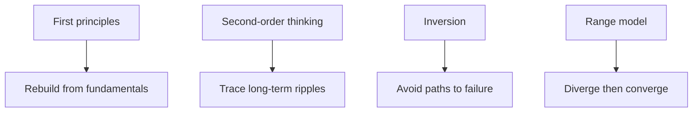
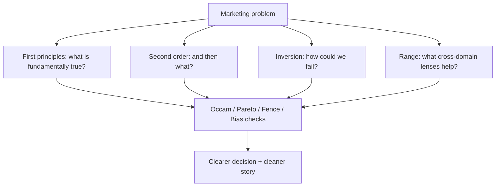

# Thinking Models for Clearer Marketing Decisions

## Intuition First

Storytelling persuades; thinking models decide *what is worth persuading for*. The best marketers do not only ask “How do we say this?” — they ask “Have we broken the problem down correctly? What happens next? How could this fail?” These models are practical lenses, not academic ornaments.

---

## Four Core Thinking Models

### 1. First Principles Thinking

**Idea:** Break a problem to fundamental truths, then rebuild a solution from the ground up — instead of copying analogies, benchmarks, or “how it’s always been done.”

| Aspect | Detail |
|--------|--------|
| Popularised by | Elon Musk (widely associated example) |
| Goal | Innovation; remove baggage of analogy |
| Method | Question assumptions → isolate basics → redesign |

**SpaceX example:** Buying rockets was expensive. Cost of raw materials (aluminium, titanium, copper, etc.) was only a small fraction of market price. By sourcing and redesigning manufacturing, rockets were built at a fraction of the prior cost.

**Marketing example:** Instead of “competitors spend 5% of revenue on ads, so we should too,” ask: What is the fundamental job of acquisition spend? What is true CAC needed for payback at our margins? Rebuild budget from unit economics, not category folklore.

---

### 2. Second-Order Thinking

**Idea:** First-order thinking stops at the immediate outcome. Second-order thinking asks **“And then what?”** — the ripple effects and long-term consequences.

| Aspect | Detail |
|--------|--------|
| Associated with | Ray Dalio (among others) |
| Goal | Avoid short-term fixes that create long-term disasters |

**Classic policy trap:** A city bounty for killed rats seemed smart — until people *bred* rats to collect rewards. The first-order win became a second-order failure.

**Marketing example:** Heavy discounting lifts this month’s sales (first order) → trains customers to wait for deals, erodes brand premium, and hurts full-price conversion (second order). Ask: after the coupon ends, *then what?*

---

### 3. Inversion Thinking

**Idea:** Approach the problem backward. Instead of “How do I succeed?” ask “How would I fail?” — then avoid those paths.

| Aspect | Detail |
|--------|--------|
| Championed by | Charlie Munger |
| Famous line | Want to know where you’d “die” so you never go there |
| Goal | Surface hidden risks and obstacles |

**Personal:** Happy marriage — invert to “What would ruin it?” (dishonesty, neglect, poor communication) and avoid those.

**Work / marketing:** “How could this campaign / launch fail?” Score failure modes by severity × probability (quality, proactivity, stakeholder relations, deadlines, creative relevance, tracking integrity). Focus effort where failure is most likely.

---

### 4. Range Model (Diverge → Converge)

**Idea (David Epstein’s *Range* lineage):** Success often comes from breadth of experience, not only narrow specialisation.

| Phase | What you do |
|-------|-------------|
| **Divergence** | Explore different fields, skills, perspectives |
| **Convergence** | Bring ideas together to solve a specific problem |

**Goal:** Integrated, adaptive thinking across domains.

**Example:** A software engineer with psychology and art background may design a UI that is technically sound *and* emotionally intuitive — pure coding expertise can miss the human element.

**Marketing example:** Campaign strategy that blends behavioural science + media maths + cultural literacy usually beats “only media buying” or “only creative” silos.

---

## Practical Models That Cut Through Complexity

### Occam’s Razor

When multiple explanations fit the outcome, prefer the **simplest** — fewest assumptions. Avoid elaborate theories when a straightforward account works.

**Fence example:** Knocked-down fence → wild conspiracy vs strong wind. Start with the simpler explanation.

**Marketing:** CPA spiked — is it a rare bot apocalypse, or did someone break the UTM / pixel? Check the simple tracking break first.

---

### Pareto Principle (80/20)

Roughly **80% of outcomes** come from **20% of causes**. Focus effort on the vital few.

| Domain | Typical pattern |
|--------|-----------------|
| Business | ~80% of profits from ~20% of customers |
| Personal | Much happiness from a small set of relationships/activities |
| Marketing | Often: small % of creatives, keywords, or SKUs drive most results |

Identify the critical 20% and double down; stop spreading effort thin.

---

### Chesterton’s Fence

**Rule:** Never remove a rule, process, or tradition until you understand why it exists. Avoid “reformer’s luck” — fixing a small annoyance and creating a bigger problem.

**Example:** New manager cancels a hated weekly meeting → cross-department alignment collapses because that meeting was the only shared forum.

**Marketing:** Don’t delete a “legacy” discount tier or brand safety rule until you know which failure mode it was preventing.

---

### Survivorship Bias

**Trap:** Studying only successes and ignoring unseen failures.

**WWII aircraft example (Abraham Wald):** Bullet holes on *returning* planes showed where planes could survive hits. Armor needed where holes were *absent* — those hits brought planes down.

**Marketing:** Studying only viral campaigns or unicorn startups without dead campaigns/failed startups skews your playbook. “Everyone who succeeded did X” ignores everyone who did X and failed.

---

### Base Rate Neglect

**Trap:** Ignoring historical base rates in favour of vivid stories.

**Example:** Wanting to become a professional YouTuber after seeing huge success stories — while the base rate of that success is extremely low.

Survivorship bias shows only winners; base rate neglect makes people assume they will be the exception without evidence.

**Marketing:** “This influencer 10×’d a brand” is vivid; the base rate of influencer ROI for *your* category and audience may be modest. Ground forecasts in averages, then adjust with evidence.

---

## How the Models Relate

---

## Further Reading (Optional Depth)

| Book | Why relevant |
|------|----------------|
| *Atlas of the Heart* (Brené Brown) | Emotion vocabulary for storytelling |
| *The Power of Now* | Attention and clarity |
| *Clear Thinking* | Decision discipline |
| *The Game of Life* | Experiments / systemic play |

---

## Common Pitfalls / Exam Traps

- **Trap**: Confusing first principles with first-*order* thinking. First principles = rebuild from fundamentals. First-order = only immediate effects (the shallow half of second-order thinking).
- **Trap**: Calling Pareto “80% effort → 80% results.” Correct intuition: ~20% of inputs drive ~80% of outcomes.
- **Trap**: Misnaming Chesterton’s Fence as permission to never change. It says: understand the fence *before* removing it.
- **Trap**: Reinforcing “what survivors show” (survivorship bias). Absence of evidence in the failed set is the clue.
- **Trap**: Using inversion only for personal life questions. It is equally powerful for campaigns, launches, and org roles.

---

## Quick Revision Summary

- First principles: strip assumptions; rebuild from basics (SpaceX materials logic)
- Second-order: ask “and then what?” to catch ripple effects
- Inversion: map failure modes, then avoid them (Munger)
- Range: diverge across domains, then converge on the problem
- Occam: prefer simplest adequate explanation
- Pareto 80/20: focus the vital few inputs
- Chesterton’s Fence: understand before removing
- Survivorship bias + base rate neglect: don’t let vivid winners erase the unseen and the averages
