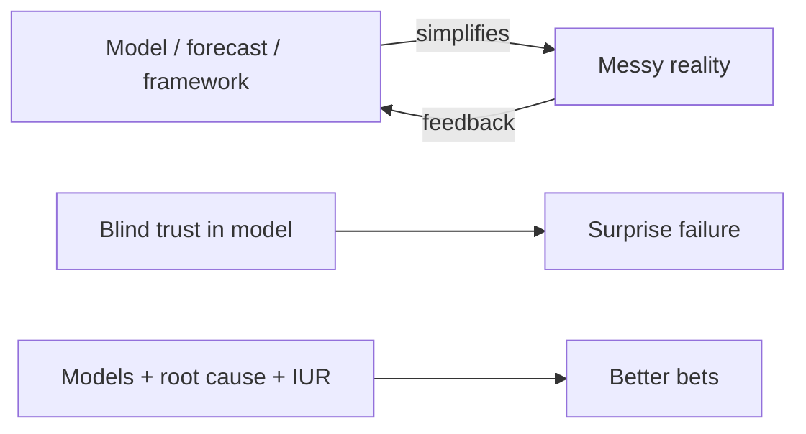
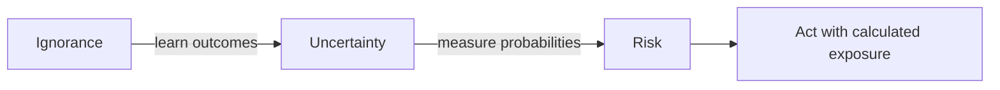

# The Map Is Not the Territory, Five Whys, and the IUR Model

## Intuition First

Every framework in this module is a *map* — useful, portable, incomplete. Reality is the *territory*. Blind faith in dashboards, forecasts, or playbooks is how good-looking plans fail in market. The fix is not abandoning models; it is treating them as tools, digging to root causes (**Five Whys**), and knowing whether you face ignorance, uncertainty, or risk (**IUR**) before you bet the budget.

---

## The Map Is Not the Territory

From Alfred Korzybski’s idea: any model, framework, or representation is a simplified version of reality — **the model is not the reality**. Matters because models always leave something out.

| Map (model) | Territory (reality) |
|-------------|---------------------|
| Revenue projection chart | Actual demand, competition, execution |
| “Next Taco Bell” franchise playbook | Consumer behaviour that did not follow the script |
| Tesla-style investment thesis from neat slides | Live markets, regulation, sentiment, timing |

**1980s reminder:** concepts pitched as inevitable category winners (e.g. “the next Taco Bell”) can fail despite convincing forecasts. The playbook looked right; reality did not follow.

**Marketing takeaway:** treat CAC models, attribution reports, and persona decks as maps. Validate against behaviour in the territory (tests, fieldwork, post-mortems).

---

## Five Whys (Root Cause Discipline)

**Origin:** Associated with Sakichi Toyoda / Toyota problem-solving. When a problem occurs, ask **why** repeatedly (often about five times) until you reach a root cause you can act on — not just a symptom.

### Worked Example (Personal Habit → System Failure)

| Step | Why? | Answer |
|------|------|--------|
| 1 | Why did I run a red light? | I was late |
| 2 | Why was I late? | I woke up late |
| 3 | Why wake late? | Alarm did not work |
| 4 | Why no alarm? | Battery was dead |
| 5 | Why dead battery? | I never check / replace it |

**Surface story:** traffic / lateness. **Root:** habit and maintenance failure.

### Marketing Example

| Step | Why? | Answer |
|------|------|--------|
| 1 | Why did ROAS collapse? | Purchases dropped |
| 2 | Why fewer purchases? | Checkout completions fell |
| 3 | Why checkout fall? | Payment errors spiked on mobile |
| 4 | Why payment errors? | New SDK conflict after app release |
| 5 | Why shipped with conflict? | No pre-release payment smoke test on device matrix |

**Trap avoided:** blaming “creative fatigue” (map) when the territory was a broken checkout path.

**How to use well:**

- Stop when you hit a **controllable root**, not an infinite philosophy chain
- Prefer causes you can fix with process, product, or incentive design
- Combine with data checks so “whys” are not just opinions

---

## IUR Model: Ignorance, Uncertainty, Risk

| State | Outcomes | Probabilities | Decision quality |
|-------|----------|---------------|------------------|
| **Ignorance** | Unknown | Unknown | Guessing in the dark |
| **Uncertainty** | Somewhat known | Unclear | Scenarios without clean odds |
| **Risk** | Known | Measurable | Calculated bets possible |

### Car-Buying Analogy

| Situation | IUR state |
|-----------|-----------|
| Buy from a stranger with no inspection | **Ignorance** |
| See the car online, little history | **Uncertainty** |
| Full report + inspection done | **Risk** (you can reason with numbers) |

**Goal of good thinking:** not to eliminate all risk, but to move from **ignorance → uncertainty → calculated risk**.

### Marketing Mapping

| Marketing situation | Likely IUR state | Move to improve |
|---------------------|------------------|-----------------|
| Entering a new country with no prior data | Ignorance | Small pilots, qualitative research |
| Launching a variant of a known product | Uncertainty | A/B tests, holdouts, stepwise scale |
| Media buy with known historical CPA bands | Risk | Optimise within measured ranges |

---

## How These Ideas Sit Under All Other Models

| Tool | Role under “map ≠ territory” |
|------|------------------------------|
| First principles / inversion / second-order | Better maps — still not territory |
| Five Whys | Dig beneath the map’s symptoms |
| IUR | Know how much *unknown* remains before you scale spend |
| Experiments / authenticity / customer reality | Touch the territory |

---

## Optional Depth Reading

| Book | Angle |
|------|--------|
| *Against the Gods* (Peter L. Bernstein) | History of risk and probability |
| *Fooled by Randomness* (Nassim Nicholas Taleb) | Luck, narrative, and misread patterns |

---

## Common Pitfalls / Exam Traps

- **Trap**: Treating frameworks as reality. Exam phrase / principle: **the map is not the territory**.
- **Trap**: Stopping Five Whys at the first convenient answer (“we were late” / “competition intensified”). Dig to an actionable root.
- **Trap**: Confusing uncertainty with risk. Risk implies known, measurable probabilities; uncertainty does not.
- **Trap**: Trying to “eliminate risk” entirely. The goal is to *convert* ignorance/uncertainty into calculated risk.
- **Trap**: Mixing IUR labels: ignorance = both outcomes and probabilities unknown; uncertainty = outcomes somewhat known, probabilities unclear; risk = probabilities known/measurable.

---

## Quick Revision Summary

- Models simplify reality; never confuse map with territory
- Forecasts and playbooks can look perfect and still fail in market
- Five Whys: ask why repeatedly to reach root cause (Toyoda / Toyota lineage)
- Surface symptoms ≠ systemic causes — marketing post-mortems need roots
- IUR: Ignorance → Uncertainty → Risk
- Good thinking moves you toward calculated risk, not fantasy certainty
- Pair models with real-world feedback before large bets
