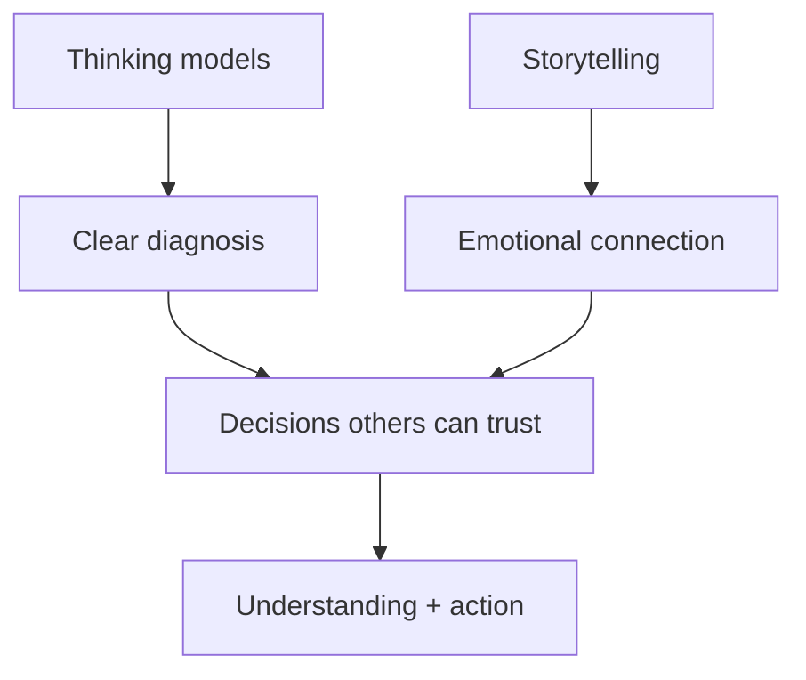

# Storytelling and Thinking Models: Module Summary

## Intuition First

This module’s core insight is simple: **storytelling connects emotionally; thinking models provide clarity**. Combined, they improve both the quality of decisions and the impact of how those decisions are communicated — so others can understand, trust, and act.

---

## Pillar 1: Storytelling as Structure, Not Decoration

Stories are not entertainment add-ons. They organise complex ideas, clarify scattered thoughts, and make information easier to understand and remember by engaging imagination and emotion.

| Without story | With story |
|---------------|------------|
| Data and facts sit flat | Ideas become experiences audiences can follow |
| Hard to recall | Messages stick |
| Weak connection | Emotional landing that facts alone cannot create |

Effective business stories typically:

1. Know the **audience**
2. Articulate the **why**
3. Make **problems and transformations** visible
4. Use practical techniques so updates, insights, and proposals feel human and relevant

---

## Pillar 2: Authenticity

The most impactful stories are rooted in **real experiences** — customers, teams, lessons learned — not polished slogans.

| Authentic | Generic |
|-----------|---------|
| Specific customer journey | “We put customers first” with no scene |
| Honest lessons from failure | Empty success theatre |
| Builds trust and resonance | Feels like brochure copy |

Authenticity makes the message more credible, meaningful, and memorable.

---

## Pillar 3: Thinking Models for Discipline

Models bring clarity to decision-making by giving structured ways to question assumptions, think beyond immediate outcomes, anticipate risk, and integrate ideas across domains.

| Model / idea | Job in one line |
|--------------|-----------------|
| First principles | Rebuild from fundamentals |
| Second-order thinking | Trace “and then what?” |
| Inversion | Avoid paths to failure |
| Range thinking | Diverge across domains, then converge |
| Occam / Pareto / Chesterton’s Fence | Simplify, focus, respect existing fences |
| Survivorship bias / base rate neglect | See what vivid stories hide |
| Map ≠ territory | Trust models humbly |
| Five Whys | Dig to root cause |
| IUR | Move ignorance → uncertainty → risk |

---

## The Combined Skill

| Alone | Weakness |
|-------|----------|
| Story without thinking | Persuades toward the wrong solution |
| Thinking without story | Correct answer that nobody adopts |
| Both together | Well-reasoned *and* meaningfully conveyed |

Forward-looking practice goal: not memorising every framework name, but recognising:

- When to tell a story
- When to slow down your thinking
- Which lens fits the problem

Over time these become intuitive — smarter decisions, clearer messages, stronger influence.

---

## Week Checklist (Exam / Revision)

- [ ] Audience clarity + lead with why + contrast (problem ↔ possibility)
- [ ] LATE vs PPT: immersive scene vs quick anchor
- [ ] Emotional contrast / roller-coaster beats + authenticity
- [ ] First principles, second-order, inversion, range
- [ ] Occam, Pareto, Chesterton’s Fence, survivorship, base rates
- [ ] Map ≠ territory; Five Whys; IUR progression

---

## Common Pitfalls / Exam Traps

- **Trap**: Defining storytelling as decoration or entertainment only. It is structure, meaning, and connection.
- **Trap**: Treating authenticity as optional fluff. Real experiences outperform generic slogans on trust.
- **Trap**: Listing models without knowing *when* to apply them. Selection skill matters more than name recall alone.
- **Trap**: Separating communication skill from decision skill. The module’s point is their combination.
- **Trap**: Blind faith in frameworks (forgetting map ≠ territory) or stopping at symptoms (skipping Five Whys / IUR).

---

## Quick Revision Summary

- Stories organise complexity and create memory through emotion — not mere ornament
- Great business stories: audience + why + visible problem/transformation + human techniques
- Authenticity from real experiences beats polished generic messaging
- Thinking models discipline analysis: first principles, second-order, inversion, range, plus bias/efficiency tools
- Map ≠ territory; Five Whys for roots; IUR to move toward calculated risk
- Together: emotional connection + analytical clarity → better decisions and stronger influence
