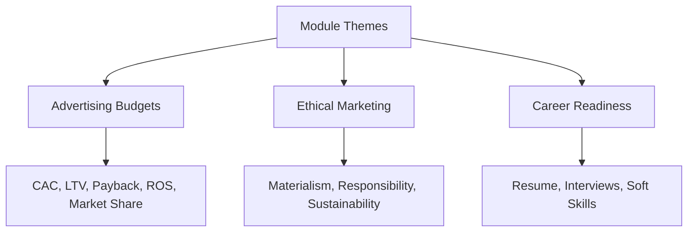

# Advertising Budgets, Ethics, and Career Readiness: Module Overview

## Intuition First

This final module connects three threads of modern marketing: **how much to spend** (metrics for budgeting), **how to spend responsibly** (ethics and sustainability), and **how to build a career** (skills and professional positioning). Growth without measurement is guesswork; measurement without ethics is fragile; technical skill without communication rarely scales.

---

## Three Focus Areas

| Area | Core Question | Tools / Themes |
|------|---------------|----------------|
| **Advertising budgets** | How much should we invest to acquire, retain, or engage customers? | $CAC$, $LTV$, payback period, market share models, marketing ROS |
| **Ethical marketing** | How does marketing influence behaviour — and what duties follow? | False wants, materialism, responsible communication, sustainability |
| **Career readiness** | How do you position yourself as a marketing professional? | Soft skills, resume building, interview preparation |

---

## Why Metrics Matter Now

Modern marketing is increasingly **data-driven**. Budget decisions rely on measurable indicators — acquisition cost, churn, and long-term value — not intuition alone. Firms that interpret acquisition data, retention patterns, and value projections well can scale with more confidence.

**Example**: Two brands spend the same on ads. The one that tracks $LTV$ vs $CAC$ and payback period knows whether that spend funds profitable growth or subsidises losses.

---

## Marketing in a Social Environment

Customers expect **transparency, fairness, and responsibility**. Privacy, inclusiveness, and environmental impact shape trust. Strong marketers drive growth **and** contribute positively to society — numbers and responsibility travel together.

---

## Learning Outcomes

By the end of this module, you should be able to:

1. Define and apply key metrics — $CAC$, $LTV$, and marketing return on sales ($ROS$) — to support advertising decisions
2. Evaluate marketing strategies from an **ethical and sustainability** perspective
3. Prepare for marketing careers by building professional skills and workplace awareness

---

## Common Pitfalls / Exam Traps

- **Trap**: Treating budgeting as “pick a spend number.” The module frames budget as a metric-led decision ($CAC$, $LTV$, payback, share).
- **Trap**: Separating ethics from performance. Responsible marketing is part of strategy, not an optional add-on.
- **Trap**: Ignoring career skills as “soft fluff.” Communication, strategic thinking, and adaptability are exam and job-relevant outcomes here.
- **Trap**: Memorising metric names without linking them to **real acquisition and retention decisions**.

---

## Quick Revision Summary

- Three pillars: budgets (metrics), ethics (society), careers (skills)
- Key metrics preview: $CAC$, $LTV$, payback, market share, marketing $ROS$
- Data-driven budgeting + ethical responsibility = sustainable growth
- Career readiness: communication, strategic thinking, adaptability
- Goal: marketer who scales profitably and contributes positively

---

**← [Previous](../week-12/06-summary-transcript.md) · [Index](../README.md) · [Next](02-deciding-on-advertising-budgeting-cac-ltv-transcript.md) →**
