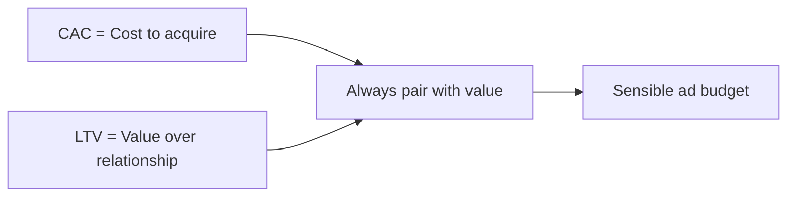

# Advertising Budgeting: CAC and LTV

## Intuition First

Before setting an ad budget, ask two linked questions: **What does each new customer cost?** and **What is that customer worth over time?** $CAC$ is the price tag of growth; $LTV$ is the return that growth can generate. Looking at either alone misleads — a high $CAC$ can be fine if $LTV$ is much higher.

---

## Customer Acquisition Cost ($CAC$)

**$CAC$** is the total cost required to convince a potential customer to buy — the “price tag” on every new customer.

Typical costs included:

| Cost Component | Examples |
|----------------|----------|
| Advertising spend | Paid search, social ads, display |
| Marketing tools | CRM, analytics, creative platforms |
| Agency retainers | Creative, media, consulting fees |
| People costs | Sales and marketing salaries/effort linked to acquisition |

### Formula

$CAC = \frac{\text{Total sales and marketing expenses}}{\text{Number of new customers acquired}}$

**Same-period rule**: Expenses and new customers must come from the **same time window** (e.g., monthly spend ÷ customers acquired that month).

**Example**: ₹10,00,000 sales & marketing spend in a month; 1,000 new customers → $CAC = ₹1{,}000$ per customer.

---

## Why $CAC$ Alone Is Incomplete

Imagine $CAC = ₹1{,}000$. That looks expensive — until the same customer spends ₹10,000 over several years. Acquisition is then justified. Marketers need the **lifetime value** lens, not only the cost lens.

---

## Customer Lifetime Value ($LTV$)

**$LTV$** (lifetime value) measures the **total revenue** a customer is expected to generate over their entire relationship with the business.

| Metric | Focus |
|--------|--------|
| $CAC$ | Cost of acquiring customers |
| $LTV$ | Long-term value those customers create |

Higher $LTV$ means the firm can support higher acquisition spend while staying profitable, and rely less on endless new-customer acquisition.

### Formula (three-component estimate)

$LTV = \text{Average purchase value} \times \text{Purchase frequency} \times \text{Customer lifespan}$

Compact form: $LTV = APV \times F \times L$

| Component | Meaning |
|-----------|---------|
| Average purchase value ($APV$) | Spend per transaction |
| Purchase frequency ($F$) | How often the customer buys (in the lifespan unit) |
| Customer lifespan ($L$) | How long the customer stays active |

**Example**: $APV = ₹500$, buys 4 times/year, stays 3 years → $LTV = 500 \times 4 \times 3 = ₹6{,}000$.

---

## How Companies Raise $LTV$

| Lever | Action |
|-------|--------|
| Retention | Keep customers longer (reduces churn; extends lifespan) |
| Repeat purchase | Habits, subscriptions, loyalty |
| Upsell / cross-sell | Higher basket or additional products |

When $LTV$ rises, growth becomes more stable and less dependent on constant cold acquisition.

---

## Common Pitfalls / Exam Traps

- **Trap**: Mismatched periods — monthly spend ÷ yearly customers. Always align the time window.
- **Trap**: Treating $CAC$ as only media spend. Include tools, agencies, and relevant sales/marketing labour when the full definition is asked.
- **Trap**: Judging growth only by $CAC$. A rising $CAC$ can be healthy if $LTV$ rises faster.
- **Trap**: Confusing $LTV$ revenue estimate with profit. This simple $LTV$ is revenue-oriented; margin-aware variants appear with payback later.
- **Trap**: Ignoring levers of $LTV$ (retention, frequency, upsell) when asking how to improve advertising ROI.

---

## Quick Revision Summary

- $CAC$ = total sales & marketing cost ÷ new customers (same period)
- $LTV$ ≈ average purchase value × frequency × lifespan
- $CAC$ alone understates strategy; pair with $LTV$
- Raise $LTV$ via retention, repeats, and upselling
- Budget logic: can we afford this $CAC$ given expected $LTV$?

---

**← [Previous](01-module-introduction-transcript.md) · [Index](../README.md) · [Next](03-explain-ltv-cac-ratio-and-payback-period-transcript.md) →**
