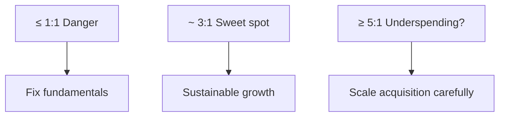

# LTV:CAC Ratio, Payback Period, Churn, and ARPU

## Intuition First

Knowing $LTV$ and $CAC$ separately is not enough. The **ratio** answers: for every rupee spent to acquire, how much value returns? **Payback** answers: how long until that acquisition spend is recovered in cash? Profitability without timing can still kill a company through cash-flow gaps.

---

## LTV:CAC Ratio (the “Golden Ratio”)

$LTV:CAC = \frac{LTV}{CAC}$

It asks: for every unit spent on acquisition, how many units of lifetime value does the business receive?

| Ratio | Interpretation | Typical Action |
|-------|----------------|----------------|
| $\leq 1:1$ | Break-even or loss per customer — **danger zone** | Stop scaling ads; fix product, pricing, retention, or targeting |
| $\approx 3:1$ | Healthy benchmark in many industries — **sweet spot** | Cover ops, manage risk, reinvest in growth |
| $\approx 5:1$ or higher | Very efficient — may mean **underinvesting** | Consider increasing ad spend to capture share (if ops/retention support it) |

**Example**: $LTV = ₹9{,}000$, $CAC = ₹3{,}000$ → ratio $= 3:1$ (healthy).

Benchmarks vary by industry; the principle does not: acquisition must fund value after costs and risk.

---

## Payback Period

Even a great $LTV:CAC$ fails if cash returns too slowly. **Payback period** is time needed to recover $CAC$.

$\text{Payback period} = \frac{CAC}{\text{Average monthly revenue per customer} \times \text{Gross margin}}$

Compact form: $\text{Payback} = \frac{CAC}{AMR \times GM}$

Gross margin matters because only the **contribution after production cost** actually pays back acquisition.

**Worked example**:

| Input | Value |
|-------|-------|
| $CAC$ | ₹1,000 |
| Average monthly revenue | ₹200 |
| Gross margin | $50\%$ ($0.5$) |
| Monthly contribution | $200 \times 0.5 = ₹100$ |
| Payback | $1000 / 100 = 10$ months |

| Payback | Business Meaning |
|---------|------------------|
| **Long** (e.g., 12 months) | Cash-flow gap: ads due in 30 days, recovery takes a year — grow carefully, finance conservatively |
| **Short** (e.g., 2 months) | Cash returns fast → reinvest in ads/research → compounding growth loop |

---

## Churn Rate

**Churn** = percentage of customers who stop using the product/service in a period — the natural enemy of $LTV$ (shortens lifespan).

$\text{Churn rate} = \frac{\text{Customers lost in period}}{\text{Customers at start of period}} \times 100$

| Context | Common target direction |
|---------|-------------------------|
| B2B | Keep **monthly** churn under ~$5\%$ |
| B2C | Often aim for roughly **$7\%$–$10\%$** monthly (context-dependent; lower is better) |

---

## ARPU (Average Revenue per User)

**$ARPU$** = average revenue generated per customer/user — a direct lever on $LTV$.

$ARPU = \frac{\text{Total revenue}}{\text{Total number of users}}$

Raise $ARPU$ via **upselling** (and related moves: higher-tier plans, bundles, add-ons).

---

## How the Metrics Fit Together

| Metric | Role in budgeting |
|--------|-------------------|
| $LTV:CAC$ | Is acquisition financially sustainable? |
| Payback | How fast does cash return? |
| Churn | How fast does $LTV$ erode? |
| $ARPU$ | How much value per user each period? |

Together they support data-driven advertising budgets — not spend for spend’s sake.

---

## Common Pitfalls / Exam Traps

- **Trap**: Celebrating a very high $LTV:CAC$ as “perfect.” It can signal underinvestment and lost market share.
- **Trap**: Scaling ads at $\leq 1:1$. You amplify losses.
- **Trap**: Computing payback as $CAC \div$ revenue **without** gross margin — overstates payback speed.
- **Trap**: Ignoring cash timing: profitable lifetime can still bankrupt the firm if payback is long and ad bills are immediate.
- **Trap**: Confusing churn with $CAC$. Churn destroys $LTV$; $CAC$ is acquisition cost.
- **Trap**: Mixing “ROAS / return on ad sales” wording with $LTV:CAC$ — next topic is marketing **return on sales ($ROS$)**, a different profit lens.

---

## Quick Revision Summary

- $LTV:CAC$: value per unit of acquisition spend; ~$3:1$ often healthy; $\leq 1$ danger; very high may mean underspend
- Payback $= CAC / (AMR \times GM)$ — timing of cash recovery
- Long payback → cash-flow risk; short payback → reinvestment loop
- Churn $= \text{lost}/\text{start} \times 100$ — enemy of $LTV$
- $ARPU = \text{revenue}/\text{users}$ — raise via upsell to lift $LTV$

---

**← [Previous](02-deciding-on-advertising-budgeting-cac-ltv-transcript.md) · [Index](../README.md) · [Next](04-marketing-ros-return-on-sales-transcript.md) →**
