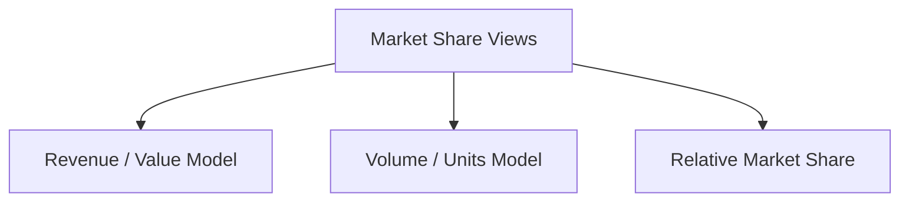

# Easy Market Share Calculation Models

## Intuition First

Internal metrics ($CAC$, $LTV$, $ROS$) answer “are we efficient?” **Market share** answers “how big are we relative to the market and rivals?” Share is competitive position in one number — but revenue share, unit share, and relative share each tell a different story.

---

## What Market Share Means

**Market share** = percentage of total industry sales captured by a company in a period.

**Example**: Industry sales ₹100 crore; firm sales ₹10 crore → market share $\approx 10\%$.

Rising share usually signals gaining strength vs competitors. High share often brings brand recognition, scale economies, and pricing flexibility — but share growth should still be balanced with **profitability**.

---

## Two Primary Models

| Model | Basis | Best When |
|-------|--------|-----------|
| **Revenue / value-based** (most common) | Money | Pricing differs a lot across competitors |
| **Volume / units** | Units sold | Scale and customer reach matter more than ticket price |

---

## Revenue (Value-Based) Model

$\text{Market share}_{\text{revenue}} = \frac{\text{Company sales revenue}}{\text{Total industry revenue}} \times 100$

**Example**: Boutique revenue ₹1,00,000; total market ₹10,00,000 → market share $= 10\%$.

Useful when competitors sell at very different prices (premium vs discount players can look unequal on units but clear on value).

---

## Volume (Units) Model

$\text{Market share}_{\text{volume}} = \frac{\text{Company units sold}}{\text{Total industry units sold}} \times 100$

Emphasises **operational scale and reach**. A low-price mass brand may lead on units while a luxury brand leads on revenue share.

| Lens | Luxury niche brand | Mass discounter |
|------|--------------------|-----------------|
| Revenue share | May lead | May trail |
| Unit share | May trail | May lead |

---

## Relative Market Share

Compares the firm to the **largest competitor**, not the whole industry (classic BCG-style idea).

$\text{Relative market share} = \frac{\text{Company sales}}{\text{Largest competitor's sales}}$

| Result | Meaning |
|--------|---------|
| $> 1$ | Leadership vs the #1 rival |
| $< 1$ | Behind the market leader |
| $= 1$ | Tied with the leader |

**Example**: Your sales ₹80 crore; leader ₹100 crore → relative share $= 0.8$ (follower).

---

## Reading Share with Other Metrics

When market share is read together with $CAC$, $LTV$, and marketing $ROS$, managers see both **competitive position** and **financial performance**.

| Alone | Risk |
|-------|------|
| Chase share only | Unprofitable growth |
| Ignore share | Miss competitive erosion |
| Share + $LTV:CAC$ + $ROS$ | Balanced growth narrative |

---

## Common Pitfalls / Exam Traps

- **Trap**: Mixing revenue and unit bases in one comparison (“we’re #1”) without stating the model.
- **Trap**: Confusing absolute market share (vs industry) with relative market share (vs leader).
- **Trap**: Treating any share gain as success. Share without contribution/$ROS$ can destroy value.
- **Trap**: Using incompatible numerators/denominators (e.g., company retail sales ÷ industry including wholesale) — bases must match.
- **Trap**: Assuming revenue model is always best. Choose value vs volume by analysis objective.

---

## Quick Revision Summary

- Market share = firm’s slice of industry sales in a period
- Revenue: $\text{share} = \frac{\text{company revenue}}{\text{industry revenue}} \times 100$
- Volume: $\text{share} = \frac{\text{company units}}{\text{industry units}} \times 100$
- Relative share $= \frac{\text{company sales}}{\text{leader sales}}$ ($>1$ = ahead of leader)
- Prefer revenue model when prices diverge; pair share with $CAC$, $LTV$, $ROS$ for full picture

---

**← [Previous](04-marketing-ros-return-on-sales-transcript.md) · [Index](../README.md) · [Next](06-false-wants-and-excessive-materialism-problems-transcript.md) →**
