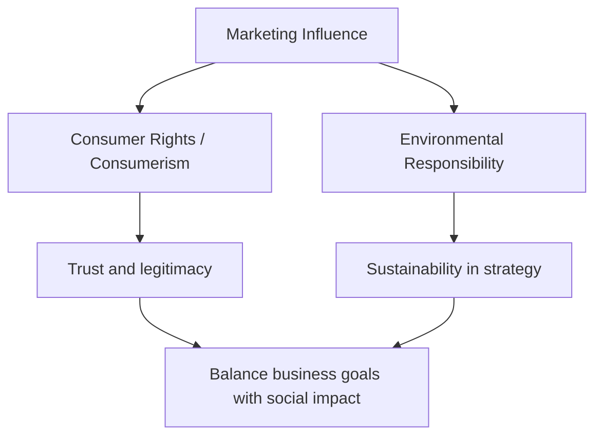
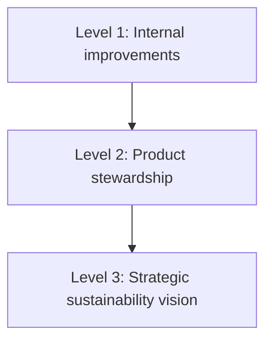

# Responsible and Sustainable Marketing Policies

## Intuition First

If marketing can shape behaviour and consumption, **responsibility follows power**. Critics raise false wants and materialism; this topic moves to solutions — consumer rights, environmentalism, carbon footprint, and structured sustainability so ethics becomes scalable strategy, not a slogan.

---

## Consumerism and Consumer Rights

**Consumerism** = organised effort to strengthen buyer power in the marketplace.

Buyers should have the right to be **informed** about quality, safety, pricing, and business practices before purchase.

| Era | Emphasis |
|-----|----------|
| Traditional focus | Safety and performance |
| Modern expansion | Transparency, ethical sourcing, responsible communication |

Consumers are no longer passive message recipients; they act as **stakeholders** who expect responsible operations.

---

## Environmentalism and Quality of Life

**Environmentalism** pushes firms beyond short-term consumption maximisation toward long-term planetary impact and **quality of life**, while protecting environmental resources.

### Carbon Footprint

**Carbon footprint** = total environmental impact of a product/service across its **entire life cycle**:

1. Raw material sourcing
2. Manufacturing
3. Transportation
4. Usage
5. Disposal

Cutting the footprint needs coordinated effort from **companies and consumers**.

---

## Sustainability Grid (Levels of Responsibility)

A practical framework distinguishing levels of environmental responsibility:

| Level | Focus | What It Looks Like |
|-------|--------|---------------------|
| **1. Internal operations** | Clean up inside the firm | Reduce waste, improve energy efficiency, lower emissions in own operations |
| **2. Product stewardship** | Design for lower life-cycle impact | Products/services engineered to reduce harm from cradle to disposal |
| **3. Strategic integration** | Sustainability in core vision | Not a side project — part of business strategy and performance |

When sustainability aligns with business performance, responsible marketing becomes **practical and scalable**.

---

## Link Back to Ethics

Responsible marketing balances:

| Goal | Without balance |
|------|-----------------|
| Growth and sales | Risk of exploitation and backlash |
| Rights, transparency, environment | Empty virtue without viable economics |
| Aligned strategy | Trust + durable competitive position |

Ethical marketing ultimately rests on understanding what people **actually need** — bridging to human motivation frameworks next.

---

## Common Pitfalls / Exam Traps

- **Trap**: Equating consumerism with “buying more.” Here **consumerism** means strengthening **buyer rights/power**.
- **Trap**: Limiting consumer rights to product safety only — modern view adds transparency and ethical sourcing.
- **Trap**: Treating carbon footprint as only factory emissions — it is **life-cycle** (source → dispose).
- **Trap**: Calling any green ad “sustainable strategy.” The grid’s top level requires **strategic integration**, not only ops tweaks.
- **Trap**: Framing responsibility as anti-profit. The goal is alignment of sustainability with performance so it scales.

---

## Quick Revision Summary

- Consumerism strengthens buyer power: information on quality, safety, price, practices
- Modern rights: transparency, ethical sourcing, responsible communication
- Environmentalism: quality of life + resource protection beyond short-term consumption
- Carbon footprint = full life-cycle impact
- Sustainability grid: internal ops → product stewardship → strategic vision
- Responsibility + performance alignment = scalable responsible marketing

---

**← [Previous](06-false-wants-and-excessive-materialism-problems-transcript.md) · [Index](../README.md) · [Next](08-understand-how-human-basic-needs-are-the-same-and-how-to-tap-those-transcript.md) →**
