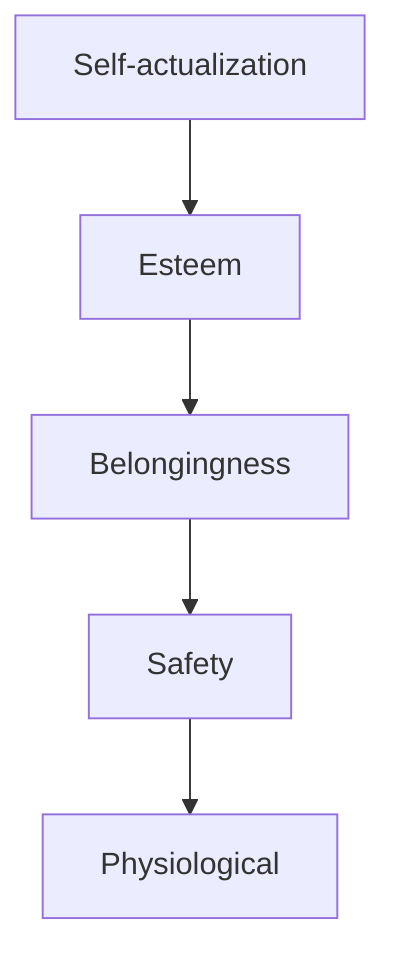

# Human Basic Needs and How Marketing Taps Them

## Intuition First

Platforms, media, and tech change fast; **basic human motivations** change slowly. Campaigns resonate when they map to real needs — food security, safety, belonging, esteem, growth — and fail when they chase superficial trends or exploit insecurity without meaning.

---

## Why Needs Still Anchor Marketing

Despite shifts in technology and behaviour, the motivations that drive decisions remain largely stable. Understanding them explains why some messages stick and others bounce.

---

## Maslow’s Hierarchy of Needs

Human behaviour is framed as a progression of needs:

| Level | Needs | Marketing Resonance |
|-------|--------|---------------------|
| **Physiological** | Food, water, shelter | Basics, FMCG staples, meal solutions |
| **Safety** | Financial security, physical protection | Insurance, security, reliable banking |
| **Belongingness** | Relationships, community, acceptance | Social platforms, membership clubs, communities |
| **Esteem** | Recognition, confidence, achievement | Luxury, status signals, awards/credentials |
| **Self-actualization** | Growth, fulfilment, purpose | Purpose-led brands, learning, personal development |

*(Pyramid reads bottom-up: physiological foundation → self-actualization at the top.)*

---

## Brand Mapping Examples

| Need level | Brand / category pattern | Message flavour |
|------------|--------------------------|-----------------|
| Safety | Insurance, security products | Protection, stability, peace of mind |
| Belonging | Social apps, membership programmes | Community, shared identity |
| Esteem | Luxury and premium badges | Status, recognition, achievement |
| Self-actualization | Purpose / growth brands | Becoming your best self, meaning |

**Example**: An insurer sells more than a policy document — it sells **safety**. A luxury watch may sell less “timekeeping” and more **esteem**. A course platform may sell **self-actualization**.

---

## Responsibility Edge

Marketing works best when aligned with **genuine** needs. The same map can be abused (fear-mongering on safety; manufactured inadequacy on esteem). Ethical practice:

- Support real motivations
- Avoid exploiting insecurity
- Balance effectiveness with responsibility

---

## Stable Psychology, Changing Channels

Advertising techniques and media will keep evolving. The underlying drivers — belonging, recognition, security, meaning — remain. Map creatives and offers to the hierarchy; do not confuse channel novelty with new human nature.

---

## Common Pitfalls / Exam Traps

- **Trap**: Treating Maslow as a rigid ladder every buyer climbs perfectly. Use it as a **lens**, not a law of physics.
- **Trap**: Ignoring lower needs when designing “aspiration-only” messages for audiences still focused on price and safety.
- **Trap**: Confusing “creating needs” with “appealing to needs.” This topic stresses tapping **existing** motivations.
- **Trap**: Using esteem appeals without noting ethical risk of insecurity exploitation.
- **Trap**: Forgetting physiological/safety examples (insurance, staples) when asked for marketing applications.

---

## Quick Revision Summary

- Basic motivations stay stable even as platforms change
- Maslow: physiological → safety → belonging → esteem → self-actualization
- Map brands: insurance–safety; social/membership–belonging; luxury–esteem; purpose–self-actualization
- Best marketing aligns with genuine needs, not only trends
- Effectiveness + responsibility = ethical need-based marketing

---

**← [Previous](07-responsible-and-sustainable-marketing-policies-in-force-transcript.md) · [Index](../README.md) · [Next](09-soft-skill-transcript.md) →**
