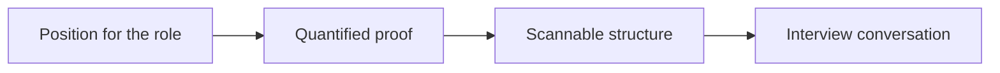

# Resume and Interview Tips for Marketing Careers

## Intuition First

Your resume is not an autobiography — it is a **positioning document** for a specific role. Interviews test competence, thinking, and fit. Technology and job boards change; human psychology — clarity, proof, belonging, recognition — still decides who gets heard.

---

## Resume as Positioning

| Career stage | Emphasise |
|--------------|-----------|
| Students / recent grads | Education, projects, internships, relevant coursework |
| Experienced professionals | Work experience, leadership, measurable achievements |

Match content to the role: highlight what proves you can create value **there**, not every life event.

---

## Resume Writing Tips

| Do | Why |
|----|-----|
| Specific language, active voice | Impact is clear |
| Articulate work plainly | Fancy wording without proof fails |
| Quantify and qualify achievements | Facts beat adjectives |
| Scan-friendly layout | Humans and systems skim |

**Example**: Prefer “Grew paid signup conversion from $2.1\%$ to $3.4\%$ in one quarter” over “Responsible for improving performance.”

---

## Top Resume Mistakes to Avoid

1. Spelling and grammar errors
2. Missing email or phone (contact is a deal-breaker)
3. Passive language instead of strong action verbs
4. Cluttered layout that is hard to skim
5. Listing duties only — no actions and results

### Also avoid

| Avoid | Prefer |
|-------|--------|
| Personal pronouns (I / we) | Action-led bullets |
| Heavy abbreviations / narrative style | Clear, scannable bullets |
| Casual expressions | Professional tone |
| Photo / age / gender (unless asked) | Skills and proof |
| References listed by default | Provide when requested |
| Starting every line with a date | Lead with achievement/action |

---

## Formatting and Structure Checklist

| Practice | Detail |
|----------|--------|
| Consistency | Format and content patterns stay uniform |
| Readability | Clean spacing; use bold/italics consistently |
| Order | Headings by importance; within sections, **reverse chronological** |
| Timeline | No unexplained gaps |
| Export | Formatting intact in PDF |

---

## Interviews: What Is Being Assessed

Interviews are structured conversations evaluating:

1. **Competence** — can you do the work?
2. **Thinking process** — how do you solve problems?
3. **Alignment** — fit with the organisation

Questions often follow patterns: problem-solving, communication, and value creation — prepare stories that show all three.

---

## Human Patterns Under the Surface

Popular stories (e.g., mentor figures, hidden abilities, facing a challenge) recur across cultures because they mirror stable psychology. Platforms and tools will keep shifting; people still seek **belonging, recognition, security, and meaning**. That same insight helps:

- Position yourself clearly on a resume
- Tell coherent interview narratives
- Craft brand messages that resonate

---

## Common Pitfalls / Exam Traps

- **Trap**: Treating the resume as a complete life story instead of role-specific positioning.
- **Trap**: Vague responsibility lists with no metrics or outcomes.
- **Trap**: Passive verbs and pronouns that hide agency.
- **Trap**: Including photo/age/gender or references when not asked.
- **Trap**: Preparing only “answers,” not evidence of **thinking process** and organisational fit.
- **Trap**: Forgetting that storytelling patterns and human needs still sit under career and brand communication.

---

## Quick Revision Summary

- Resume = positioning document, stage-appropriate (edu vs experience)
- Active, specific, quantified, scannable; reverse chronological
- Avoid: errors, missing contact, passive duty lists, pronouns, unneeded personal data
- Interviews test competence, thinking, and alignment
- Tools change; motivations (belonging, recognition, security, meaning) stay — use that in careers and marketing

---

**← [Previous](09-soft-skill-transcript.md) · [Index](../README.md) · [Next](11-summary-transcript.md) →**
