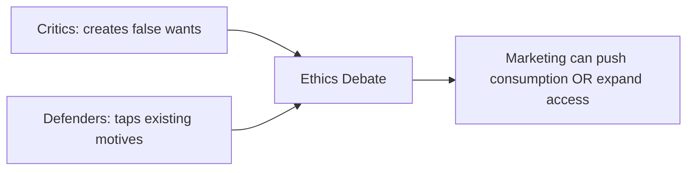

# False Wants, Excessive Materialism, and Marketing’s Social Debate

## Intuition First

Marketing metrics grow the firm; this topic asks whether marketing also **inflates desire**. Critics say ads manufacture wants and equate happiness with ownership. Defenders say marketers channel existing motives — comfort, status, belonging — and that high product failure rates prove consumers still choose freely. Ethical marketers must hold both sides.

---

## The Core Debate

| Side | Claim | Implication |
|------|--------|-------------|
| **Critics** | Advertising creates a consumption cycle; success/happiness measured by possessions; marketing creates new desires and pressure to buy more | Marketing manufactures “false wants” and fuels materialism |
| **Marketers’ reply** | Needs are not invented; ads appeal to existing motivations (comfort, status, convenience, belonging) | Influence ≠ total control |
| **Evidence often cited by marketers** | Many new products fail | If firms fully controlled behaviour, failure rates would be much lower |

---

## Cultural Pollution Argument

Critics argue people face constant ad exposure — billboards, digital ads, social promotions, influencers, notifications — that crowds public and mental space.

**Marketer counterpoint**: Advertising **funds** much of the digital ecosystem. Search, social platforms, and many news outlets rely on ad revenue; without it, users might pay more via subscriptions.

| Criticism | Response |
|-----------|----------|
| Ads overwhelm attention (“cultural pollution”) | Ads subsidise “free” platforms and content |
| Pushes overconsumption | Can also improve access and information |

---

## Access and Fairness — Marketing’s Other Face

Ethics is not only about excess consumption. Tools — pricing, distribution, communication — can reach disadvantaged groups and improve access to essentials.

**Example — SNAP Online (USDA)**: Enables lower-income consumers to buy groceries online at competitive prices — marketing/distribution expanding **access**, not only impulse buying.

---

## Case: REI “Opt Outside”

In 2015, outdoor retailer **REI** closed stores on Black Friday and urged people to spend the day outdoors instead of participating in heavy promotions. Participation grew; the firm later made Black Friday store closure permanent while paying employees for the day.

| Question | Insight |
|----------|---------|
| Pure ethics or brand play? | Often **both** — values stance + identity and loyalty |
| Marketing lesson | Brands can refuse consumption rituals and still build equity |

---

## Dual Impact (Takeaway)

Marketing influences society in multiple ways:

1. Can encourage continuous consumption and materialism
2. Can expand access, fund media ecosystems, and express values that earn trust

Ethical awareness does **not** weaken capability — it strengthens long-term judgment about impact.

*(Recommended enrichment: documentary *Buy Now: The Shopping Conspiracy* — consumer culture, digital ads, fast fashion, and continuous consumption systems.)*

---

## Common Pitfalls / Exam Traps

- **Trap**: Framing the debate as “marketing is always bad” or “always good.” Exams expect the **both-sides** structure plus examples of access/responsibility.
- **Trap**: Saying marketers “create needs.” Course language usually: needs/motivations exist; marketing shapes **wants** and appeals.
- **Trap**: Ignoring the “ads fund free services” counterargument on cultural pollution.
- **Trap**: Reading REI only as charity. It is values **and** brand positioning.
- **Trap**: Separating ethics from strategy — responsible framing is part of modern brand trust.

---

## Quick Revision Summary

- Debate: false wants/materialism vs appealing to existing motives
- Product failures argue against total consumer control
- Cultural pollution vs advertising-funded digital ecosystem
- Marketing can expand access (e.g., SNAP Online) as well as push buying
- REI Opt Outside: ethics + brand identity can reinforce each other
- Ethical awareness → stronger long-term marketing judgment
