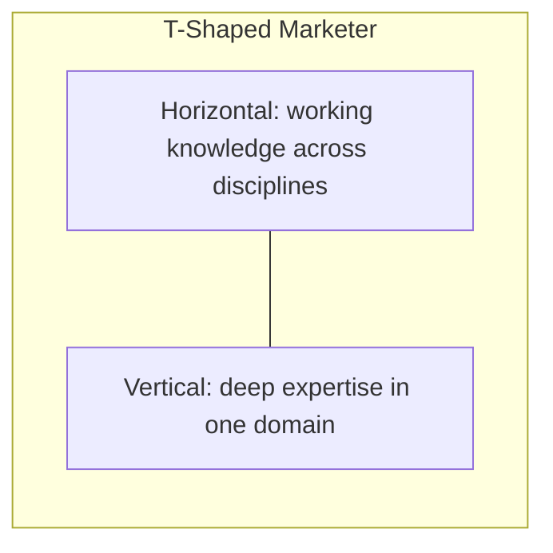

# Soft Skills and the T-Shaped Marketer

## Intuition First

Marketing concepts get you into the room; **soft skills and shape of expertise** keep you effective there. Modern campaigns cross content, analytics, paid media, product, and design. Pure specialists struggle to collaborate; pure generalists struggle to deliver depth. The **T-shaped** marketer balances both.

---

## Why Soft Skills Matter in Marketing Careers

Financial and ethical literacy are necessary — but careers also demand:

- Clear communication across teams
- Translation of data into creative strategy
- Alignment of marketing with broader business goals
- Adaptability as platforms and briefs change

---

## Value of Generalists on Modern Teams

Campaigns require coordination across:

| Function | Role in the mix |
|----------|-----------------|
| Content | Narrative and assets |
| Data analytics | Insight and measurement |
| Paid advertising | Reach and conversion |
| Product | Offer and experience |
| Design | Clarity and brand craft |

Generalists adapt faster, collaborate across silos, connect perspectives, and link insights to strategy.

---

## T-Shaped Professionals

| Shape | Meaning |
|-------|---------|
| **Specialist (I)** | Deep expertise in one area (e.g., SEO, analytics, performance marketing) — strong technical delivery |
| **T-shaped** | Deep vertical + broad horizontal awareness of related fields |

- **Vertical bar**: depth in one domain
- **Horizontal bar**: working knowledge across several disciplines

That balance explains how professionals stay specialised **and** adaptable.

---

## Career Path Suggestion

| Stage | Focus |
|-------|--------|
| Early career | Build **depth** first — analytics tools, campaign management, or content strategy |
| Next | Expand horizontally — e.g., performance marketer learns CRO, retention, positioning |
| Outcome | Better collaboration and contribution to strategic discussions |

**Example**: A performance-marketing specialist who also understands retention and product positioning can debate budget shifts using $CAC$/$LTV$ language with product and finance — not only report CPC.

---

## Specialist vs Generalist (Both Have a Place)

Depth wins on technical excellence; breadth wins on integration. The T-model is the career design that often fits modern marketing orgs best: **deep enough to execute, broad enough to orchestrate**.

---

## Common Pitfalls / Exam Traps

- **Trap**: Treating soft skills as unrelated to marketing exams. Module frames them as career-readiness outcomes.
- **Trap**: Assuming only specialists succeed — or only generalists. The point is the **T** combination.
- **Trap**: Expanding horizontally before any depth — early career usually needs a strong vertical first.
- **Trap**: Confusing T-shaped with “know everything equally.” The vertical is still deeper than the horizontal arms.
- **Trap**: Ignoring cross-functional translation (data ↔ creative ↔ business goals) as a core skill.

---

## Quick Revision Summary

- Modern marketing is cross-functional; collaboration and communication are core
- Generalists connect teams; specialists deliver depth
- T-shaped = deep expertise + broad related awareness
- Early: deepen one skill; later: expand adjacent domains
- Goal: execute technically and contribute strategically
