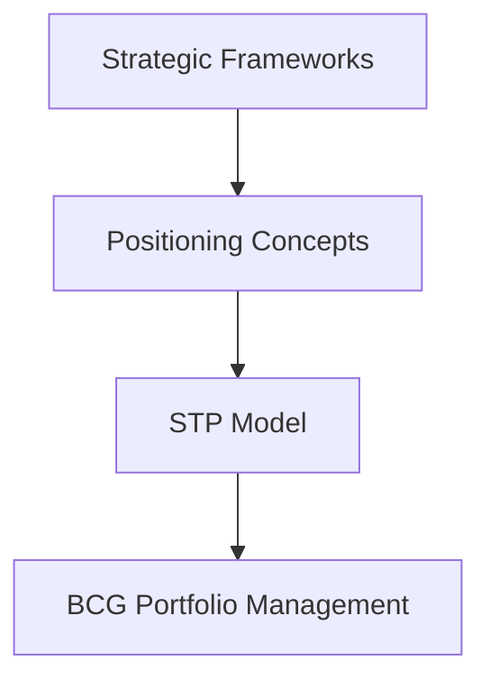

# Marketing Foundations and Strategic Evolution: Module Overview

## Why This Module Matters

Week 1 established what marketing is, how value works, and how demand forms. This module moves from foundations to **strategic frameworks** — the tools marketers use to analyse markets, position products, and manage portfolios. Frameworks here are not checklists; they build reasoning for real decisions.

---

## Learning Outcomes

By the end of this module, you should be able to:

1. Apply foundational frameworks: AIDA, PESTEL, Porter's Five Forces, SWOT
2. Distinguish **points of parity (POP)** from **points of difference (POD)**
3. Use the **STP model** (Segmentation, Targeting, Positioning) in real scenarios
4. Manage multiple products using the **BCG Growth-Share Matrix**

---

## Topics Covered

| Topic | Purpose |
|-------|---------|
| Funnel vs flywheel | Evolution of customer journey thinking |
| AIDA (+ confidence, satisfaction) | Psychological stages of purchase decisions |
| PESTEL | Macro-environment analysis |
| Porter's Five Forces | Industry competitiveness assessment |
| SWOT | Internal strengths/weaknesses + external opportunities/threats |
| POP vs POD | Competitive positioning mechanics |
| STP | Segment, target, and position in market |
| BCG Matrix | Portfolio investment and divestment decisions |

---

## Evolution Theme

Modern marketing has shifted from a **linear funnel** (awareness → purchase → end) to a **flywheel** (continuous momentum through retention, advocacy, and compounding value). Frameworks in this module reflect both classic analysis tools and this evolutionary thinking.

---

## Common Pitfalls / Exam Traps

- **Trap**: Memorising frameworks without applying them. Exams test interpretation (e.g., which BCG quadrant, which PESTEL factor).
- **Trap**: Confusing SWOT (firm-level) with Porter's Five Forces (industry-level).
- **Trap**: Treating STP as three independent steps. The formula is: Segmentation + Targeting = Positioning.
- **Trap**: Using AIDA only as a funnel endpoint. The flywheel extends it with confidence and satisfaction stages.

---

## Quick Revision Summary

- Module focus: strategic frameworks for marketing decisions
- Key frameworks: AIDA, PESTEL, Porter's Five Forces, SWOT, STP, BCG
- POP = parity with competitors; POD = differentiation
- STP: segment market → select targets → position offering
- BCG: manage product portfolio by growth and market share
- Shift from funnel (linear) to flywheel (continuous momentum)
