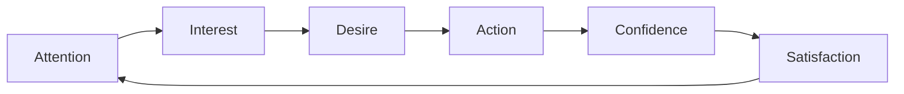

# From Marketing Funnel to Flywheel: AIDA in Practice

## Intuition First

For decades, marketers pictured customers moving linearly: awareness → interest → desire → action. Globalisation and digital complexity broke that model. Today's journey is co-shaped by trust signals, cultural relevance, and emotional priming — not a single straight path.

---

## The Classic AIDA Model

| Stage | Goal | Tactics |
|-------|------|---------|
| **Attention** | Get noticed; create first recognition | Bold visuals, striking headlines, contrast |
| **Interest** | Keep audience curious | Provocative questions, surprising answers |
| **Desire** | Turn curiosity into emotional need | Storytelling, value promises, sensory experience |
| **Action** | Drive next step | CTA, contact info, purchase, visit |

---

## Beyond the Funnel: Proving and Priming

Modern purchase decisions involve pre-stages:

| Concept | Purpose | Examples |
|---------|---------|----------|
| **Proving** | Build credibility | Reviews, portfolios, Instagram proof, case studies |
| **Priming** | Build cultural relevance and emotional connection | Brand distinctiveness, cultural alignment, repeated exposure |

Together, proving and priming shape decisions before AIDA stages even begin.

---

## Case Study: Coca-Cola Coke Zero "Drinkable Advertisement"

### Attention

- Black background, glowing Coke Zero bottle
- Command: "Just Add Zero"
- Stood out vs unbranded posters; captured eyeballs instantly

### Interest

- Question: "What does Coke Zero sugar taste like?"
- Surprising answer: "It's still a Coke"
- Challenged consumer assumptions about zero-sugar taste

### Desire

- Promise: zero sugar, same great Coke taste
- Billboards poured real ice-cold Coke Zero at sampling stations
- Multi-sensory: see, hear, taste on the spot

### Action

- 23,000-pound drinkable billboard at Final Four
- 4,000 feet of tubing spelling "Taste It"
- Literal action: drink the advertisement

**Lesson**: AIDA works best when each stage is experiential, not just informational.

---

## Funnel vs Flywheel

| Model | Journey End | Focus |
|-------|-------------|-------|
| **Funnel** | Action (purchase) | Linear conversion |
| **Flywheel** | Continuous momentum | Retention, advocacy, compounding value |

### Extended AIDA (Flywheel Mindset)

Beyond action, add:

- **Confidence**: Trust that the purchase was right
- **Satisfaction**: Post-purchase delight that fuels retention and referrals

Satisfaction feeds back into the system — strengthening retention, advocacy, and long-term growth.

---

## Case Study: Volkswagen Beetle Ad

Single-visual AIDA execution:

| Stage | Element |
|-------|---------|
| Attention | Yellow Beetle against red wedding-themed background; headline "Marriage does come with rewards" |
| Desire | Subheading and body copy position Beetle as joy, independence, fresh beginning |
| Action | Slogan + contact details guide showroom visit |

Demonstrates that all AIDA elements can coexist in one creative asset.

---

## Common Pitfalls / Exam Traps

- **Trap**: Treating AIDA as strictly sequential in all media. Digital touchpoints can hit multiple stages simultaneously.
- **Trap**: Ending the journey at Action. Flywheel thinking requires post-purchase confidence and satisfaction.
- **Trap**: Ignoring proving/priming. Without credibility, attention-stage spend is wasted.
- **Trap**: Confusing interest with desire. Interest is curiosity; desire is emotional commitment to own.

---

## Quick Revision Summary

- AIDA: Attention → Interest → Desire → Action
- Proving (credibility) and priming (relevance) precede modern purchase paths
- Coke Zero: multi-sensory AIDA culminating in drinkable billboard
- Funnel ends at purchase; flywheel continues with confidence and satisfaction
- Extended AIDA feeds retention and advocacy back into the system
- Single ads can execute full AIDA in one visual (Beetle example)
