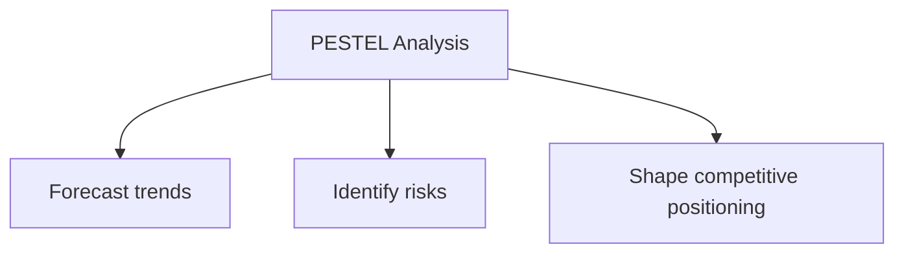
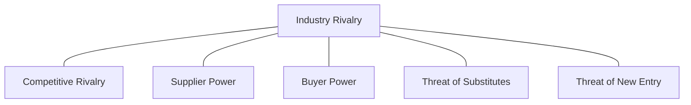

# Strategic Analysis Frameworks: PESTEL, Porter's Five Forces, and SWOT

## Intuition First

Before positioning a product, a marketer must read the environment. **PESTEL** scans macro forces. **Porter's Five Forces** assesses industry competitiveness. **SWOT** maps internal capabilities against external realities. Together they answer: *Where are we, and what can we do about it?*

---

## PESTEL Analysis

**Purpose**: Examine the external macro environment affecting a business.

| Factor | What to Analyse | Marketing Implication |
|--------|-----------------|----------------------|
| **P**olitical | Government policies, trade agreements, political stability | Regulatory compliance, market entry timing |
| **E**conomic | Inflation, currency, raw material costs, consumer spending | Pricing, financing offers, value messaging |
| **S**ocial | Demographics, culture, lifestyle trends | Positioning, product design, ethical branding |
| **T**echnological | Innovation, digital trends, R&D | Channel strategy, product features |
| **L**egal | Laws, patents, data privacy rules | Compliance, risk management |
| **E**nvironmental | Sustainability, ecological regulations | Green marketing, ESG positioning |

### Example: Starbucks

| Factor | Impact |
|--------|--------|
| Political | Tax regulations, trade agreements across operating regions |
| Economic | Currency fluctuations, coffee bean costs, macro trends |
| Social | Premium coffee culture, ethical consumerism, lifestyle shifts |
| Technological | Mobile ordering, loyalty apps, payment innovation |
| Legal | Food safety, labour laws, franchise regulations |
| Environmental | Sustainable sourcing, waste reduction expectations |

### Example: Samsung

| Factor | Impact |
|--------|--------|
| Political | US-China trade tensions affecting manufacturing and sourcing |
| Economic | Consumer purchasing power, inflation, component costs |
| Social | Smart devices, connected homes, digital lifestyle demand |
| Technological | 5G, semiconductors — core to competitiveness |
| Legal | Patent disputes, global data privacy compliance |
| Environmental | Eco-friendly design, e-waste recycling initiatives |

---

## Porter's Five Forces

**Purpose**: Evaluate industry competitiveness and profit potential.

| Force | Question |
|-------|----------|
| Competitive rivalry | How intensely do firms compete? |
| Supplier power | Can suppliers dictate prices/terms? |
| Buyer power | Can customers drive prices down? |
| Threat of substitutes | Can alternatives replace the product? |
| Threat of new entry | How easy is it for new competitors to enter? |

### Example: Walmart

| Force | Assessment | Reasoning |
|-------|------------|-----------|
| Threat of new entrants | Low | Scale, capital, compliance, brand reputation barriers |
| Buyer power | Medium–Low | Many small buyers; Walmart uses pricing and low switching costs |
| Supplier power | Low | Walmart is largest buyer; suppliers are interchangeable |
| Threat of substitutes | Low | Wide product range limits substitution |
| Industry rivalry | Medium | Competes with retailers; price-sensitive consumers; high marketing costs |

**Conclusion**: Walmart holds strong positioning despite meaningful rivalry.

---

## SWOT Analysis

**Purpose**: Evaluate internal strengths/weaknesses against external opportunities/threats.

| | Helpful | Harmful |
|---|---------|---------|
| **Internal** | Strengths | Weaknesses |
| **External** | Opportunities | Threats |

### Example: Zomato (India Food Delivery)

| Quadrant | Elements |
|----------|----------|
| **Strengths** | Market dominance in India, global presence, strong consumer support |
| **Weaknesses** | History of losses, management restructuring, discount dependency |
| **Opportunities** | Market growth, partnerships, acquisitions, product diversification |
| **Threats** | Fragile unit economics, policy changes, intense competition, shrinking margins |

**Use**: Maximise strengths, minimise weaknesses, capitalise on opportunities, mitigate threats.

---

## Framework Selection Guide

| Question | Use |
|----------|-----|
| What macro forces affect us? | PESTEL |
| How competitive is our industry? | Porter's Five Forces |
| What should our firm do next? | SWOT |
| How does a customer decide to buy? | AIDA / Flywheel |

---

## Common Pitfalls / Exam Traps

- **Trap**: Using PESTEL for internal analysis. It is strictly external/macro.
- **Trap**: Confusing Porter's forces with SWOT. Porter = industry structure; SWOT = firm-specific.
- **Trap**: Listing SWOT items without strategic implication. Each item should suggest an action.
- **Trap**: Treating all five Porter forces as equally important. Dominant forces vary by industry (e.g., supplier power in luxury vs retail).

---

## Quick Revision Summary

- PESTEL: Political, Economic, Social, Technological, Legal, Environmental
- Porter's Five Forces: rivalry, suppliers, buyers, substitutes, new entry
- SWOT: Strengths, Weaknesses, Opportunities, Threats (2×2 matrix)
- PESTEL = macro scan; Porter = industry competitiveness; SWOT = firm strategy
- Starbucks/Samsung illustrate PESTEL; Walmart illustrates Porter; Zomato illustrates SWOT
- Use frameworks together: environment → industry → firm action
