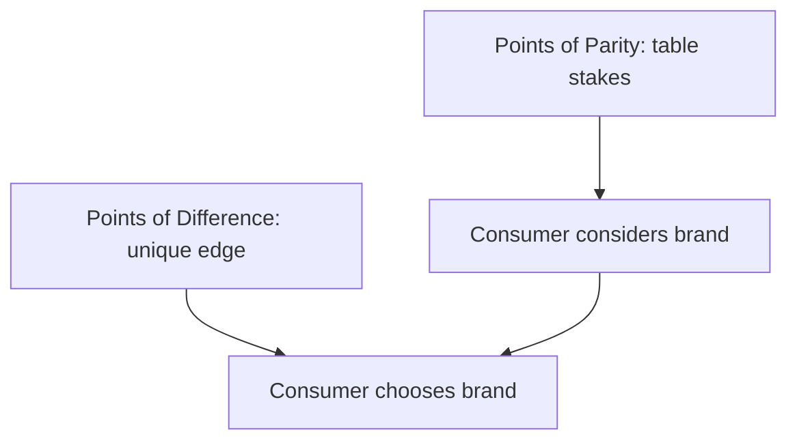

# Points of Parity and Points of Difference

## Intuition First

To win a purchase decision, a brand must pass two tests: be **good enough** to be considered (parity) and **different enough** to be chosen (difference). Fail parity and you are invisible. Fail difference and you are interchangeable.

---

## Definitions

| Concept | Abbreviation | Definition |
|---------|--------------|------------|
| **Point of Parity** | POP | Areas where your offering matches competitors — minimum requirements to be considered |
| **Point of Difference** | POD | Factors that create differentiated value and competitive advantage |

---

## Point of Parity (POP)

**Purpose**: Ensure the brand is not eliminated from the consideration set.

- Features or attributes consumers **expect** from any credible player
- "Hygiene factors" — absence causes rejection; presence does not win alone
- Must match or exceed category norms

**Examples**:

| Category | POP Examples |
|----------|--------------|
| Airline | Safety record, on-time performance, baggage handling |
| Smartphone | Calling, messaging, app store access, camera |
| Bank | Secure transactions, regulatory compliance, ATM access |
| E-commerce | Payment options, return policy, delivery tracking |

---

## Point of Difference (POD)

**Purpose**: Give consumers a compelling reason to choose your brand over alternatives.

- Unique value that competitors cannot easily replicate
- Basis for premium pricing, loyalty, and advocacy
- Rooted in functional, emotional, or experiential advantages

**Examples**:

| Brand | POD |
|-------|-----|
| Tesla | Software-driven vehicles, Supercharger network, brand innovation identity |
| Dyson | Engineering-led suction performance, design differentiation |
| Patagonia | Environmental activism as brand identity |
| Zomato | Hyperlocal delivery speed + restaurant discovery in India |

---

## Balancing POP and POD

| Strategy | When to Use |
|----------|-------------|
| Lead with POD | Mature market with established POP baselines |
| Fix POP gaps first | New entrant failing basic category expectations |
| POD on one dimension, POP on others | Most common — differentiate on one axis, match on rest |

**Rule**: You cannot differentiate (POD) if you are not even considered (POP).

---

## Competitive Positioning Logic

| Step | Action |
|------|--------|
| 1 | Identify category POPs (what every player must offer) |
| 2 | Audit own POP coverage (gaps = risk) |
| 3 | Identify potential PODs (what only you can credibly claim) |
| 4 | Communicate POD while maintaining POP |

---

## POP vs POD Comparison

| Dimension | POP | POD |
|-----------|-----|-----|
| Role | Entry ticket to consideration | Reason to choose |
| Competitive effect | Neutralises disadvantage | Creates advantage |
| Risk if missing | Elimination from consideration | Commoditisation, price wars |
| Marketing message | "We meet your expectations" | "We offer something unique" |
| Stability | Changes slowly (category norms) | Can erode as competitors copy |

---

## Common Pitfalls / Exam Traps

- **Trap**: Pursuing POD while ignoring POP gaps. A unique feature on an unreliable base product fails.
- **Trap**: Treating every feature as POD. Most features are POP in mature categories.
- **Trap**: Confusing POP with POD over time. Yesterday's POD (e.g., smartphone fingerprint sensor) becomes today's POP.
- **Trap**: Claiming POD without credibility. Differentiation must be defensible and deliverable.

---

## Quick Revision Summary

- POP = parity with competitors; minimum to be considered
- POD = differentiated value; reason to choose
- Balance both: match baselines, highlight uniqueness
- Missing POP = eliminated; missing POD = commoditised
- Audit category norms first, then build defensible differentiation
- POP and POD shift over time as categories mature
