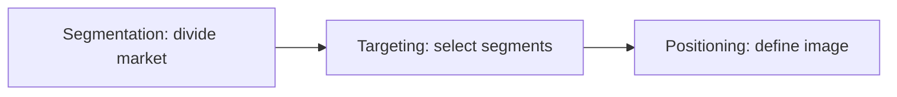
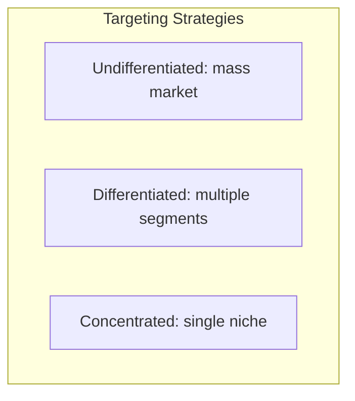

# The STP Model: Segmentation, Targeting, and Positioning

## Intuition First

A product cannot serve everyone equally well. STP is the disciplined process of dividing the market (Segmentation), choosing where to compete (Targeting), and defining how to win in consumers' minds (Positioning).

**Core formula**: Segmentation + Targeting = Positioning

---

## The Three Steps

| Step | Definition | Key Question |
|------|------------|--------------|
| **S** — Segmentation | Divide broad market into distinct subgroups with shared characteristics | Who are the meaningful groups? |
| **T** — Targeting | Evaluate and select segment(s) to focus on | Which groups are worth pursuing? |
| **P** — Positioning | Create unique, desirable image in target consumers' minds | How do we want to be perceived? |

---

## Segmentation Bases

| Basis | Variables | Use Case |
|-------|-----------|----------|
| **Geographic** | Country, region, city, climate | Localised products, regional campaigns |
| **Demographic** | Age, gender, income, profession | Mass-market products with clear buyer profiles |
| **Behavioural** | Purchase patterns, channel preference, loyalty level | Retention programs, channel strategy |
| **Psychographic** | Lifestyle, values, hobbies, personality | Premium brands, identity-driven products |

---

## Segmentation Example: Plant-Based Milk

**Broad audience**: People moving away from dairy.

| Segment | Profile | Messaging Angle |
|---------|---------|-----------------|
| Lifestyle-driven | High-income, wellness/sustainability motivated | Ethics, sustainability, premium lifestyle |
| Lactose-intolerant | Health necessity, daily consumption need | Health, digestibility, functional benefit |

Same product category — different motivations require different messages. Tools like Google Analytics/Data Studio can further split segments (e.g., competitor users vs new category entrants).

---

## Targeting Approaches

| Strategy | Definition | Example |
|----------|------------|---------|
| **Undifferentiated** | One product/message for entire market | Colgate toothpaste — staple for broad audience |
| **Differentiated** | Separate offerings/messages per segment | Nike — different lines for runners, basketball, casual wear |
| **Concentrated** | Focus on one niche | Lululemon — yoga and fitness-conscious athletic wear |

### Targeting Evaluation Criteria

| Criterion | Question |
|-----------|----------|
| Size | Is the segment large enough? |
| Profitability | Will it generate acceptable margins? |
| Reachability | Can we access them via channels we control? |
| Fit | Does our offering match their needs? |

---

## Positioning (Overview)

Positioning defines the **competitive image** in the target consumer's mind relative to alternatives. Covered in detail in the positioning note — here, recognise it as the output of successful segmentation and targeting.

---

## STP Workflow

| Phase | Output |
|-------|--------|
| Segment | List of distinct customer groups with profiles |
| Target | Prioritised segment(s) with rationale |
| Position | Value proposition and messaging for chosen segment(s) |

---

## Common Pitfalls / Exam Traps

- **Trap**: Skipping segmentation and targeting to jump to positioning. Position without target = vague brand.
- **Trap**: Confusing differentiated targeting with multiple brands. One brand can use differentiated messaging across segments.
- **Trap**: Choosing segments that are large but unprofitable or unreachable.
- **Trap**: Using only demographic segmentation. Behavioural and psychographic often predict purchase better.

---

## Quick Revision Summary

- STP = Segmentation + Targeting = Positioning
- Segment by geography, demographics, behaviour, or psychographics
- Target via undifferentiated, differentiated, or concentrated strategies
- Evaluate segments on size, profitability, reachability
- Plant-based milk: lifestyle vs lactose-intolerant = same product, different messages
- Positioning is the mental image created for chosen target segments
