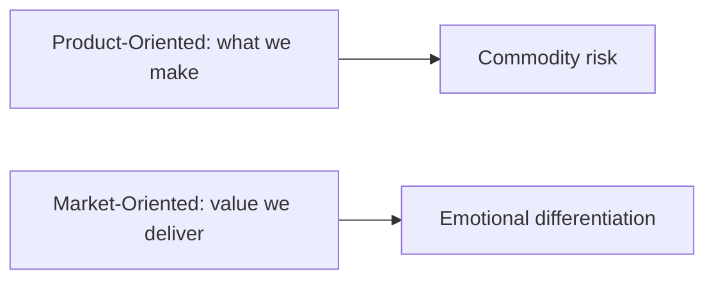

# Product-Oriented vs Market-Oriented Positioning

## Intuition First

Positioning is how a business defines itself in consumers' minds. The critical choice: define around **what you make** (product-oriented) or **what value you deliver** (market-oriented). Market-oriented positioning typically builds stronger emotional connection and competitive moats.

---

## Two Positioning Orientations

| Orientation | Focus | Definition Style |
|-------------|-------|------------------|
| **Product-oriented** | What the company makes or sells | "We sell coffee and snacks" |
| **Market-oriented** | Value, experience, benefit to consumer | "We deliver the third-place experience between home and work" |

---

## Brand Examples

| Brand | Product-Oriented | Market-Oriented |
|-------|------------------|-----------------|
| **Starbucks** | Selling coffee and snacks | Delivering the Starbucks experience |
| **Walmart** | Running discount stores | Low prices for better living |
| **Zoom** | Hosting online meetings | Frictionless, secure video communication |
| **HUL** | Making soaps and detergents | Helping people feel good, look good, get more out of life |
| **Voltas/AC brand** | Making air conditioners | Offering comfort |
| **Big Bazaar** | Running hypermarkets | Offering the best prices (saste mein sabse accha) |
| **Airbnb** | Renting places online | Helping people belong anywhere |
| **LIC** | Selling insurance | Financial support — in life and after life |

---

## Why Market-Oriented Positioning Wins

| Advantage | Explanation |
|-----------|-------------|
| Emotional connection | Consumers buy outcomes, not specifications |
| Competitive resilience | Harder to undercut on features alone |
| Premium pricing | Value framing justifies higher prices |
| Category leadership | Defines the market rather than fitting into it |

Product-oriented definitions invite comparison on specs and price. Market-oriented definitions compete on meaning and experience.

---

## Positioning Dimensions

Beyond product vs market orientation, positioning can be built on:

| Dimension | Example |
|-----------|---------|
| Attribute | "Longest battery life" |
| Benefit | "Peace of mind" |
| User | "For serious runners" |
| Competitor | "Unlike traditional banks..." |
| Category | "The original energy drink" |
| Quality/price | "Affordable luxury" |

---

## Positioning Statement Structure

A strong positioning statement typically answers:

1. **Target segment**: Who is this for?
2. **Frame of reference**: What category do we compete in?
3. **Point of difference**: Why choose us?
4. **Reason to believe**: What proof supports the claim?

---

## Common Pitfalls / Exam Traps

- **Trap**: Product-oriented positioning in mature markets. Commodities compete on price; experiences compete on value.
- **Trap**: Market-oriented claims without delivery. "Belong anywhere" fails if the product experience is poor.
- **Trap**: Confusing positioning with tagline. Tagline is expression; positioning is strategic mental space.
- **Trap**: Positioning for everyone. Effective positioning requires a clear target segment.

---

## Quick Revision Summary

- Positioning = how brand is defined in consumers' minds
- Product-oriented = what we make; market-oriented = value we deliver
- Market-oriented builds emotional connection and pricing power
- Starbucks: coffee → experience; Airbnb: rentals → belonging
- Strong positioning needs target, category, POD, and proof
- Outcome-focused positioning resists commoditisation
