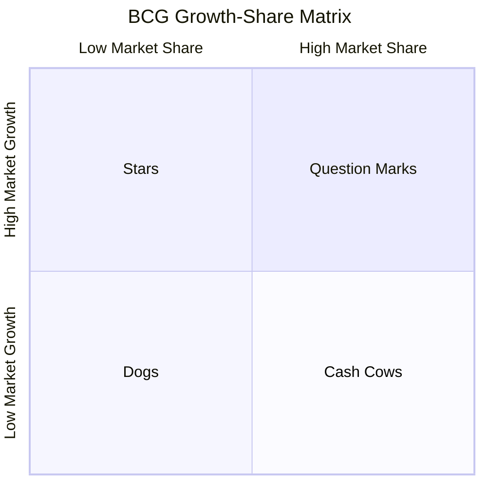
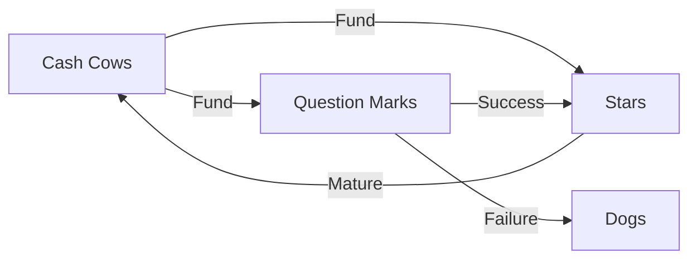

# BCG Growth-Share Matrix

## Intuition First

Companies with multiple products cannot invest equally everywhere. The BCG matrix classifies products by **relative market share** and **market growth rate** to guide investment, harvesting, or divestment decisions.

---

## The Matrix

| Quadrant | Market Share | Market Growth | Strategy |
|----------|--------------|---------------|----------|
| **Stars** | High | High | Invest heavily — future returns potential |
| **Cash Cows** | High | Low | Milk for cash — reinvest elsewhere |
| **Question Marks** | Low | High | Invest or divest — decide if they can become stars |
| **Dogs** | Low | Low | Liquidate, divest, or reposition |

---

## Quadrant Details

### Stars (High Share, High Growth)

- Leaders in fast-growing markets
- Require significant investment to maintain position
- Future cash generators if market share is defended
- **Action**: Invest aggressively

### Cash Cows (High Share, Low Growth)

- Mature market leaders with stable demand
- Generate more cash than they consume
- Fund investment in stars and question marks
- **Action**: Harvest profits; minimise new investment

### Question Marks (Low Share, High Growth)

- Operate in attractive growing markets but lack leadership
- Consume cash with uncertain returns
- May become stars with investment or dogs without it
- **Action**: Selective investment or exit

### Dogs (Low Share, Low Growth)

- Weak position in slow markets
- Often cash traps with limited upside
- **Action**: Divest, reposition, or phase out

---

## Portfolio Management Logic

| Principle | Application |
|-----------|-------------|
| Balance portfolio | Mix of cash generators and growth bets |
| Cash flow discipline | Cows fund stars; don't over-invest in dogs |
| Dynamic movement | Products shift quadrants as markets evolve |
| Strategic choice | Not every question mark deserves investment |

---

## Real-World Application

A diversified FMCG company might classify:

| Product | Likely Quadrant | Action |
|---------|-----------------|--------|
| Leading detergent in mature market | Cash Cow | Maximise margin, defend share |
| New plant-based snack in growing category | Question Mark | Test investment, monitor share gain |
| Category-leading energy drink in growing market | Star | Invest in distribution and marketing |
| Declining legacy product in shrinking segment | Dog | Divest or discontinue |

---

## Limitations

| Limitation | Implication |
|------------|-------------|
| Oversimplification | Two dimensions miss profitability, synergies, strategic fit |
| Market definition | Share and growth depend on how market boundaries are drawn |
| Static snapshot | Requires periodic reassessment |
| Synergies ignored | Products may support each other across quadrants |

---

## Common Pitfalls / Exam Traps

- **Trap**: Investing equally in all quadrants. Portfolio strategy requires selective allocation.
- **Trap**: Keeping dogs indefinitely out of sentiment. Dogs drain resources from stars.
- **Trap**: Confusing high revenue with high market share. Share is relative to competitors.
- **Trap**: Treating cash cows as stars. Mature products need harvesting, not growth investment.
- **Trap**: Calling question marks "stars." Low share disqualifies star status regardless of growth.

---

## Quick Revision Summary

- BCG matrix: relative market share vs market growth rate
- Stars: high/high — invest; Cash cows: high share/low growth — milk
- Question marks: low share/high growth — invest or exit
- Dogs: low/low — divest or reposition
- Cash cows fund stars and selected question marks
- Portfolio must balance growth bets with cash generation
- Reassess periodically — products move between quadrants
