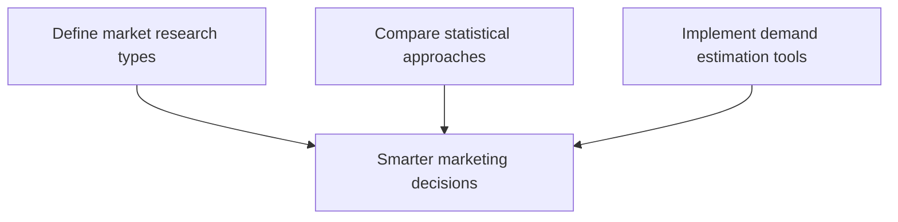

# Marketing Information and Research: Module Overview

## Why This Module Matters

Strategic frameworks (STP, BCG, PESTEL) tell you *how to think*. Market research and analytics tell you *what is true* about consumers and markets. This module bridges data collection, statistical reasoning, and practical tools for demand estimation.

---

## Three Learning Outcomes

### 1. Market Research Fundamentals

- Define market research in a business context
- Distinguish **primary research** (original data collected directly) from **secondary research** (existing external data)
- Know when customised insights are required vs when existing data suffices

### 2. Statistical Approaches

- Compare methods balancing speed vs accuracy, cost vs depth, scale vs precision
- Understand how statistics summarise data, compare alternatives, and evaluate uncertainty
- Interpret research findings critically — not just accept numbers at face value

### 3. Practical Demand Estimation

- Use digital platforms for trend analysis, competition study, and demand forecasting
- Explore markets and validate ideas without always conducting expensive primary research
- Combine multiple data sources into actionable insights

---

## Topics Covered

| Area | Content |
|------|---------|
| Marketing Information Ecosystem (MIE) | People, process, assets for data-driven decisions |
| Primary vs secondary research | Methods, benefits, limitations |
| Analytics maturity | Descriptive → diagnostic → predictive → prescriptive |
| Statistics | Central tendency, dispersion, sampling |
| Tools | Google Trends, Ubersuggest, SEMrush, Ahrefs, Google Ads Keyword Planner, AnswerThePublic, Simple ML for Sheets |

---

## Module Philosophy

Modern marketers do not rely on a single data source. They combine:

- Internal data (sales, CRM)
- External scanning (competitors, macro trends)
- Primary research (surveys, interviews)
- Secondary platforms (search trends, keyword tools)

The goal is **actionable insight**, not data volume.

---

## Common Pitfalls / Exam Traps

- **Trap**: Treating secondary research as a complete substitute for primary. Secondary gives breadth; primary gives depth and specificity.
- **Trap**: Accepting statistics without understanding sampling method. Bad samples produce confident but wrong conclusions.
- **Trap**: Using tools without interpreting intent. Search volume alone does not explain why people search.
- **Trap**: Confusing descriptive analytics with predictive. Knowing what happened does not automatically forecast what will happen.

---

## Quick Revision Summary

- Module focus: information-driven marketing decisions
- Primary = original data; secondary = existing external data
- Statistics help summarise, compare, and evaluate uncertainty
- Digital tools enable fast demand estimation and trend tracking
- Combine internal + external + primary + secondary sources
- Goal: actionable insights that shape real business decisions
