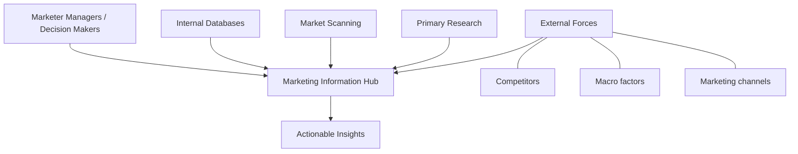

# Marketing Information Ecosystem and Market Research

## Intuition First

Marketing decisions fail when they run on assumptions. The Marketing Information Ecosystem (MIE) is the organisational system — people, processes, and assets — that gathers, analyses, and applies data to replace guesswork with evidence.

---

## Marketing Information Ecosystem (MIE)

**Definition**: A framework of people, processes, and assets used to gather, analyse, and apply data for strategic decision-making.

**Purpose**:

- Generate consumer insights
- Monitor external environment
- Evaluate marketing strategy effectiveness

### MIE Components

| Layer | Elements |
|-------|----------|
| **Top** | Marketer managers and information users (decision makers) |
| **Centre** | MIE hub — integrates all data streams |
| **Left** | Internal assessment: sales data, CRM, operational metrics |
| **Right** | Primary research: surveys, focus groups, interviews, experiments |
| **Bottom** | External forces: competitors, channels, target markets, macro trends, regulations |

---

## Market Research

**Definition**: Process of evaluating viability of a new product or service by studying potential consumers.

**Purpose**: Move from assumptions to informed decisions before market launch.

**Influences**: Product features, pricing, positioning, final design.

---

## Primary vs Secondary Research

| Dimension | Primary Research | Secondary Research |
|-----------|------------------|-------------------|
| Data source | Collected firsthand for specific question | Existing external studies and databases |
| Methods | Surveys, interviews, focus groups, experiments, MVP tests | Industry reports, government data, digital trend platforms |
| Cost | Higher | Lower or free |
| Time | Longer | Faster |
| Specificity | Highly tailored to business | Broader, less customised |
| Ownership | Exclusive to organisation | Shared/public |
| Depth | Deep qualitative/quantitative insight | Broad context |

**Best practice**: Combine both — secondary for landscape, primary for depth.

---

## Primary Research: Benefits

| Benefit | Explanation |
|---------|-------------|
| **Control** | Design questions, methods, and analysis |
| **Relevance** | Aligned to specific business problem |
| **Ownership** | Competitors cannot access insights |
| **Deep insights** | Direct consumer voice via surveys/interviews |
| **Timeliness** | Reflects current market conditions |

---

## Primary Research: Limitations

| Limitation | Risk |
|------------|------|
| **Cost** | Significant budget for design, collection, analysis |
| **Time** | Planning and execution delays decisions |
| **Bias** | Respondent misunderstanding, personal bias, poor question design |

---

## Primary Research Methods

| Method | Use Case |
|--------|----------|
| Interviews | Deep qualitative understanding |
| Ethnographic research | Observe behaviour in natural context |
| Observational research | Track actions without direct questioning |
| MVP testing | Validate product concept early |
| Product/field trials | Test in real market conditions |
| Hypothesis testing | Statistical validation of assumptions |
| Online surveys / intercept surveys | Scale quantitative data collection |
| Focus groups (online/in-person) | Group dynamics and idea generation |

---

## Secondary Research: Why It Matters

- **Efficiency**: Build on existing studies instead of starting from scratch
- **Speed**: Quick market size, trend, and competition overview
- **Early-stage decisions**: Validate direction before expensive primary research

### Secondary Research Sources

| Source | Examples |
|--------|----------|
| Internet / digital platforms | Google Trends, industry databases |
| Government agencies | Census, economic reports |
| Trade associations | Industry benchmarks |
| Competitor websites | Pricing, positioning, product range |
| NGOs and educational institutions | Sector studies |
| Company reports and media | Annual reports, news analysis |
| Public libraries | Historical records |

---

## Common Pitfalls / Exam Traps

- **Trap**: Using only secondary research for launch decisions. Lacks company-specific depth.
- **Trap**: Ignoring bias in primary research. Poor survey design invalidates results.
- **Trap**: Treating MIE as a one-time project. It is a continuous ecosystem, not a single report.
- **Trap**: Confusing internal data with market research. Sales data is input; research interprets and extends it.

---

## Quick Revision Summary

- MIE = people + process + assets for data-driven marketing decisions
- Hub integrates internal data, market scanning, and primary research
- Primary = firsthand, costly, specific, owned; secondary = existing, fast, broad
- Combine primary (depth) and secondary (breadth)
- Primary methods: surveys, interviews, focus groups, MVP tests
- Secondary sources: government, industry reports, digital platforms, competitors
- Quality decisions require continuous information flow, not one-off studies
