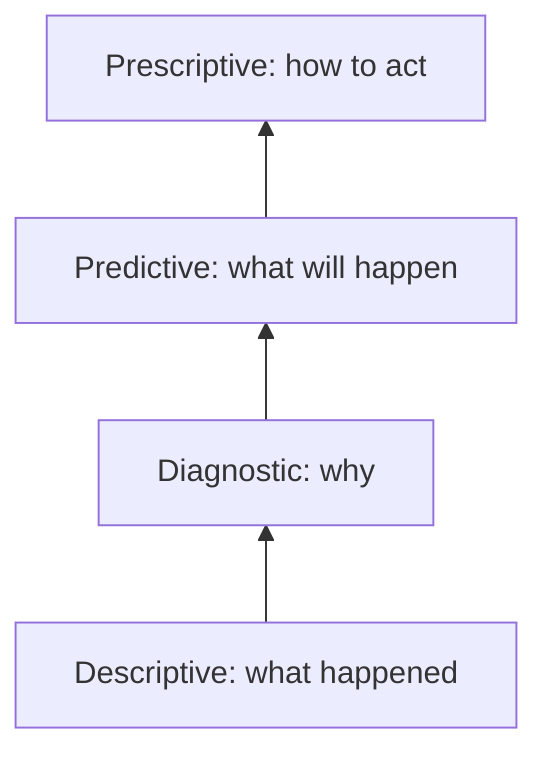

# Analytics Maturity, Statistics, and Sampling

## Intuition First

Data without interpretation is noise. Marketers need a ladder of analytical sophistication — from describing what happened to prescribing what to do — plus statistical foundations to know whether findings are meaningful or random.

---

## Analytics Maturity Model

| Stage | Question | Methods | Marketing Example |
|-------|----------|---------|-------------------|
| **Descriptive** | What happened? | Dashboards, reports, alerts, summaries | Campaign click-through rates, monthly sales |
| **Diagnostic** | Why did it happen? | Queries, data mining, correlation analysis | Why did churn spike in Region X? |
| **Predictive** | What will happen? | ML models, statistical forecasting, simulation | Forecast Q4 demand for product line |
| **Prescriptive** | How do we make it happen? | Optimisation, planning, recommendation engines | Optimal ad budget allocation by channel |

**Trend**: Value and complexity increase up the ladder. Organisations become more strategic as they mature.

---

## Descriptive vs Inferential Statistics

| Type | Purpose | Marketing Examples | Tools |
|------|---------|-------------------|-------|
| **Descriptive** | Summarise existing data | Average purchase per customer, median response time, open rates | Mean, median, mode, variance, SD, percentiles |
| **Inferential** | Generalise from sample to population | A/B test significance, regional churn comparison | Confidence intervals, hypothesis testing, p-values, z-scores |

**Key distinction**: Descriptive = understand what you have. Inferential = predict beyond your sample.

---

## Measures of Central Tendency

| Measure | Definition | Strength | Weakness |
|---------|------------|----------|----------|
| **Mean** | Arithmetic average | Simple, widely used | Skewed by outliers |
| **Median** | Middle value when sorted | Resistant to outliers | Ignores extreme values entirely |
| **Mode** | Most frequent value | Best for categorical data | May not exist or be unique |

**Marketer's question**: *What is typical behaviour?*

---

## Measures of Dispersion (Spread)

| Measure | Definition | Marketing Use |
|---------|------------|---------------|
| **Range** | Max − Min | Quick spread check; sensitive to outliers |
| **Variance** | Average squared distance from mean | Compare spread across datasets |
| **Standard deviation** | $\sqrt{\text{variance}}$ | Most interpretable spread measure (same units as data) |
| **Percentiles** | Value below which X% of data falls | Benchmarking (80th percentile performer) |
| **IQR** | Middle 50% range (Q3 − Q1) | Outlier detection; robust to skew |

**High SD** = unpredictable behaviour. **Low SD** = consistency.

---

## Sampling Methods

### Stratified Sampling

- Divide population into meaningful subgroups (strata): demographics, regions, behaviour
- Random sample from each stratum
- Ensures proportional representation

| Parameter | Rating |
|-----------|--------|
| Accuracy | High |
| Reliability | High (stable across repeated samples) |
| Efficiency | Low (requires full sampling frame, more effort) |

### Cluster Sampling

- Divide population into clusters (geographic groups)
- Randomly select entire clusters
- Include all individuals within chosen clusters

| Parameter | Rating |
|-----------|--------|
| Accuracy | Low (depends on cluster representativeness) |
| Reliability | Moderate (varies by which clusters selected) |
| Efficiency | High (practical for large, spread-out populations) |

---

## Sampling Comparison

| Parameter | Stratified | Cluster |
|-----------|------------|---------|
| Accuracy | High | Low |
| Reliability | High | Moderate |
| Efficiency | Low | High |
| Best for | Fair subgroup comparison | Large geographic populations |
| Risk | Administrative overhead | Biased if clusters differ significantly |

---

## A/B Testing Connection

A/B testing is inferential statistics in marketing:

1. Split audience into control (A) and variant (B)
2. Measure outcome (clicks, conversions, revenue)
3. Test whether difference is statistically significant or random noise
4. Use p-values and confidence intervals to decide

---

## Common Pitfalls / Exam Traps

- **Trap**: Using mean when data is heavily skewed. Median is more representative.
- **Trap**: Confusing descriptive dashboards with predictive capability.
- **Trap**: Choosing cluster sampling when subgroup accuracy is critical.
- **Trap**: Ignoring sample size in inferential statistics. Small samples produce unreliable p-values.
- **Trap**: Treating correlation as causation in diagnostic analytics.

---

## Quick Revision Summary

- Analytics maturity: descriptive → diagnostic → predictive → prescriptive
- Descriptive stats summarise; inferential stats generalise from samples
- Mean, median, mode = centre; range, variance, SD, IQR = spread
- Stratified = accurate, reliable, inefficient; cluster = efficient, less accurate
- A/B testing uses inferential statistics for campaign decisions
- Insight quality depends on statistical foundations and sampling design
