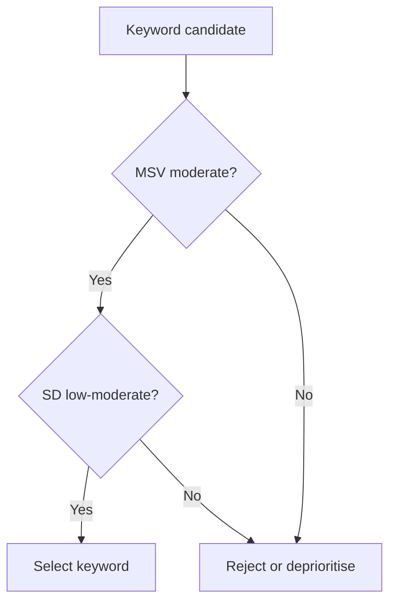

# Demand Research Tools: Google Trends, Search Intent, and Keyword Analysis

## Intuition First

Before launching a campaign or writing content, marketers need to know *what people are searching for, why, and how competitive those queries are*. Free and paid tools turn search behaviour into demand signals — without running a single survey.

---

## Google Trends

**Purpose**: Understand what people search across regions, categories, and time periods.

### Core Features

| Feature | Use |
|---------|-----|
| Term exploration | Track interest for a keyword (e.g., "iPhone 17") |
| Comparison | Compare two terms (e.g., iPhone 17 vs MacBook) |
| Timeline adjustment | 24 hours to multi-year trend views |
| Channel filter | Web Search, Image, Shopping, News, YouTube |
| Related queries | Top and rising associated searches |
| Regional view | Interest by country or region |

### Related Queries Insight

- **Top queries**: Most common associated searches (e.g., "iPhone 17 Pro" up 4%)
- **Rising queries**: Fastest-growing searches (e.g., festival sale terms)

**Marketing use**: Identify demand spikes, seasonal patterns, and product variant interest.

### Google Trends TV (`trends.google.com/tv`)

- Shows top searches in a selected country in real time
- Useful for cultural moment marketing and news-jacking

---

## Search Intent (Motivation Behind Searches)

| Intent Type | User Goal | Example Query |
|-------------|-----------|---------------|
| **Informational** | Learn about a topic | "What is the capital of India?" |
| **Navigational** | Reach a specific site | "Facebook", "Amazon" |
| **Transactional** | Buy something | "Buy iPhone 17" |
| **Commercial investigation** | Research before purchase | "LG washing machine 3321 vs Samsung 591" |

**Why it matters**: Content and ad strategy differ by intent. Informational queries need educational content; transactional queries need product pages and checkout paths.

---

## Ubersuggest (Free Tier)

**Purpose**: Keyword ideas with volume, intent, and SEO difficulty.

### Key Metrics

| Metric | Definition |
|--------|------------|
| **Monthly Search Volume (MSV)** | Average monthly searches for a keyword |
| **SEO Difficulty (SD)** | How competitive the keyword is in organic search (lower = easier to rank) |
| **Intent label** | C (commercial), N (navigational), T (transactional), I (informational) |

### Keyword Selection Framework

Choose keywords where:

1. **MSV is moderate** — not too high (likely very competitive), not too low (not worth effort)
2. **SEO difficulty is low to moderate** — achievable ranking in reasonable time

**Example**: "BITS Pilani in Goa" (MSV ~33,000, SD ~18) preferred over "BITS Pilani Goa" (MSV ~14,800, SD ~15) — higher volume with manageable competition.

---

## SEMrush and Ahrefs (Paid Tools)

Deeper keyword analysis with:

- Keyword volume and keyword difficulty (KD) on scales of 50 or 100
- Competitive landscape by region and category
- Related keyword clusters

### Example: Interior Design Software (US)

| Keyword | Volume | KD |
|---------|--------|-----|
| interior design software | 4,400 | 72.5 |
| free interior design software | 2,400 | 75 |
| best interior design software | 880 | Higher |
| 3D interior design software | Lowest volume | Lowest KD |

**Strategy**: Start with "3D interior design software" (low competition, build authority), then expand to higher-volume terms.

### Example: Weight Loss Keywords

| Keyword | Volume | KD |
|---------|--------|-----|
| how to lose weight | 90,000 | 49 |
| how to lose weight fast | 58,000 | 45 |
| lose weight | 35,000 | 56 (highest KD) |

**Ideal pick**: "how to lose weight fast" — moderate volume and moderate KD. High volume does not always mean highest KD (market-specific).

---

## Google Ads Keyword Planner

**Access**: ads.google.com → Tools → Planning → Keyword Planner

| Option | Use |
|--------|-----|
| Discover new keywords | Enter website; get thematic keyword suggestions |
| Get search volume and forecast | Enter known keywords; see volume by region |

**Example**: "BITS Pilani" targeted to Delhi — average monthly searches between 10,000–100,000.

**Note**: Provides ad metrics beyond organic SEO difficulty — useful for paid campaign planning.

---

## AnswerThePublic

**Purpose**: Quick visual map of questions and searches across engines, social media, and AI tools.

- Aggregates data from Google, YouTube, social platforms, AI models
- Shows categorical search patterns (e.g., iPhone 17 Pro Max trending on search and social)
- Less data-intensive than SEMrush/Ahrefs but fast for brainstorming

**Best for**: Early ideation when deep competitive metrics are not yet needed.

---

## Tool Selection Guide

| Need | Tool |
|------|------|
| Trend over time | Google Trends |
| Real-time country trends | Google Trends TV |
| Free keyword research | Ubersuggest |
| Deep competitive SEO | SEMrush, Ahrefs |
| Paid campaign volume | Google Ads Keyword Planner |
| Quick question brainstorming | AnswerThePublic |

---

## Common Pitfalls / Exam Traps

- **Trap**: Choosing highest-volume keywords blindly. High MSV often means high competition.
- **Trap**: Ignoring search intent. Ranking for informational queries does not drive sales directly.
- **Trap**: Treating SEO difficulty scales as identical across tools. SEMrush (100) vs others (50) — compare within tool, not across.
- **Trap**: Using only one tool. Triangulate with Trends (direction) + keyword tools (volume/competition).
- **Trap**: Confusing navigational searches with commercial demand. "Amazon" searches are not product demand.

---

## Quick Revision Summary

- Google Trends: interest over time, comparisons, related/rising queries
- Four search intents: informational, navigational, transactional, commercial investigation
- Keyword framework: moderate MSV + low-moderate SEO difficulty
- Ubersuggest (free), SEMrush/Ahrefs (paid), Keyword Planner (ads), AnswerThePublic (quick ideas)
- Start with low-KD niches, expand to higher-volume terms
- MSV and KD are not always correlated — evaluate both together
