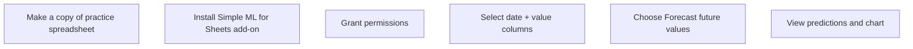

# Market Demand Forecasting with Simple ML for Sheets

## Intuition First

Forecasting does not always require a data science team. When historical data includes timestamps, marketers can predict future demand using automated ML inside Google Sheets — no code, no third-party data sharing.

---

## What Is Forecasting?

**Definition**: Prediction of future events based on past data patterns.

| Domain | Forecasting Application |
|--------|------------------------|
| Retail | Product sales prediction |
| Energy | Demand load forecasting |
| Services | Customer return/churn anticipation |
| Marketing | Campaign response, seasonal demand |

**Requirement**: Each data row must include a **time or date** column. Forecasting detects temporal patterns (trend, seasonality) in historical series.

---

## Simple ML for Sheets

**Tool**: Google Sheets add-on by TensorFlow Decision Forests

**Website**: simplemlforsheets.com

### Capabilities

| Feature | Purpose |
|---------|---------|
| Predict missing values | Fill gaps in datasets |
| Spot abnormal values | Anomaly detection |
| **Forecast future values** | Time-series prediction |

**Key advantage**: No ML coding knowledge required; data stays in your Google Sheet.

---

## Setup Workflow

### Installation Steps

1. Open practice Google Sheet → Make a copy
2. Extensions → Add-ons → Get add-ons
3. Search "Simple ML for Sheets" → Install → Grant permissions
4. Navigate to forecast tab (e.g., Case 4: Forecast Future Values)

---

## Practice Case: Airline Passenger Forecasting

### Problem

| Given | Required |
|-------|----------|
| Monthly passenger data Jan 1949 – Dec 1960 | Predict Jan 1961 – May 1963 traffic |

### Data Structure

| Column | Content |
|--------|---------|
| Date/Time | Month-year timestamp |
| Value | Number of passengers |

### Execution

1. Select date and passenger columns
2. Extensions → Simple ML for Sheets → Start
3. Choose **Forecast future values**
4. Select **Value** column (passengers) as forecast target
5. Run forecast

### Output

- Predicted passenger counts for 1961–1963
- Chart with **blue line** = historical data, **red line** = predicted values
- Timeline adjustable for visual analysis

---

## How Forecasting Works (Conceptual)

| Concept | Explanation |
|---------|-------------|
| Historical patterns | Model learns trend and seasonality from past data |
| Time column | Required anchor for temporal pattern detection |
| Automated ML | Algorithm selects appropriate model without user configuration |
| Extrapolation | Extends learned patterns into future periods |

**Not magic**: Forecast quality depends on data quality, pattern stability, and forecast horizon length. Sudden market shocks (pandemics, regulation changes) degrade accuracy.

---

## When to Use This vs Other Tools

| Scenario | Tool |
|----------|------|
| Quick forecast from historical sales data | Simple ML for Sheets |
| Search demand trends | Google Trends |
| Keyword-level demand | Ubersuggest / SEMrush |
| Complex multi-variable forecasting | Dedicated ML platform (Python, BigQuery ML) |
| Early market exploration | Secondary research + Trends |

---

## Marketing Applications

| Use Case | Data Needed |
|----------|-------------|
| Seasonal campaign planning | Monthly sales by product |
| Inventory planning | Weekly demand history |
| Budget allocation | Historical channel performance over time |
| Launch timing | Category search trend + sales forecast |

---

## Common Pitfalls / Exam Traps

- **Trap**: Forecasting without a time/date column. Model cannot detect temporal patterns.
- **Trap**: Extrapolating too far into the future. Error compounds beyond the data's predictable range.
- **Trap**: Ignoring external shocks. Historical patterns break during disruptions (COVID, policy changes).
- **Trap**: Treating forecast as certainty. It is a probabilistic estimate, not a guarantee.
- **Trap**: Using forecasting when insufficient history exists. Need enough data points for pattern detection.

---

## Quick Revision Summary

- Forecasting = predicting future values from historical time-series data
- Simple ML for Sheets: no-code ML add-on in Google Sheets
- Requires date column + value column
- Airline case: predict 1961–1963 passengers from 1949–1960 data
- Output: predicted values + chart (blue = past, red = forecast)
- Best for quick operational forecasts; not a substitute for strategic market research
- Quality depends on data history, pattern stability, and forecast horizon
