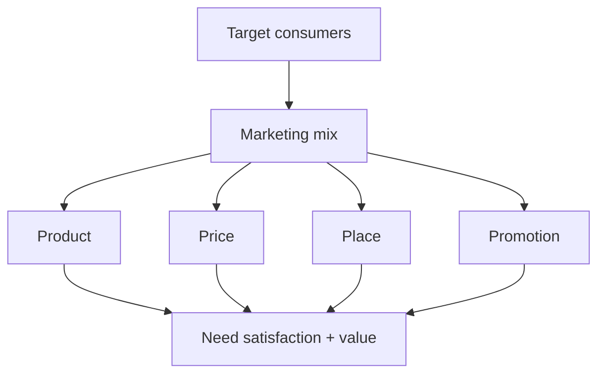

# Marketing Mix Foundation

## Intuition First

Marketing succeeds when the firm repeatedly delivers the right product, in the right place, at the right price, at the right time — at scale, and in a way that matches real consumer needs. The marketing mix is the set of levers managers control to make that balance happen.

---

## Core Definition

**Marketing mix**: Controllable elements (variables) that an organisation uses to influence and meet the needs of target consumers efficiently and effectively.

**Classic expression**: Right product × right place × right price × right time.

The challenge is not naming the levers — it is coordinating them consistently under competitive and operational pressure.

---

## The Four Ps (Classic Mix)

| P | Meaning | What it includes in practice |
|---|---------|------------------------------|
| **Product** | What is offered | Features, packaging, associated services |
| **Price** | Cost to the buyer / value signal | Amount charged; reflects delivered value |
| **Place** | Where and how it can be bought | Channels that make the offer available at the right location and time |
| **Promotion** | How awareness and desire are created | Media and communication channels used to promote the product |

---

## Why the Mix Expanded to Seven Ps

As markets became more **service-oriented** and **consumer-experience focused**, product–price–place–promotion alone were incomplete. Three more controllable elements were added:

| Extended P | Role |
|------------|------|
| **People** | Who delivers the experience |
| **Process** | How delivery is standardised and managed |
| **Physical evidence** | Tangible cues that make the service real |

Together these form the **seven Ps of marketing**. The original four still apply; the extra three become critical when the "product" is intangible or heavily experience-based (retail, hospitality, SaaS onboarding, consulting).

---

## Controllable vs Uncontrollable

- **Controllable (mix)**: What the firm sets — offer, price bands, channel design, messaging, staff, processes, store/app environment.
- **Not the mix**: Macro forces (regulation, recession), competitor moves, and pure demand shocks — the mix responds to these; it does not invent them.

---

## Common Pitfalls / Exam Traps

- **Trap**: Calling the mix a "slogan of four words." It is an operational framework for decisions that interact (e.g. premium price needs aligned product and place).
- **Trap**: Treating Place as only "physical store." Digital marketplaces, wholesale, resellers, and export are all place.
- **Trap**: Ignoring 7Ps in service cases. People/process/evidence often decide satisfaction when the core offer is intangible.
- **Trap**: Optimising one P in isolation (cheap price, weak product) — the mix fails when elements contradict.

---

## Quick Revision Summary

- Foundation idea: right product, place, price, time — consistently at scale
- Marketing mix = controllable variables to meet target needs
- Classic 4Ps: Product, Price, Place, Promotion
- Evolved 7Ps add People, Process, Physical evidence for service/experience markets
- Challenge is coordination and consumer-fit, not memorisation of labels
