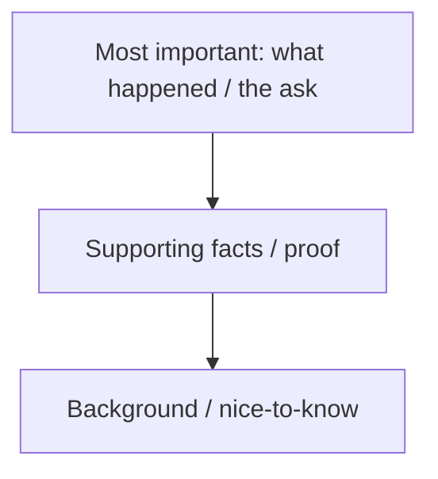

# Copywriting for Marketing

## Intuition First

The marketing mix decides what you sell and where. Copywriting decides whether strangers pause, believe, and act — buy, click, subscribe — in the moment. Words still shape how people think, feel, and behave, even when AI drafts first pass text.

---

## What Copywriting Is

**Copywriting**: The art and science of writing persuasive words (*copy*) that prompt the reader to take an **immediate action** (purchase, click, subscribe, book a demo).

**Primary role in marketing/ads**: Drive conversions via ads, landing pages, email campaigns, and web UI text.

---

## Copywriting vs Content Writing

| Dimension | Copywriting | Content writing |
|-----------|-------------|-----------------|
| **Goal** | Immediate action; hook and persuade | Inform, educate, build trust and engagement |
| **Tone** | Persuasive, punchy, often urgent | Educational, narrative, informative |
| **Length** | Usually short: headlines, ads, CTAs, landing hero | Longer: blogs, white papers, case studies |
| **Success metric** | Conversion / response | Reach, time-on-page, trust, SEO/education outcomes |

Both matter. Content builds the relationship; copy closes the moment.

---

## Why Copy Still Matters in the Age of AI

Technology amplifies distribution; **language still changes minds**. Narratives colour attention and memory. Tools can draft, but marketers still need judgement on:

- Brand voice fit
- Audience tone (formal vs informal)
- Truthful claims and differentiation
- Structure that earns the click without confusing the reader

---

## Building Copywriting Habits

### 1. Read widely and regularly

Novels, blogs, magazines, newspapers — exposure to sentence craft, joke timing, metaphor, and voice. A practical starter: *Everybody Writes* (Ann Handley) for clear, persuasive business writing.

### 2. Choose formal vs informal — then stay consistent

Like dressing for a formal vs casual event: pick the tone that fits **brand + audience**, then hold it. Switching mid-journey confuses readers and dilutes the message.

---

## Practical Writing Tactics

| Tactic | Why it works |
|--------|----------------|
| **One idea per paragraph** | Easier flow; no cognitive overload |
| **Shorter sentences** | Clarity; protects short attention spans |
| **Simple words** | Reach and readability across audiences |
| **Transition / signal words** | *Because, therefore, most importantly, besides* — guide next thought |
| **Metaphors** | Make ideas vivid and memorable (e.g. "cold as ice") |
| **Story structure (PPT)** | Place, Protagonist, Time + conflict + resolution |
| **Inverted pyramid** | Most important first → less important → details |
| **Vary sentence length** | Avoid monotonous rhythm |

### Inverted pyramid (journalism model)

**Example**: Report a fire — lead with time, place, injuries; then chaos/police; then politicians arriving later. In marketing, lead with the benefit or offer, then proof, then fine print.

---

## Common Pitfalls / Exam Traps

- **Trap**: Equating copywriting with "pretty writing." Success is action, not literary praise.
- **Trap**: Mixing copy and content goals on the same asset without clear hierarchy (long essay ads rarely convert).
- **Trap**: Inconsistent tone across funnel stages without a brand system.
- **Trap**: Stuffing many ideas into one paragraph or one sentence.
- **Trap**: Assuming AI removes the need for craft — judgement and brand fit remain human responsibilities.

---

## Quick Revision Summary

- Copy = persuasive words for immediate action and conversion
- Content = longer educational/trust-building writing
- Read broadly; lock formal/informal tone to brand + audience
- Clarity tactics: one idea, short sentences, simple words, transitions
- Creative spice: metaphor, PPT storytelling, inverted pyramid, varied rhythm
- Words still matter because narratives change feeling and behaviour
