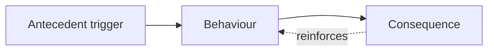

# Creative Execution and the ABC Behaviour Model

## Intuition First

Clicks and purchases are surface behaviours. To change what people do, marketers need the story around the act: what triggered it, what the person did, and what consequence reinforced (or killed) the habit. The ABC model supplies that full picture so interventions fix the right stage.

---

## The ABC Behaviour Model

| Letter | Name | Meaning |
|--------|------|---------|
| **A** | Antecedents | Events or triggers immediately before the behaviour |
| **B** | Behaviour | Observable action |
| **C** | Consequences | Outcomes that follow — and often reinforce — the behaviour |

Focusing only on B (e.g. "why didn't they buy?") misses whether the problem is missing triggers (A), friction in the act (B), or weak rewards (C).

### Everyday illustration

| Stage | Fast-food example |
|-------|-------------------|
| A | Anxiety or hunger |
| B | Eating fast food |
| C | Temporary relaxation / contentment → reinforces the habit |

---

## Applying ABC in Marketing

Diagnose *where* the funnel breaks:

| Symptom | Likely ABC gap | Intervention direction |
|---------|----------------|------------------------|
| People don't know you exist | Weak **A** | Stronger awareness cues, reach, reminders |
| Visitors arrive but don't buy | Hard **B** | Cut friction: UX, pricing clarity, checkout, trust |
| People buy once and never return | Weak **C** | Rewards, loyalty, post-purchase value, reminders to return |

The model guides interventions that shape antecedents, simplify behaviour, and design consequences that reinforce desired actions.

---

## Business Example: Starbucks

| Stage | Starbucks design |
|-------|------------------|
| **A** | Push notification at ~2 p.m. with afternoon half-price offer |
| **B** | Open app → reorder → one-click pay |
| **C** | Skip the line + earn loyalty points |

Trigger → easy action → immediate reward is a complete ABC loop built for habit.

---

## Linking ABC to Creative Execution

- **Copy and ads** often create or strengthen antecedents (reminders, urgency, desire).
- **UX and design cues** make the behaviour easier (clear CTA, less friction).
- **Loyalty, status, delight, savings** design consequences that retain.

Creative without ABC thinking can look beautiful and still fail the wrong stage.

---

## Common Pitfalls / Exam Traps

- **Trap**: Blaming "bad creative" when the real issue is consequence (no reason to return).
- **Trap**: Flooding antecedents (more ads) when behaviour is blocked by checkout friction.
- **Trap**: Treating ABC as psychology trivia — exam cases expect A/B/C diagnosis of a marketing failure.
- **Trap**: Ignoring reinforcement — one-off promotions without a C loop do not build retention.

---

## Quick Revision Summary

- ABC = Antecedents → Behaviour → Consequences
- Diagnose awareness (A), friction (B), and reward/retention (C) separately
- Interventions should target the broken stage
- Starbucks pattern: timed offer → easy reorder → skip line + points
- Creative, UX, and loyalty design map naturally onto A, B, and C
