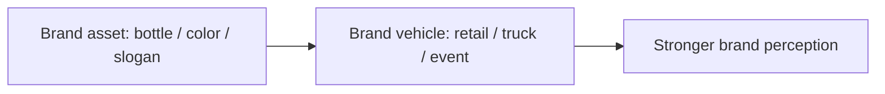

# Branding: Meaning, Levels, Roles, Assets, and Vehicles

## Intuition First

A logo is not a brand. Color, symbol, and packaging are **brand communication assets**. A brand is the *perception* people hold in their minds — how they think and feel about a product or company. You can influence that perception; you cannot fully control it. Like raising a child, experiences accumulate into an image you guide but do not own completely.

---

## What a Brand Is (and Is Not)

| Concept | Definition |
|---------|------------|
| **Brand (formal)** | Name, term, sign, symbol, design — or a combination — that identifies one seller's goods/services and differentiates them from competitors |
| **Brand as promise** | Seller's commitment to deliver a consistent set of features, benefits, and service |
| **Brand image** | Perception built from many small experiences over time |
| **Not just** | Color, logo, or slogan alone (those are communication assets) |

---

## Six Levels of Brand Meaning

A brand communicates value at six nested levels. Together they define what the brand truly represents.

| Level | Meaning | Example angle |
|-------|---------|---------------|
| **1. Attributes** | Tangible or technical traits | Technology superiority, ease of use |
| **2. Benefits** | What the customer gains | Social status, experience, self-esteem |
| **3. Values** | How the brand helps solve customer problems | Reliability, problem-solving ethos |
| **4. Culture** | Community or mindset around the brand | Apple community — "think different" |
| **5. Personality** | Human character the brand projects | Rebels; people who want to make a difference |
| **6. User** | Who typically buys and stays loyal | Target segments and loyal customers |

Strong brands are coherent across all six — not attribute-heavy with empty personality, and not personality-only with weak delivery.

---

## Roles of Brands for Consumers

| Role | Why it matters |
|------|----------------|
| **Identify source** | Assign responsibility for performance to a maker/distributor |
| **Ethical evaluation** | Same product type may be judged differently once branded |
| **Learn from experience** | Past use + marketing teach which brands satisfy needs |
| **Simplify decisions** | Time-starved buyers use brands as shortcuts |
| **Reduce risk** | Familiar brand lowers fear of a bad purchase |

As lives get busier, the brand's ability to simplify choice and reduce risk becomes more valuable than another feature bullet.

---

## Roles of Brands for Firms

| Role | Firm benefit |
|------|--------------|
| **Handling & tracing** | Organize inventory and accounting |
| **Legal protection** | Trademark (name), patents (process), copyright/design (packaging) |
| **Quality signal** | Credible brand → easier repurchase |
| **Demand security** | Loyalty creates predictable demand |
| **Barriers to entry** | Harder for new rivals to steal share |
| **Price premium** | Loyal buyers often pay ~$20$–$25\%$ more than competing brands |

Intellectual property makes brand investment safer: firms can build equity knowing competitors cannot legally copy protected elements.

---

## Brand Assets vs Brand Vehicles

| Concept | Definition | Examples |
|---------|------------|----------|
| **Brand asset** | Element that carries brand identity (color, symbol, shape, slogan) | Coca-Cola bottle silhouette; UPS Pullman brown; Mastercard interlocking circles; Red Bull "gives you wings" |
| **Brand vehicle** | Physical or experiential expression in the market | 3D Times Square billboard; UPS delivery trucks; plastic Mastercard; Red Bull space jump sponsorship |

Assets are the *ingredients* of recognition. Vehicles put those ingredients in front of people through real touchpoints.

---

## Putting It Together

| Layer | Question |
|-------|----------|
| Meaning levels | What do we stand for — attributes through to users? |
| Consumer roles | Do we reduce risk and simplify choice? |
| Firm roles | Are we protected, loyal, and premium-capable? |
| Assets + vehicles | Are visual/verbal assets expressed in strong market experiences? |

---

## Common Pitfalls / Exam Traps

- **Trap**: Defining a brand as only logo/color. Those are assets; the brand is perception + promise.
- **Trap**: Skipping levels — talking only about attributes without benefits, culture, personality, or user.
- **Trap**: Confusing **asset** (identity element) with **vehicle** (how/where it is expressed).
- **Trap**: Ignoring firm-side value: trademarks, demand security, and the ~$20$–$25\%$ loyalty premium.
- **Trap**: Assuming brands are fully controllable. Experience shapes perception; control is influence, not ownership.

---

## Quick Revision Summary

- Brand = identification + differentiation + consistent promise; image = lived perception
- Six meaning levels: attributes → benefits → values → culture → personality → user
- For consumers: identify source, learn from experience, simplify, reduce risk
- For firms: tracing, IP protection, quality signal, loyalty, entry barriers, price premium
- Loyal customers often accept ~$20$–$25\%$ higher prices
- Assets = color/symbol/slogan; vehicles = trucks, billboards, cards, sponsorships
- Influence perception through experiences — you cannot fully dictate it
