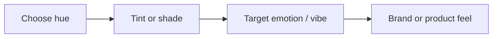

# Color Psychology for Branding and Design

## Intuition First

Color is not decoration — it is a shortcut to emotion. Color psychology is a framework for choosing *which* color (and *which shade*) to use so that the vibe matches the message: trust, passion, creativity, calm, or mystery.

---

## What Color Psychology Does

| Question | Color psychology answers |
|----------|--------------------------|
| Which color when? | Match emotion/vibe to context |
| What does it evoke? | Different hues trigger different feelings |
| Do shades matter? | Yes — moving along a hue changes the emotion |

**Examples of hue associations** (guidance, not absolute law):

| Color family | Typical vibe |
|--------------|--------------|
| **Red** (and its shades) | Excitement, passion, desire — intensity shifts with shade |
| **Blue** | Trustworthy technology; reliability |
| **Violet** | Creativity |
| **Green** | Reassurance, nature |

---

## Bright vs Soft Colors (Intensity)

Research points to a pattern shared across genders for light vs dark, with divergence on intensity:

| Dimension | Finding |
|-----------|---------|
| Light vs dark | Men and women generally share similar preferences |
| Intensity | Men tend to prefer **brighter** colors; women are often more drawn to **softer** colors |
| Implication | Gender-skewed packaging or UI may lean bright vs soft accordingly — but test, don't stereotype blindly |

Intensity changes emotional response even when the base hue stays the same.

---

## Achromatic Colors

**Achromatic colors** = colors without hue: black, white, and grays.

| Point | Detail |
|-------|--------|
| Nature | No chromatic hue; strong visual impact via contrast |
| Audience pattern | Men generally tolerate achromatic palettes more than women |
| Use cases | Luxury minimalism, tech, premium packaging, high-contrast type |

Simple does not mean weak — black/white/gray can dominate perception when used deliberately.

---

## Tints vs Shades

| Term | How it is made | Typical feel |
|------|----------------|--------------|
| **Tint** | Add **white** to a color | Softer, youthful, calming |
| **Shade** | Add **black** to a color | Deeper, stronger, mysterious |

| Preference pattern | Implication |
|--------------------|-------------|
| Women generally prefer **tints** more than shades | Softening a brand color (adding white) can feel more approachable |
| Linked to sensitivity to subtle variation | Small tint/shade shifts change brand warmth vs drama |

Designers and marketers pick tint vs shade to match the intended emotional register of the brand or product.

---

## Limits of Color Psychology

Human perception is complex. Color–emotion links are **not universal**.

| Influencer of interpretation | Effect |
|------------------------------|--------|
| Personal experience | Same red can mean love or danger for different people |
| Upbringing | Learned associations override textbook wheels |
| Cultural background | Colors carry different meanings across cultures |
| Mood in the moment | Same palette can feel different today vs tomorrow |

Color psychology is useful **guidance**, not a guarantee. Individual perception and momentary mood always mediate the result.

---

## Practical Checklist for Marketers

| Step | Action |
|------|--------|
| 1 | Define the emotion you want (trust, energy, calm, luxury) |
| 2 | Pick a hue family that usually supports that vibe |
| 3 | Decide intensity: bright vs soft for audience |
| 4 | Decide tint (soft/youthful) vs shade (deep/mysterious) |
| 5 | Validate against culture and category norms — then test |

---

## Common Pitfalls / Exam Traps

- **Trap**: Treating color associations as universal laws. Culture, mood, and experience break the wheel.
- **Trap**: Confusing **tint** (add white) with **shade** (add black).
- **Trap**: Ignoring **achromatic** colors as "not psychology" — they still shape vibe and tolerance differs by audience.
- **Trap**: Focusing only on hue and ignoring intensity (bright vs soft).
- **Trap**: Copying a competitor's blue for "trust" without aligning to own brand emotion and category.

---

## Quick Revision Summary

- Color psychology = framework for matching color/shade to emotion and context
- Red → passion/desire; blue → trustworthy tech; violet → creativity; green → nature/reassurance
- Men often prefer brighter intensity; women more often prefer softer colors
- Achromatic = black, white, gray (no hue); men often tolerate them more
- Tint = + white (soft, youthful); shade = + black (deep, mysterious)
- Women generally prefer tints over shades more than men
- Associations are guidance — experience, culture, and mood always mediate
