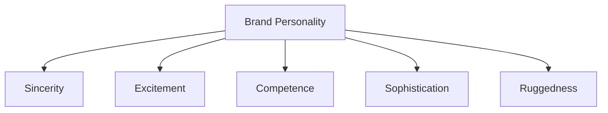

# Brand Personality: Human Traits Brands Can Own

## Intuition First

Brand personality is the moment a brand becomes humanized. It is the set of human traits that define how a brand behaves and communicates. When a brand feels human, people connect more naturally and emotionally — the same way they relate to a friend's character, not a feature list.

---

## Definition

| Term | Meaning |
|------|---------|
| **Brand personality** | Human traits and characteristics that describe how a brand behaves and communicates |
| **Why it matters** | Emotional connection rises when the brand feels like a person with a consistent character |

Personality is not a slogan bolted on. It shows up in tone of voice, visual style, product choices, and customer experience — consistently.

---

## Aaker's Five Dimensions

Social psychologist Jennifer Aaker identified five key dimensions used to measure brand personality:

| Dimension | Feels like | Traits in practice | Brand examples |
|-----------|------------|--------------------|----------------|
| **Sincerity** | Genuine, pure-hearted | Honest, warm, joyful | Disney, Amazon, Cadbury |
| **Excitement** | Adventurous, energetic | Creative, bold, modern, vibrant | Coca-Cola, Nike, Red Bull, Tesla |
| **Competence** | Trustworthy, capable | Intelligent, reliable, expert, efficient | Microsoft, Google |
| **Sophistication** | Elegant, high-class | Luxurious, prestigious, refined taste | Gucci, Apple, Tiffany, Rolex |
| **Ruggedness** | Outdoorsy, tough | Strong, resilient, durable | Timberland, Jeep, Marlboro, Harley-Davidson |

---

## Dimension Deep Dive

### 1. Sincerity

A sincere brand communicates honestly, with warmth and joy. It feels "good-hearted" rather than edgy or cold.

**Fit**: Family brands, everyday treats, customer-obsessed service brands.

### 2. Excitement

An exciting brand feels energetic and alive — often creative, bold, and modern.

**Fit**: Sports, soft drinks, energy, innovation-forward tech.

### 3. Competence

A competent brand signals expertise and reliability: "this will work."

**Fit**: Productivity software, search, enterprise tools, professional services.

### 4. Sophistication

A sophisticated brand projects elegance, luxury, and refined taste.

**Fit**: Fashion, jewelry, premium devices, status categories.

### 5. Ruggedness

A rugged brand feels outdoorsy and resilient — toughness and durability.

**Fit**: Outdoor footwear, off-road vehicles, bold lifestyle brands.

---

## Choosing and Measuring Personality

| Decision question | Practical test |
|-------------------|----------------|
| Who are we for? | Which traits would our ideal user claim as their own? |
| Can we own it? | Do product, packaging, ads, and service all agree? |
| Distinct vs rivals? | Does a competitor already own this dimension in the category? |
| Measurement | Rate the brand (and rivals) on each of the five dimensions |

Brands can emphasize more than one trait, but a muddled mix (e.g., cheap and ultra-luxury cues together) weakens recognition.

---

## Link to Broader Branding

| Related concept | How personality connects |
|-----------------|--------------------------|
| Six levels of brand meaning | Personality is one of the six meaning levels |
| Brand architecture pyramid | Personality sits near the emotional / essence layers |
| Color and design | Visual system should reinforce chosen traits |

---

## Common Pitfalls / Exam Traps

- **Trap**: Listing random adjectives instead of Aaker's five: sincerity, excitement, competence, sophistication, ruggedness.
- **Trap**: Treating personality as logo redesign alone — behavior and communication must match.
- **Trap**: Mixing incompatible dimensions without hierarchy (e.g., rugged + ultra-sophisticated with no story).
- **Trap**: Memorizing examples wrong: e.g., Harley-Davidson → ruggedness (not sincerity); Microsoft/Google → competence.
- **Trap**: Assuming personality replaces product truth. Traits without delivery feel fake.

---

## Quick Revision Summary

- Brand personality = human traits that make the brand feel human and emotionally connectable
- Measured via Aaker's five: sincerity, excitement, competence, sophistication, ruggedness
- Sincerity: Disney, Amazon, Cadbury
- Excitement: Coca-Cola, Nike, Red Bull, Tesla
- Competence: Microsoft, Google
- Sophistication: Gucci, Apple, Tiffany, Rolex
- Ruggedness: Timberland, Jeep, Marlboro, Harley-Davidson
- Consistency across touchpoints is what makes personality believable
