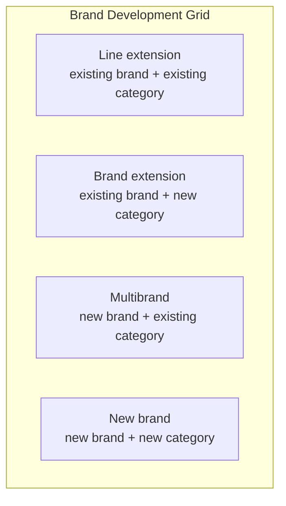
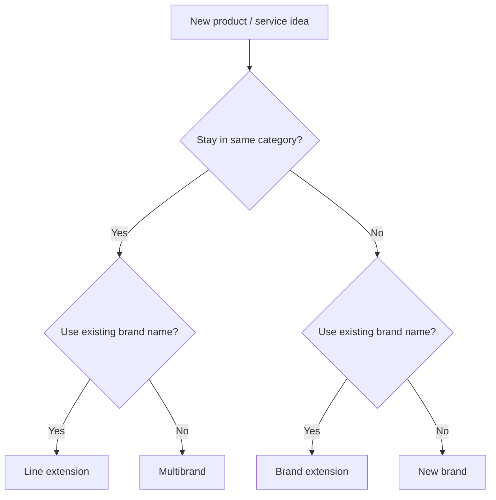

# Brand Development Strategy: The 2×2 Growth Grid

## Intuition First

When a company launches something new, the first strategic fork is: stretch the existing brand, or birth a new one — and stay in the same category, or enter a new one. The brand development 2×2 grid maps those choices so marketers pick a path that matches brand strength, market position, and risk appetite.

---

## The 2×2 Grid

Axes: **brand** (existing vs new) × **category** (existing vs new).

| Strategy | Brand name | Category | Classic example |
|----------|------------|----------|-----------------|
| **Line extension** | Same | Same (new formats/variants) | Coca-Cola → Diet Coke, Cherry Coke, Coke Zero |
| **Brand extension** | Same | New | Dove → Dove Men+Care (e.g., men's shampoos/care) |
| **Multibrand** | New | Same | Unilever launching multiple shampoo brands for shelf space |
| **New brand** | New | New | Typical startup launch; radical innovations as a clean slate |

---

## Strategy-by-Strategy: Logic, Upside, Risk

### Line Extension

Same brand, same category, new formats or variants.

| | |
|--|--|
| **Why choose it** | Low cost; reuses packaging systems, recognition, and trust; keeps brand feeling fresh |
| **Risk** | **Cannibalization** — new SKU steals sales from existing SKUs |

### Brand Extension

Same brand name enters a **new** category.

| | |
|--|--|
| **Why choose it** | Instant credibility from known brand; cheaper than building a brand from zero |
| **Risk** | Failure can **damage or dilute** the parent brand's reputation |

### Multibrand Strategy

New brand names inside an **existing** category the company already plays in.

| | |
|--|--|
| **Why choose it** | Capture more **shelf space** and multiple **price segments**; stronger category presence |
| **Risk** | **Internal competition** — own brands fight each other for the same shopper |

### New Brand Strategy

Entirely new brand in a completely new category.

| | |
|--|--|
| **Why choose it** | Clean slate free of old associations; fits radical innovation or high-risk markets |
| **Risk** | Heavy spend to build awareness, trust, and presence |

---

## Decision Lens

| Factor | Favors |
|--------|--------|
| Strong equity + close fit to current category | Line extension |
| Strong equity + meaningful fit to a *new* category | Brand extension |
| Need for distinct price tiers / shelf control | Multibrand |
| Radical break / toxic or mismatched associations | New brand |
| Low budget / need speed | Line or brand extension |
| High risk tolerance + large investment | New brand (or carefully chosen multibrand) |

---

## Comparison Table (Exam-Ready)

| Strategy | Category | Brand | Key upside | Key downside |
|----------|----------|-------|------------|--------------|
| Line extension | Existing | Existing | Cheap, fresh, trusted | Cannibalization |
| Brand extension | New | Existing | Credibility transfer | Dilution / reputation risk |
| Multibrand | Existing | New | Shelf + price coverage | Internal rivalry |
| New brand | New | New | Clean associations | High build cost |

---

## Common Pitfalls / Exam Traps

- **Trap**: Swapping **line** vs **brand** extension. Line = same category, new format; brand extension = new category, same name.
- **Trap**: Calling Unilever's many shampoos a "line extension." Same category + *new brand names* = multibrand.
- **Trap**: Ignoring cannibalization as the signature risk of line extension.
- **Trap**: Ignoring dilution as the signature risk of brand extension.
- **Trap**: Treating new brand as cost-free freedom — it still needs awareness and trust investment.

---

## Quick Revision Summary

- Brand development grid = existing/new brand × existing/new category
- Line extension: Diet/Cherry/Zero Coke — same brand, same category, new formats
- Brand extension: Dove into men's care — same brand, new category
- Multibrand: Unilever's many shampoo brands — new brands, same category
- New brand: new name + new category — clean slate, high cost
- Watch cannibalization (line), dilution (brand extension), internal rivalry (multibrand)
- Choose based on brand strength, market position, and risk appetite
