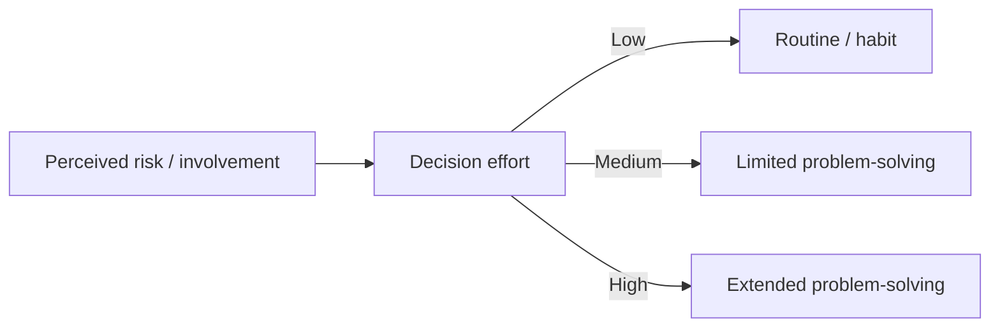

# Purchase Decision Involvement and Problem-Solving

## Intuition First

Not every purchase deserves the same mental effort. Buying a lunchtime soft drink is almost automatic; buying a car or a house is not. Involvement and perceived risk decide whether the shopper glides on habit or works through extended problem-solving.

---

## Low vs High Involvement

| Dimension | Low involvement | High involvement |
|-----------|-----------------|------------------|
| **Behavior** | Routine / habitual | Extended problem-solving |
| **Risk if wrong** | Low | High |
| **Complexity** | Simple | Complex |
| **Price / stakes** | Usually lower | Often higher price or life impact |
| **Frequency** | Often frequent | Infrequent |
| **Example** | Always ordering Diet Coke at lunch | Car, house, insurance policy |

High-involvement items matter to the buyer; failure hurts. Buyers then compare features, prices, and guarantees instead of responding on autopilot.

---

## Three Problem-Solving Modes

| Mode | When it appears | How the consumer decides | Example angle |
|------|-----------------|--------------------------|---------------|
| **Extended problem-solving** | High risk or high uncertainty | Gather information; carefully evaluate options | Car, home, insurance |
| **Limited problem-solving** | Impulse or moderate situations | Decide quickly with less information | Many impulse buys |
| **Routine problem-solving** | Brand loyalty / familiar purchase | Rely on past experience and trust; almost automatic | Loyalty to Diet Coke at lunch |

**Rule of thumb**: Level of involvement + perceived risk → amount of effort in the purchase decision.

---

## Linking Involvement to Process

| If the shopper feels… | They tend to use… |
|-----------------------|--------------------|
| Low stakes, familiar brand | Routine response behavior |
| Some novelty, but not life-changing | Limited problem-solving (including impulse) |
| High stakes, high uncertainty | Extended problem-solving |

Routine response is **not** lazy buying in a negative sense — for low-involvement categories, it is efficient. Brands that win loyalty *become* the routine.

---

## Marketing Implications

| Decision type | Marketer focus |
|---------------|----------------|
| **Routine / low involvement** | Habit cues, packaging recognition, shelf presence, reminders, keep friction near zero |
| **Limited / impulse** | Point-of-purchase, scarcity or offer triggers, simplify choice |
| **Extended / high involvement** | Comparison content, proofs, guarantees, demos, reviews, sales assistance |

Pushing "long form education" at a habitual soft-drink buy wastes attention. Underinvesting in proof for insurance or autos loses the sale.

---

## Core Definitions (Exam Clarity)

| Term | Definition |
|------|------------|
| **Routine / habitual behavior** | Automatic purchases based on limited or past information |
| **High-involvement decision** | Higher risk if wrong; more complex; often higher price; infrequent but important |
| **Extended problem-solving** | Deliberate search and evaluation under high risk/uncertainty |
| **Limited problem-solving** | Faster decisions with less information (often impulse contexts) |
| **Routine problem-solving** | Brand-loyal, experience-based, near-automatic choice |

---

## Common Pitfalls / Exam Traps

- **Trap**: Equating "cheap" alone with low involvement. Familiarity and risk also matter.
- **Trap**: Calling every fast purchase "routine." Impulse often sits under **limited** problem-solving.
- **Trap**: Assuming high involvement means consumers always use the same attitude to risk — effort rises, but process still depends on uncertainty.
- **Trap**: Forgetting examples: Diet Coke lunch = routine; car/house/insurance = extended.
- **Trap**: Ignoring brand loyalty as the engine of routine problem-solving.

---

## Quick Revision Summary

- Involvement + perceived risk set how hard consumers think
- Low involvement → routine/habitual (e.g., Diet Coke at lunch)
- High involvement → extended problem-solving (car, house, insurance)
- Three modes: extended, limited (incl. impulse), routine (loyalty-driven)
- Extended: high risk/uncertainty → research and compare
- Limited: quick decisions with less information
- Routine: past experience + trust → nearly automatic purchase
