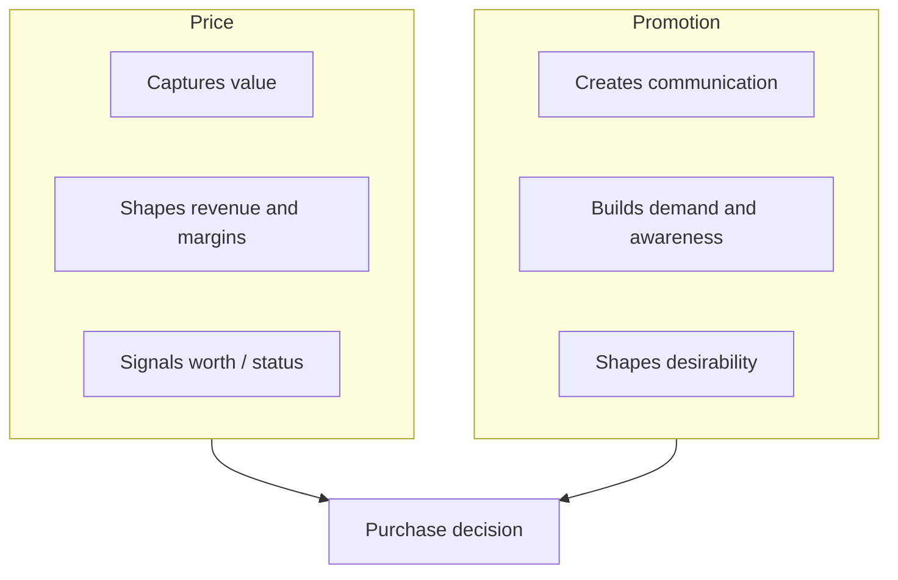

# Price vs Promotion

## Intuition First

Price and promotion both sit in the marketing mix, but they do different jobs. **Price captures value** in the exchange. **Promotion creates communication and demand.** Treating a discount campaign as “pricing strategy” — or expecting ads alone to fix a broken price — confuses the levers and muddies P&L diagnosis.

---

## Three Comparison Dimensions

| Dimension | Price | Promotion |
|-----------|-------|-----------|
| **Primary role** | Sets the monetary value of the exchange | Communicates and persuades consumers |
| **Impact on bottom line** | Directly influences revenue and profit margins | Usually an expense aimed at longer-term growth, not instant profit |
| **Consumer perception** | Shifts perceived worth or status of the product | Influences awareness and desirability |

---

## One-Line Summary

**Price captures value; promotion creates communication and demand.**

---

## Marketing Examples

| Situation | Dominant Lever | Why |
|-----------|----------------|-----|
| Luxury watch raises MRP after brand campaign | Price + perception | Status signalling; promotion built desirability first |
| FMCG runs “buy 1 get 1” across stores | Promotion (tactical) often with temporary price effect | Stimulates trial/volume; lasting margin impact depends on design |
| SaaS cuts list price permanently after losing deals | Price | Changes the exchange value itself, not only awareness |
| Startup runs influencer reach without fixing overpriced SKU | Promotion alone | Demand may rise, but conversion stalls if price-value gap remains |

### Worked Pair: Budget Airline vs Fashion Brand

| Brand Type | Price Role | Promotion Role |
|------------|------------|----------------|
| Budget airline | Low fare is the core value capture story | Ads emphasise “from ₹1,999” to drive search and booking |
| Premium fashion house | High price protects exclusivity and margin | Campaigns sell craftsmanship and lifestyle; heavy discounting can damage status |

---

## Strategic Implications

- If margins collapse, audit **price and mix** before blaming “weak creatives.”
- If awareness is low but price is fair, invest in **promotion**.
- If customers desire the brand but balk at checkout, reassess **price-value fit** (or justify price with stronger value cues).
- Chronic deep discounting can train customers to wait — blurring price and promotion roles and eroding the price ceiling.

---

## Common Pitfalls / Exam Traps

- **Trap**: Saying promotion “makes profit directly.” Promotion is typically an expense for growth; price hits revenue and margins more directly.
- **Trap**: Equating a discount with pricing strategy. A discount is often a promotional tactic that temporarily changes effective price.
- **Trap**: Claiming promotion does not affect perceived value. It mainly drives awareness/desirability, while price more directly signals worth/status — both can interact.
- **Trap**: Forgetting the three-dimension frame (role, P&L, perception) when asked to “compare price and promotion.”

---

## Quick Revision Summary

- Price: monetary value of exchange; direct revenue/margin impact; signals worth/status
- Promotion: communicate and persuade; usually expense for growth; builds awareness/desirability
- Price captures value; promotion creates communication and demand
- Diagnose problems by which lever is broken — not by adding more of the wrong one
- Discounts often blur the line; exam answers should still separate roles clearly
