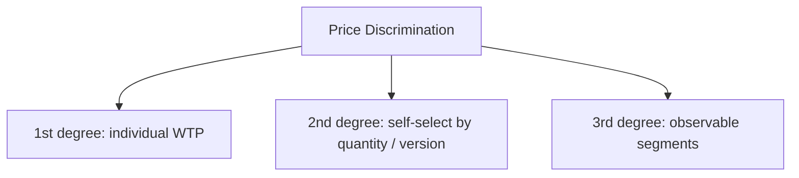

# Pricing Strategies from an Economist’s Perspective

## Intuition First

Where marketers talk floors, ceilings, and brand, economists ask: **how much consumer surplus can the seller capture?** The toolkit centres on charging different prices to different buyers (or self-selected behaviours), splitting fees, bundling products, and using discounts as screening devices. Same SKU, different extraction logic.

---

## Price Discrimination Overview

**Price discrimination**: charging different prices for the **same** product based on what different buyer groups are willing to pay.

---

## First-Degree (Perfect) Price Discrimination

Charge **each** consumer their maximum willingness to pay (WTP).

| Result | Implication |
|--------|-------------|
| Consumer surplus → $0$ | Producer captures all surplus |

| Classic form | Modern form |
|--------------|-------------|
| Personalised haggling (flea market); fees tailored to client capacity (e.g. high-end legal services) | Dynamic pricing algorithms using browsing, history, and behaviour to personalise price |

Often called the economist’s “holy grail” — powerful in theory, hard to achieve perfectly in practice.

---

## Second-Degree Discrimination (Quantity / Self-Selection)

Seller does **not** know each buyer’s exact WTP. Instead, a schedule lets customers **self-select** by how much they consume. Unit price falls as quantity rises.

| Logic | Example |
|-------|---------|
| More volume → lower unit price | Buy one at $\$10$, second at $\$5$; wholesale bulk packs |

Captures extra value from high-volume users without needing person-by-person WTP knowledge.

---

## Third-Degree (Segment-Based) Discrimination

Divide the market by observable traits (age, location, status). Segments differ in **price elasticity**; sellers charge:

| Segment elasticity | Price |
|--------------------|-------|
| More inelastic | Higher price |
| More elastic (price-sensitive) | Lower price |

| Example | Rationale |
|---------|-----------|
| Student discounts; senior movie tickets | Higher elasticity / lower WTP |
| Business-class airfares | More inelastic demand (urgency, employer pay) |

---

## Two-Part Tariffs

Total price = **fixed access fee** + **variable usage fee**.

| Component | Role |
|-----------|------|
| Fixed fee | Captures “entry” / access value |
| Usage fee | Covers incremental consumption |

**Example**: Gym monthly membership (access) + charges for personal training or specialty classes (usage).

---

## Bundled Pricing

Two or more distinct products sold as one combined offer.

| Consumer effect | Firm effect |
|-----------------|-------------|
| Higher perceived value / “deal” feeling | Higher items per transaction; sells add-ons buyers might skip à la carte |

**Example**: McDonald’s Value Meal — burger + fries + drink cheaper together than as three separate full-price items.

---

## Discounts as Tactical Discrimination

Discounts separate buyers by how they trade **time vs money**.

| Mechanism | Who self-selects in |
|-----------|---------------------|
| Coupons / rebates (effort required) | Price-sensitive buyers who will invest effort |
| No coupon / full price | Time-poor buyers who value convenience over search |

**Seasonal / temporal pricing**: hotels charge more in peak season and lower rates off-season to fill rooms when demand drops.

---

## Strategy Map for Quick Choice

| Tool | When it fits |
|------|----------------|
| 1st degree / dynamic personalisation | Granular WTP signals available |
| 2nd degree | Heterogeneous usage; versioning or quantity breaks work |
| 3rd degree | Clear segments with different elasticities |
| Two-part tariff | Access + variable use (gyms, utilities, platforms) |
| Bundling | Complements; raise perceived value and attach rate |
| Effort / seasonal discounts | Screen by time sensitivity or demand seasonality |

---

## Common Pitfalls / Exam Traps

- **Trap**: Mixing degrees — 1st is individual WTP; 2nd is self-selection by quantity/version; 3rd is group/segment traits.
- **Trap**: Claiming 1st degree always raises consumer surplus. It drives consumer surplus toward zero.
- **Trap**: Calling any discount “1st degree.” Coupons are usually tactical screening (time vs money), not perfect individual extraction.
- **Trap**: Forgetting that 3rd degree prices by **elasticity differences** across segments (high price for inelastic groups).
- **Trap**: Describing two-part tariffs as only a “membership fee” without the usage component.

---

## Quick Revision Summary

- Price discrimination = different prices for the same product by WTP or behaviour
- 1st degree: individual max WTP; consumer surplus $\approx 0$
- 2nd degree: self-select via quantity/version; unit price falls with volume
- 3rd degree: segment by traits; price high for inelastic, low for elastic groups
- Two-part tariff = fixed access + variable use
- Bundling packages products to lift perceived value and volume
- Coupons/rebates and seasonal rates screen buyers tactically
